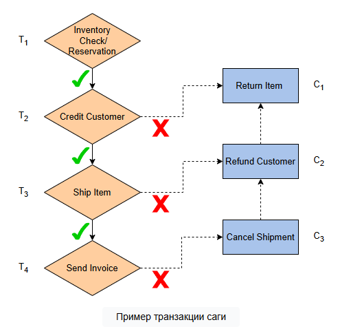

# Долгоживущие транзакции и саги
В этом уроке мы рассмотрим долгоживущие транзакции и транзакции-саги. Мы также рассмотрим преимущества саг по сравнению с распределёнными транзакциями.

Как объяснялось ранее , достижение полной изоляции между транзакциями обходится относительно дорого.

Система должна либо поддерживать блокировки для каждой транзакции и потенциально блокировать выполнение других параллельных транзакций, либо прерывать некоторые транзакции для обеспечения безопасности , что приводит к напрасной трате усилий.

Более того, чем больше продолжительность транзакции, тем большее влияние эти механизмы окажут на общую пропускную способность.

Существует также положительный цикл обратной связи: использование этих механизмов может привести к увеличению времени выполнения транзакций, что может усилить влияние этих механизмов.

# Долгосрочные транзакции
Существует особый класс транзакций, называемых долгосрочными транзакциями (LLT) .

Это транзакции, которые по своей природе длятся дольше — порядка часов или даже дней, а не миллисекунд. Это может происходить, поскольку транзакция обрабатывает большой объём данных, требует участия человека или требует взаимодействия с медленными сторонними системами.

## Примеры LLT
Пакетные задания, которые рассчитывают отчеты по большим наборам данных
Претензии в страховой компании, включающие различные этапы, требующие человеческого участия
Онлайн-заказ товара, от заказа до доставки которого проходит несколько дней
В результате выполнение этих транзакций с использованием распространенных параллельных механизмов существенно снижает производительность , поскольку им приходится удерживать ресурсы в течение длительных периодов времени, не выполняя при этом никаких операций с ними.

Иногда долгоживущие транзакции не требуют полной изоляции друг от друга, но им всё равно необходимо быть атомарными , чтобы поддерживать согласованность при частичных сбоях. Поэтому исследователи предложили новую концепцию: сагу .

# Сага
Сага представляет собой последовательность транзакций Т1, Т2, …, ТН которые могут чередоваться с другими транзакциями.

Однако гарантируется, что либо все транзакции будут выполнены успешно, либо ни одна из них, что сохраняет гарантию атомарности .

Каждая транзакция Тя связано с так называемой компенсационной транзакцией Ся, который выполняется в случае необходимости отката.

# Преимущества саги
Концепция транзакций Saga может быть действительно полезна в распределённых системах. Как было показано в предыдущих разделах, распределённые транзакции, как правило, сложны и могут быть реализованы только путём компромиссов между производительностью и доступностью .

В некоторых случаях мы можем использовать транзакцию Saga вместо распределённой транзакции. Это удовлетворит все наши бизнес-требования, сохраняя при этом слабую связанность систем и обеспечивая хорошую доступность и производительность .

# Пример сценария
Давайте представим, что мы создаем приложение для электронной коммерции, в котором каждый заказ клиента требует нескольких отдельных шагов: авторизация кредитной карты, проверка складских запасов, отправка товара, создание и доставка счета-фактуры и т. д.

Один из подходов мог бы заключаться в выполнении распределённой транзакции по всем этим системам для каждого заказа. Однако в этом случае сбой одного компонента (например, платёжной системы) потенциально может привести к остановке всей системы.

Альтернативой, использующей шаблон саги, было бы моделирование операции заказа как операции саги, состоящей из всех этих подтранзакций, где каждая из них связана с компенсирующей транзакцией.

Например, списание средств с банковского счёта клиента может сопровождаться компенсирующей транзакцией, обеспечивающей возврат средств. Тогда мы можем построить операцию заказа как последовательное выполнение этих транзакций, как показано на следующих транзакциях. В случае сбоя любой из этих транзакций мы можем откатить выполненные транзакции и выполнить соответствующие компенсирующие транзакции.

> Могут быть случаи, когда необходима некоторая форма изоляции .

В приведенном выше примере заказы от разных клиентов на один и тот же продукт могут содержать некоторые общие данные, что может привести к конфликтам.

# Случаи, когда требуется изоляция
Представьте себе ситуацию с двумя одновременными заказами A и B, где A зарезервировал последний товар на складе. В результате заказ B не выполняется на первом этапе и отклоняется из-за отсутствия товара на складе. Позже заказ A также не выполняется на втором этапе из-за недостаточной суммы на карте клиента. Затем выполняется соответствующая компенсирующая транзакция, возвращающая зарезервированный товар на склад.

Это означало бы, что заказ был отклонён, хотя его можно было бы обработать в обычном режиме. Конечно, такое нарушение изоляции не влечёт за собой серьёзных последствий. Однако в некоторых случаях последствия могут быть более серьёзными, например, с клиентов может быть списана сумма без получения товара.

> Чтобы предотвратить подобные сценарии, на уровне приложений можно ввести определенную форму изоляции.

# Обеспечение изоляции на уровне приложений
Предыдущие исследования по этой теме предложили некоторые конкретные методы, которые являютсяконтрмерами против аномалий изоляции.

Вот некоторые из этих методов:

# Семантическая блокировка
Использование семантической блокировки, по сути, сигнализирует о том, что некоторые элементы данных в данный момент находятся в обработке и должны обрабатываться иначе или вообще не использоваться. Последняя транзакция саги снимает эту блокировку и возвращает данные в нормальное состояние.

# Коммутативные обновления
Использование коммутативных обновлений, имеющих одинаковый эффект независимо от порядка их выполнения. Это может помочь снизить риск возникновения ситуаций, подверженных феномену потерянных обновлений.

# Изменение структуры саги
Измените структуру саги так, чтобы транзакция, называемая опорной транзакцией, обозначала границу между транзакциями, которые могут потерпеть неудачу, и теми, которые не могут.

Таким образом, транзакции, которые не могут потерпеть неудачу, но могут привести к серьезным проблемам при откате из-за сбоев других транзакций, могут быть перемещены после поворотной транзакции .

Примером этого является транзакция, увеличивающая баланс счёта. Эта транзакция может иметь серьёзные последствия, если другая параллельная сага считывает это увеличение баланса, но затем предыдущая транзакция откатывается. Перемещение этой транзакции после поворотной транзакции означает, что она никогда не будет откачена, поскольку только все транзакции после поворотной транзакции могут быть выполнены успешно.

> Мы можем применять эти методы выборочно, когда это необходимо. Однако они значительно усложняют систему и перекладывают часть нагрузки на разработчиков приложений; им приходится заново продумывать все возможные сбои и соответствующим образом проектировать приложение. При выборе между использованием транзакций Saga и использованием транзакционных возможностей базового хранилища данных необходимо учитывать компромиссы.