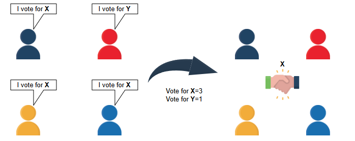

# Определение проблемы консенсуса

Рассмотрим консенсус и случаи его применения.

## Основная идея

Большинство проблем в распределённых системах имеют общую черту, которая характеризует многие (если не все) из них.

Это тот факт, что различные узлы распределённой системы пытаются прийти к соглашению по определённому вопросу:

- В случае распределённой транзакции - была ли транзакция зафиксирована или нет
- В случае доставки сообщений - было ли сообщение доставлено или нет

Это фундаментальное свойство присуще многим другим проблемам в распределённых системах.

В результате исследователи формально определили эту проблему и изучили возможные решения, которые затем можно использовать как строительные блоки для более сложных проблем. Это известно как **проблема консенсуса**.

## Формальное определение

Предположим, у нас есть распределённая система из k узлов (n₁, n₂, ..., nₖ), где каждый может предложить своё значение vᵢ.

*Консенсус* - это проблема достижения согласия всех этих узлов относительно единого значения v.

Должны выполняться следующие свойства:

- **Завершение**: Каждый исправный узел должен в конечном итоге принять решение.
- **Согласованность**: Окончательное решение всех исправных узлов должно быть одинаковым.
- **Обоснованность**: Согласованное значение должно быть предложено одним из узлов.

## Примеры использования консенсуса

Как уже объяснялось, консенсус лежит в основе многих других распространённых проблем в распределённых системах. Рассмотрим некоторые из них.

### Выбор лидера

Распространённая проблема, когда узлы распределённой системы должны выбрать один узел среди них в качестве лидера для координации работы всей системы.

#### Пример

Примером является схема **репликации primary-backup**. В этой схеме один узел (primary) отвечает за выполнение операций обновления данных, а другие узлы (secondaries) повторяют эти операции.

Однако системе сначала нужно выбрать primary-узел через процесс **выбора лидера**. Поскольку все узлы по сути соглашаются относительно одного значения (идентификатора лидера), эту проблему можно смоделировать как проблему консенсуса.

### Распределённые блокировки

Ещё одна распространённая проблема - **распределённые блокировки**. Большинство распределённых систем получают множество параллельных запросов и нуждаются в управлении параллелизмом для предотвращения несогласованности данных.

Один из методов управления параллелизмом - **блокировки**. Однако использование блокировок в распределённых системах сопряжено со многими сложными случаями.

Распределённые блокировки также можно смоделировать как проблему консенсуса, где узлы системы соглашаются относительно одного значения - узла, владеющего блокировкой.

### Атомарный broadcast

Ещё одна часто упоминаемая проблема - **атомарный broadcast**, который позволяет набору узлов параллельно рассылать сообщения, гарантируя, что все получатели доставят их в одинаковой последовательности, несмотря на возможные сбои узлов.

Эта проблема также эквивалентна консенсусу, как показано в исследованиях Chandra et al. и Defago et al.

> Причина, по которой мы описали эти проблемы и показали, как их можно смоделировать как проблему консенсуса, заключается в том, чтобы оценить ценность этой абстракции и понять, что решение проблемы консенсуса может дать решения для многих других проблем.