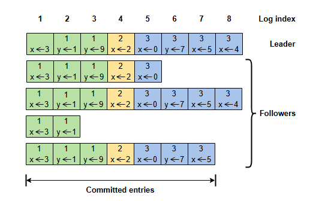
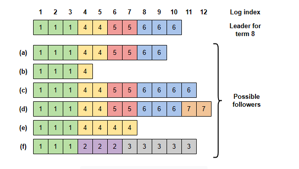

# Обмен данными между узлами Raft

Давайте рассмотрим, как узлы Raft обмениваются данными, какая проблема при этом возникает и как Raft её решает.

## Механизм обмена данными

Узлы обмениваются данными с помощью **удалённых вызовов процедур (RPC)**, и в *Raft* есть два основных типа *RPC*:

* **RequestVote**: Отправляется *кандидатами* во время выборов.
* **AppendEntries**: Отправляется *лидерами* для репликации записей журнала и в качестве сигналов (heartbeats).

Команды хранятся в журнале, реплицируемом на все узлы кластера.

Записи журнала нумеруются последовательно и содержат *терм*, в котором они были созданы, а также соответствующую команду для конечного
автомата, как показано на следующей иллюстрации.

A

Запись считается **зафиксированной (committed)**, если её можно применить к *конечному автомату* узлов. *Raft* гарантирует, что
*зафиксированные* записи **надёжно сохранены (durable)** и в конечном итоге будут выполнены всеми доступными *конечными автоматами*, а также
гарантирует, что никакая другая запись не будет зафиксирована для того же индекса. Он также гарантирует, что все предыдущие записи перед
*зафиксированной* записью также являются *зафиксированными*. Этот статус по сути означает, что по данной записи был достигнут *консенсус*.

Как упоминалось ранее, *лидеры* отвечают за получение команд от клиентов и их репликацию по кластеру. Это происходит в следующем порядке:

1. Когда *лидер* получает новую команду, он добавляет запись в свой собственный журнал, а затем параллельно отправляет запрос
   *AppendEntries* другим узлам, повторяя попытку, если не получает своевременного ответа.
2. Когда *лидер* получает ответ от большинства *последователей*, запись может считаться *зафиксированной*.
3. *Лидер* применяет команду к своему *конечному автомату* и сообщает *последователям*, что они могут сделать то же самое, добавляя
   необходимую информацию о *зафиксированных* записях в последующие сообщения *AppendEntries*.

Конечно, в основном это «счастливый» сценарий.

## Расхождения между узлами

Во время сбоев лидера и последователей между различными узлами могут наблюдаться расхождения. Следующая иллюстрация содержит несколько
примеров этого явления.

Например, *последователь* может выйти из строя и, таким образом, пропустить некоторые (*зафиксированные*) записи (строки a и b на
иллюстрации выше). Он может получить еще несколько (*незафиксированных*) записей (строки c и d). Или же могут произойти оба события (строки
e и f). В частности, сценарий в строке f может произойти, если узел был избран лидером в термах 2 и 3, реплицировал некоторые записи, но
вышел из строя до того, как любая из этих записей была зафиксирована.

## Устранение расхождений

В *Raft* есть дополнительные элементы для устранения этих временных расхождений.

Основной всеобъемлющий принцип заключается в том, что любой избранный *лидер* должен содержать все записи, которые были *зафиксированы* до
*терма*, в котором он стал *лидером*. Затем *лидер* отвечает за помощь всем *последователям* с конфликтующими журналами в их соответствующей
корректировке для повторной конвергенции.

> Важно отметить, что *лидер* только добавляет записи в свой журнал и никогда не обновляет его. Обновлять свои журналы разрешено только
*последователям*.

Эти два аспекта удовлетворяются следующим образом.

* Во время выборов каждый *RPC RequestVote* содержит некоторую информацию о журнале *кандидата*. Голосующий может отдать свой голос за
  *кандидата* только в том случае, если его собственный журнал не является более актуальным, чем журнал *кандидата*. *Raft* определяет,
  какой из двух журналов более актуален, сравнивая индекс и терм последних записей в журналах. *Кандидат* должен получить голоса от
  большинства узлов кластера, чтобы быть избранным, что означает, что каждая зафиксированная запись должна присутствовать хотя бы на одном
  из этих серверов. Если журнал *кандидата* как минимум так же актуален, как и любой другой журнал в этом большинстве, то он гарантированно
  содержит все *зафиксированные* записи.
* При отправке *RPC AppendEntries* *лидер* включает индекс и *терм* записи, которая непосредственно предшествует новым записям в его
  журнале. *Последователи* сверяют это со своими журналами и отклоняют запрос, если их журналы отличаются. Если это происходит, *лидер*
  обнаруживает первый индекс, где их журналы расходятся, и начинает отправлять все записи после этой точки из своего журнала.
  *Последователь* отбрасывает свои собственные записи и добавляет записи *лидера* в свой журнал. В результате их журналы в конечном итоге
  снова сходятся.

## Что происходит, когда лидер выходит из строя до фиксации записи?

Ранее мы упоминали, что *лидер* знает, что запись из его терма может считаться *зафиксированной*, когда она была успешно реплицирована на
большинство узлов. После этого её можно безопасно применять к *конечному автомату*.

Давайте посмотрим, что происходит, когда *лидер* выходит из строя до фиксации записи.

Если последующие *лидеры* получили эту запись, они попытаются завершить её репликацию.

Однако последующий *лидер* не может с уверенностью заключить, что запись из предыдущего *терма* является *зафиксированной*, даже если она
хранится на большинстве узлов.

Причина в том, что существует крайний случай, когда будущие *лидеры* всё ещё могут заменить эту запись, даже если она хранится на
большинстве узлов.

> Полное описание того, как это может произойти, можно найти в оригинальной статье.

В результате, *лидеры* могут с уверенностью заключить, что запись из предыдущего *терма* *зафиксирована*, реплицировав её, а затем
реплицировав поверх неё новую запись из своего *терма*. Если новая запись из его собственного *терма* реплицирована на большинство узлов,
*лидер* может с уверенностью считать её *зафиксированной*. Таким образом, на этом этапе он также может считать *зафиксированными* и все
предыдущие записи.

Итак, *лидеру* гарантировано наличие всех *зафиксированных* записей в начале его *терма*, но он не знает, каких именно. Чтобы это выяснить,
ему необходимо *зафиксировать* запись из своего собственного *терма*. Чтобы ускорить этот процесс в периоды бездействия, *лидер* может
просто *зафиксировать* команду `no-op` (пустая операция) в начале своего *терма*.