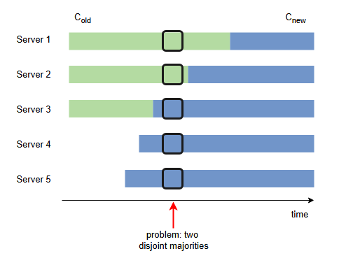

# Реализация Raft

Давайте рассмотрим реализацию Raft.

## Краткий обзор

> То, что было описано до сих пор, составляет основную спецификацию протокола Raft. В оригинальной статье содержится больше информации о некоторых других деталях реализации, которые будут кратко рассмотрены здесь.

Изменения в составе кластера могут быть выполнены с использованием тех же механизмов, сохраняя информацию о членах кластера так же, как и обычные данные.

Важно отметить, что переход от старой конфигурации C_old к новой конфигурации C_new должен осуществляться через переход к промежуточной конфигурации C_joint, которая содержит как старую, так и новую конфигурацию. Это необходимо для предотвращения избрания двух разных лидеров на один и тот же терм. Следующая иллюстрация показывает, как это могло бы произойти, если бы кластер переходил от C_old напрямую к C_new.

Во время промежуточного перехода записи журнала реплицируются на серверы обеих конфигураций. Любой узел из обеих конфигураций может выступать в роли *лидера*, а для достижения *консенсуса* требуется большинство как от старой, так и от новой конфигурации. После того как конфигурация C_joint была *зафиксирована*, *кластер* переходит к новой конфигурации C_new.

Поскольку журнал может расти бесконечно, также должен существовать механизм, предотвращающий исчерпание места для хранения.

### Механизм для предотвращения проблемы нехватки места
Узлы могут выполнять **уплотнение журнала (log compaction)**, записывая снимок текущего состояния системы в постоянное хранилище и удаляя старые записи.

При обработке запросов на чтение от клиентов *лидер* должен сначала отправить сигналы (heartbeats), чтобы убедиться, что он по-прежнему является текущим *лидером*. Это гарантирует **линеаризуемость** чтений.

В качестве альтернативы, *лидеры* могут полагаться на **механизм heartbeats** для предоставления некоторой формы аренды (lease), но это потребует предположения об ограниченной рассинхронизации часов для обеспечения безопасности.

*Лидер* также может выйти из строя после применения *зафиксированной* записи к своему *конечному автомату*, но до ответа клиенту.

В этих случаях предполагается, что клиенты будут повторять запрос к новому *лидеру*. Если эти запросы помечены уникальными серийными номерами, узлы *Raft* могут идентифицировать уже выполненные команды и отвечать клиентам, не выполняя тот же запрос дважды.

---
Вам представлен рабочий процесс **алгоритма консенсуса Raft** ниже. Ваша задача — расположить его шаги в правильном порядке.

1.  Последователи сбрасывают тайм-аут выборов при получении действительных сигналов (heartbeats) от лидера.
2.  Лидер отправляет периодические сигналы (heartbeats) для поддержания власти и предотвращения выборов.
3.  Кандидаты запрашивают голоса у других узлов и голосуют за себя.
4.  Лидер реплицирует записи журнала последователям с помощью RPC AppendEntries.
5.  Все узлы в кластере начинают как последователи.
6.  Первый кандидат, получивший большинство голосов, становится новым лидером кластера.
7.  Лидер добавляет запросы клиентов в свой журнал как новые записи.
8.  Лидер фиксирует записи, когда большинство последователей успешно их реплицируют.
9.  Зафиксированные записи применяются к конечным автоматам в порядке их следования в журнале.
10. Последователи становятся кандидатами и начинают выборы, когда истекает тайм-аут ожидания сигнала (heartbeat).

 
<b>Показать ответ</b>

1. Все узлы начинают работу как последователи в кластере.
2. Лидер отправляет периодические сердцебиения, чтобы поддерживать авторитет и предотвратить выборы.
3. Последователи сбрасывают тайм-аут выборов при получении действительных сердцебиений от лидера.
4. Последователи становятся кандидатами и начинают выборы, когда истекает тайм-аут сердцебиения.
5. Кандидаты запрашивают голоса у других узлов и голосуют за себя.
6. Первый кандидат, получивший большинство голосов, становится новым лидером кластера.
7. Лидер добавляет запросы клиентов как новые записи в свой журнал.
8. Лидер реплицирует записи журнала последователям с использованием RPC AppendEntries.
9. Лидер фиксирует записи, когда большинство последователей успешно их реплицируют.
10. Зафиксированные записи применяются к конечным автоматам в порядке журнала.

Эта последовательность обеспечивает сохранение согласованности и доступности системы, даже в случае сбоев.

