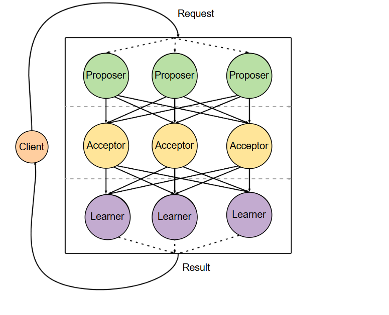

# Алгоритм Paxos

В этом уроке мы рассмотрим, как алгоритм Paxos решает проблему консенсуса.

Некоторые алгоритмы, вероятно, можно было бы применить в качестве решения проблемы консенсуса. Например, можно использовать [двухфазный протокол подтверждения](https://www.educative.io/courses/distributed-systems-practitioners/2-phase-commit-2pc), в котором координатор будет управлять процессом голосования. Однако такой протокол будет иметь очень ограниченную отказоустойчивость, поскольку отказ одного узла (координатора) может привести к остановке всей системы.

Очевидный следующий шаг — разрешить нескольким узлам наследовать роль координатора в случаях сбоя. Это может привести к появлению нескольких первичных узлов, которые могут давать противоречивые результаты.

> Это явление демонстрируется в уроке по [многопервичной репликации](https://www.educative.io/courses/distributed-systems-practitioners/multi-primary-replication-algorithm) и уроке по [трехфазной фиксации](https://www.educative.io/courses/distributed-systems-practitioners/3-phase-commit-3pc).

Одним из первых алгоритмов, который смог безопасно решить задачу консенсуса в условиях подобных сбоев, является алгоритм Paxos.

## История алгоритма Paxos

Этот алгоритм гарантирует, что система придет к соглашению по одному значению и допустит отказ любого количества узлов (потенциально всех) при условии, что более половины узлов будут работать исправно в любой момент времени, что является существенным улучшением.

Забавно, что этот алгоритм был придуман Лесли Лэмпортом, когда он пытался доказать, что это на самом деле невозможно! Он решил объяснить алгоритм с помощью парламентской процедуры, используемой на вымышленном древнегреческом острове Паксос. Несмотря на элегантность и большую занимательность, эта [первая статья](ссылка на статью) не получила одобрения в академическом сообществе, которое сочло ее чрезвычайно сложной и не смогло понять ее применимость в области распределенных систем.

Несколько лет спустя, после нескольких успешных попыток использования алгоритма в реальных системах, Лэмпорт решил опубликовать [вторую статью](ссылка на статью), объяснив алгоритм более простыми словами и показав, как его можно использовать для построения реальной, высокодоступной распределенной системы.

Историческим наследием всего этого является тот факт, что алгоритм Paxos до сих пор считается довольно сложным. Надеемся, этот раздел поможет развеять этот миф.

## Роли

Алгоритм Paxos определяет три различные роли:

- Авторы предложений
- Акцепторы
- Учащиеся

Каждый узел в системе потенциально может играть несколько ролей.

### Автор предложения

Предлагающий несёт ответственность за предложение ценностей (потенциально полученных по запросам клиентов) принимающим сторонам и пытается убедить их принять эти ценности для достижения общего решения.

### Акцептор

Акцептант несёт ответственность за получение этих предложений и предоставление ответа с решением о том, можно ли выбрать это значение или нет.

### Учащиеся

Обучающиеся отвечают за изучение результата консенсуса, его сохранение (в тиражируемом виде) и потенциальное действие на его основе, либо уведомляя клиентов о результате, либо выполняя действия.

На следующем рисунке представлен визуальный обзор этих ролей и того, как они взаимодействуют с клиентами.

## Фазы

Алгоритм Paxos разделен на две фазы, каждая из которых состоит из двух частей:

### Фаза 1 (а)

Предлагающий выбирает число N и отправляет запрос на подготовку с этим номером prepare(N) по крайней мере большинству акцептантов.

N — это круглый идентификатор, обладающий двумя интересными свойствами:

1. Идентификатор раунда должен быть больше идентификатора любого предыдущего раунда, использованного любым другим участником в нашем кластере Paxos. Это достигается путём увеличения счётчика i++.
2. Сделайте идентификаторы раундов уникальными, поскольку мы не хотим, чтобы два участника предложили один и тот же идентификатор раунда и использовали его повторно. Повторное использование идентификаторов нарушит протокол. Для этого мы добавляем значение node_number к счётчику.

> Мы будем использовать функцию cat(i++, node_number), которая добавляется node_number к счетчику i++.

### Фаза 1 (б)

При получении запроса на подготовку у акцептора есть следующие возможности:

- Если он еще не ответил на другой запрос на подготовку с более высоким номером N, он отвечает на запрос обещанием не принимать больше никаких предложений, которые пронумерованы меньше, чем N. Он также возвращает принятое предложение с наивысшим номером, если таковое имеется.
- В противном случае, если он уже принял запрос на подготовку с более высоким номером, он отклоняет этот запрос. В идеале это даёт инициатору подсказку о номере другого запроса на подготовку, на который он уже ответил.

### Фаза 2 (а)

Если предлагающий получает ответ на свой запрос N от большинства акцепторов, тогда он отправляет подтверждение(N, v) запрос к этим акцепторам на предложение с номером N со значением v. Значение выбирается по следующей логике:

- Если кто-либо из акцепторов уже принял другое предложение и включил его в свой ответ, то предлагающий использует значение предложения с наибольшим номером среди этих ответов. По сути, это означает, что предлагающий пытается завершить последнее предложение.
- В противном случае, если ни один из акцепторов не принял другое предложение, предлагающий может выбрать любое желаемое значение. Это значение обычно выбирается на основе запросов клиентов.

### Фаза 2 (б)

Если акцептор получает акцепт(N, v) запрос предложений с номером N, он принимает предложение, если только он еще не ответил на подготовку(k) запрос большего числа (k > N).

## Пример

В качестве примера можно отметить, что предлагающие также могут играть роль обучающихся, поскольку они в любом случае получают некоторые из ответов о принятии, минимизируют трафик и повышают производительность системы.

На этапе 1 (а) протокола предлагающие должны выбрать номер предложения N. Эти номера должны быть уникальными, чтобы протокол сохранял свои свойства корректности. Это необходимо для того, чтобы принимающие всегда могли сравнить два сообщения о подготовке.

Этого можно добиться несколькими способами, но самый простой — составить эти числа из двух частей: одна — целое число, а вторая — уникальный идентификатор предлагающего (то есть IP-адрес узла). Таким образом, предлагающие могут выбирать числа из одного и того же набора.

Как мы уже упоминали в начале этого раздела, несколько инициаторов могут инициировать одновременные запросы на подготовку. Инициатор, получивший ответ на свой запрос на подготовку от большинства акцепторов, по сути, избирается текущим (но временным) лидером.

В результате он может продолжить процедуру запроса предложений. Ценность этого предложения будет выбрана, если только большинство акцепторов не отклонили предложение (и не ответили на него) или другой лидер не взял на себя роль временного лидера (в этом случае акцепторы отклонят это предложение).

## Основной ингредиент протокола Paxos

Основой протокола Paxos является уже знакомая нам концепция — кворум. В частности, протокол Paxos использует кворум большинства.

Кворум большинства состоит из более чем половины узлов системы, например, по крайней мере k+1 узлы в системе 2k узлов.

Этот протокол гарантирует, что два разных автора предложений не смогут одновременно завершить обе фазы протокола, поскольку для продолжения работы над предложением требуется кворум большинства. В результате может быть выбрано только одно значение, что соответствует свойству консенсуса.
