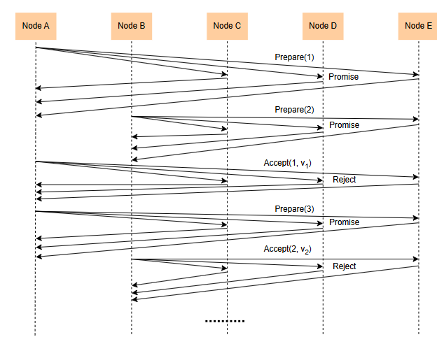
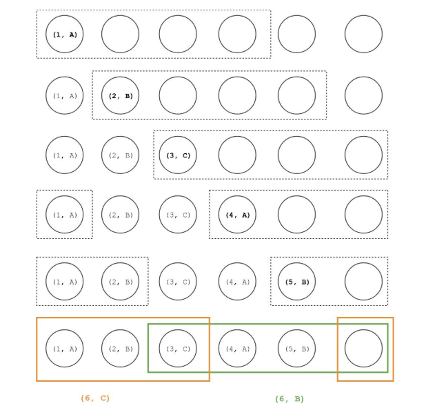

# Хитросплетения Paxos

Давайте рассмотрим тонкости Paxos, которые возникают при решении проблемы выборов лидера и обработке частичных сбоев.

Многие посчитали, что протокол Paxos сложен для понимания. Одной из причин этого является внутренняя сложность проблемы консенсуса, которая, в свою очередь, возникает из-за возросшего параллелизма и большого пространства состояний распределенных систем.

> В этом уроке мы рассмотрим некоторые пограничные случаи и то, как Paxos их обрабатывает. Конечно, мы не сможем охватить все возможные случаи, так как это потребовало бы гораздо больше усилий. Примеры, представленные в этом уроке, помогут нам понять основные элементы протокола и послужат отправной точкой для изучения любых других случаев, которые могут прийти нам на ум.

Для всех примеров, представленных в этом уроке, мы будем предполагать, что узлы играют все роли протокола, то есть являются одновременно инициаторами, и приемниками, и обучающимися, чтобы упростить наши объяснения.

> Имейте в виду, что это реалистичное предположение, поскольку многие реализации протокола Paxos следуют этому подходу.

## Paxos решает проблему выборов лидера

Paxos можно использовать для решения задачи выборов лидера.

> Для достижения консенсуса Paxos необходимо избрать лидера, что похоже на тупик.

Протокол Paxos разрешает этот парадокс, позволяя избирать нескольких лидеров, тем самым устраняя необходимость достижения консенсуса по самому лидеру. Он по-прежнему должен гарантировать, что будет принято единое решение, даже если несколько узлов предлагают разные значения.

Давайте рассмотрим, как Paxos этого добивается и каковы некоторые последствия.

Когда предлагающий получает ответ на сообщение подготовки от большинства узлов, он считает себя (временным) лидером и продолжает выдвигать предложение. Если за это время ни один другой предлагающий не пытался стать лидером, его предложение будет принято. Однако, если другому предлагающему удалось стать лидером, запросы на принятие от исходного узла будут отклонены. Это предотвращает выбор нескольких значений предложениями обоих узлов.

### Дуэль заявителей

Приведенное выше решение приводит к ситуации, когда предлагающие постоянно соревнуются друг с другом, не достигая при этом никакого прогресса.

### Способ справиться с дуэлью претендентов

Есть много способов избежать попадания в этот бесконечный цикл.

Самый простой способ — заставить предлагающих использовать случайные задержки или экспоненциальную задержку каждый раз, когда их сообщения о принятии отклоняются и им приходится отправлять новый запрос на подготовку. Таким образом, они дают узлу, который в данный момент является лидером, больше времени для завершения протокола, предлагая успешное предложение, а не конкурируя.

## Paxos обрабатывает частичные отказы

Еще одним интересным аспектом протокола Paxos является то, как он корректно обрабатывает частичные сбои, постоянно поддерживая безопасность.

В этом контексте под частичными сбоями мы подразумеваем случаи, когда узел отправляет сообщение нескольким узлам (т.е. принимает сообщения в рамках [фазы 2.a](https://www.educative.io/collection/page/10370001/4891237377638400/5732699023605760#phase-2-a)), и только некоторые из них доставляются либо из-за сбоев узлов, либо из-за проблем с сетью.

Рассмотрим крайний случай, когда несколько предлагающих пытаются предложить разные значения, но только одно из их сообщений о принятии доходит до принимающих, составляющих кворум большинства. Следующая иллюстрация наглядно иллюстрирует выполнение протокола для лучшего понимания.

- Каждая строка представляет отдельный раунд протокола.
- Пунктирная рамка показывает, какие узлы вошли в кворум большинства Фазы 1.
- Текст внутри каждого узла отображает любое предложение, которое уже было принято в форме (n, v), где n — это номер предложения, и v — стоимость предложения.
- Жирным шрифтом выделены значения, принятые в данном раунде.

Как мы видим, каждому предлагающему удается отправить сообщение о принятии только одному принимающему за каждый раунд.

В течение первых трех раундов ни один из узлов в кворуме большинства не принял никакого значения, поэтому предлагающие могут свободно предлагать свое собственное значение.

В четвёртом и пятом раундах заявители должны предложить стоимость предложения с наивысшим номером, принятого акцепторами, входящими в кворум большинства первого этапа. Это A для четвёртого раунда и B для пятого раунда.

Как было показано в шестом раунде, на этом этапе поведение частично зависит от используемого кворума. Например, если следующий предлагающий выберет жёлтый кворум, будет предложено значение C, а если будет использован зелёный кворум, будет предложено значение B.

Однако следует отметить один важный момент: как только система восстановится после сбоев и предлагающему удастся добиться принятия предложения большинством кворума, тогда это значение будет выбрано, и его нельзя будет изменить.

Это связано с тем, что любому последующему автору предложения потребуется получить кворум большинства для фазы 1 протокола. Это большинство должно включать как минимум один узел из большинства, принявшего вышеупомянутое предложение, тем самым передавая принятое предложение потенциальному лидеру.

Более того, гарантируется, что это будет предложение с наивысшим номером, а это значит, что любой последующий предлагающий может передать выбранное значение только тем принимающим, у которых его еще нет.
