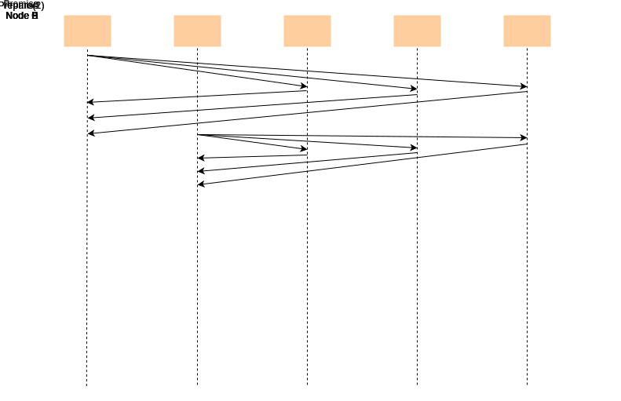
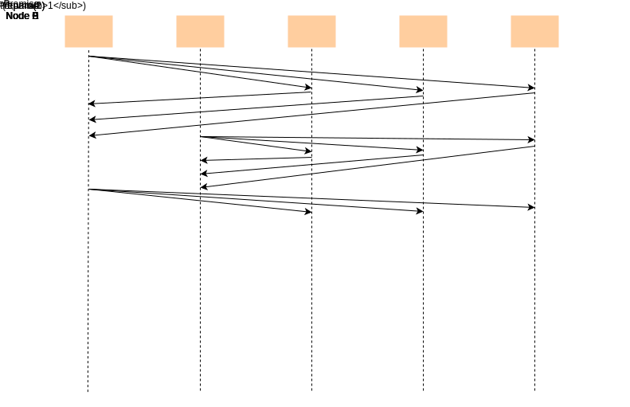
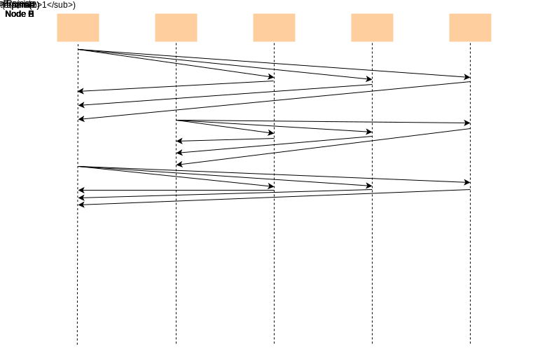
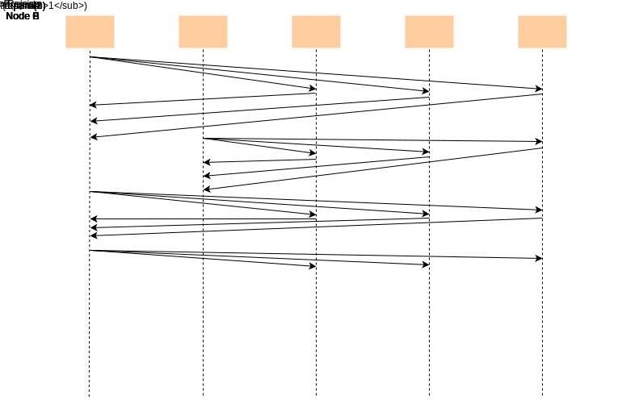
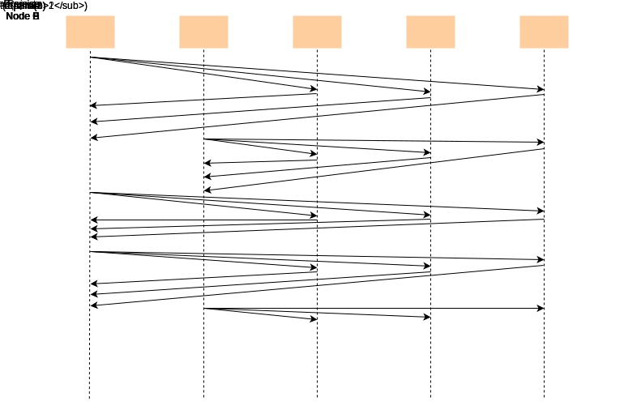
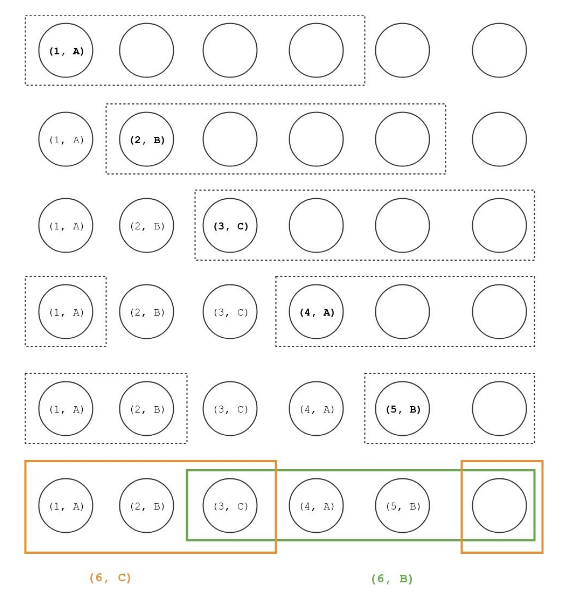

# Сложности Paxos

Протокол Paxos многими считался сложным для понимания.

Одна из причин этого — внутренняя сложность проблемы консенсуса, которая, в свою очередь, проистекает из повышенного параллелизма и большого
пространства состояний распределённых систем.

> В этом уроке мы рассмотрим некоторые крайние случаи и то, как Paxos с ними справляется. Конечно, мы не сможем охватить все возможные
> случаи, так как это была бы гораздо более масштабная задача. Примеры, представленные в этом уроке, помогут нам понять основные части
> протокола и дадут отправную точку для изучения любых других случаев, о которых мы можем подумать.

Для всех примеров, представленных в этом уроке, мы будем предполагать, что узлы выполняют все роли протокола, то есть являются одновременно
«предлагающими» (proposers), «принимающими» (acceptors) и «узнающими» (learners), чтобы упростить наши объяснения.

> Имейте в виду, что это реалистичное допущение, поскольку многие реализации протокола Paxos следуют этому подходу.

## Paxos решает проблему выбора лидера

*Paxos* можно использовать для решения проблемы **выбора лидера**.

> Самому *Paxos* для достижения консенсуса необходимо выбрать лидера, что кажется «уловкой-22».

Протокол *Paxos* разрешает этот парадокс, позволяя избирать нескольких лидеров, таким образом не требуя достижения консенсуса для самого
лидера.

Он по-прежнему должен гарантировать, что будет принято единое решение, даже если несколько узлов могут предлагать разные значения.

Давайте рассмотрим, как *Paxos* этого достигает и каковы некоторые из последствий.

Когда «предлагающий» получает ответ на сообщение о подготовке от большинства узлов, он считает себя (временным) лидером и переходит к
предложению. Если за это время ни один другой «предлагающий» не попытался стать лидером, его предложение будет принято. Однако, если другому
«предлагающему» удалось стать лидером, запросы на принятие от исходного узла будут отклонены. Это предотвращает выбор нескольких значений из
предложений обоих узлов.

### Соревнующиеся предлагающие

Вышеописанное решение приводит к ситуации, когда «предлагающие» постоянно соревнуются друг с другом, не достигая никакого прогресса, как мы
можем видеть на следующей иллюстрации.

(Подписи к иллюстрации «Соревнующиеся предлагающие»):

1. Распределённая система из пяти узлов
   

2. Узел A хочет стать лидером, поэтому он отправляет сообщение Prepare, чтобы получить голоса от большинства узлов в кворуме.
   

3. Узел A получает ответ от большинства узлов в кворуме, поэтому он считает себя (временным) лидером.
   

4. Прежде чем узел A приступил к предложению, узел B попытался стать лидером.
   

5. Узел B получает ответ от большинства узлов в кворуме, поэтому он считает себя (временным) лидером.
   

6. Узел A отправляет запрос Accept всем узлам в кворуме.
   

7. Поскольку более поздний «предлагающий» (Узел B) сумел стать лидером, запрос Accept от предыдущего «предлагающего» (Узла A) будет
   отклонён.
   

8. Узел A снова пытается стать лидером.
   

9. Узел A считает себя (временным) лидером, так как получает ответ от большинства узлов в кворуме.
   

10. Узел B отправляет запрос Accept всем узлам в кворуме.
    

11. Поскольку Узлу A снова удалось стать лидером, запрос Accept от Узла B будет отклонён всеми узлами.
    

12. Этот процесс продолжается. «Предлагающие» постоянно соревнуются друг с другом, не достигая никакого прогресса.
    

> v_N — это значение согласно определению запроса accept (N,v) на Фазе 2(b) протокола Paxos в уроке «Алгоритм Paxos».

Существует много способов избежать попадания в этот бесконечный цикл.

### Способ обработки соревнующихся предлагающих

Самый простой способ — заставить «предлагающих» использовать случайные задержки или экспоненциальную выдержку (exponential back-off) каждый
раз, когда их сообщения о принятии отклоняются и им приходится отправлять новый запрос на подготовку. Таким образом, они дают больше времени
узлу, который в данный момент лидирует, чтобы завершить протокол, сделав успешное предложение, вместо того чтобы конкурировать.

## Paxos обрабатывает частичные сбои

Другой интересный аспект протокола Paxos — это то, как он корректно обрабатывает частичные сбои, постоянно поддерживая безопасность (
safety).

В этом контексте под частичными сбоями мы подразумеваем случаи, когда узел отправляет сообщение нескольким узлам (т.е. сообщения о принятии
в рамках Фазы 2.a), и только некоторые из них доставляются из-за сбоев узлов или проблем в сети.

Давайте рассмотрим крайний случай, когда несколько «предлагающих» пытаются предложить разные значения, но только одно из их сообщений о
принятии доставляется «принимающим» из мажоритарного кворума. Следующая иллюстрация представляет визуализацию выполнения протокола для
облегчения понимания.

* Каждая строка представляет отдельный раунд протокола.
* Пунктирная рамка показывает, какие узлы были включены в мажоритарный кворум Фазы 1.
* Текст внутри каждого узла отображает любое предложение, которое уже было принято, в форме (n, v), где n — номер предложения, а v —
  значение предложения.
* Жирный текст представляет значения, которые были приняты в этом раунде.

Как мы видим, каждому «предлагающему» удается доставить сообщение о принятии только одному «принимающему» в каждом раунде.

В первых трёх раундах ни один из узлов в мажоритарном кворуме не принял никакого значения, поэтому «предлагающие» могут свободно предлагать
свои собственные значения.

В четвёртом и пятом раундах «предлагающие» должны предложить значение предложения с самым высоким номером, которое было принято
«принимающими», включёнными в мажоритарный кворум Фазы 1. Это значение A для четвёртого раунда и B для пятого.

Как показано для шестого раунда, на этом этапе поведение частично зависит от того, какой кворум будет использован. Например, если следующий
«предлагающий» выберет жёлтый кворум, будет предложено значение C, в то время как значение B будет предложено, если вместо него будет
использован зелёный кворум.

Однако следует отметить одну важную вещь: как только система восстанавливается после сбоев и «предлагающему» удается добиться принятия
предложения мажоритарным кворумом, это значение выбирается и не может быть изменено.

Причина в том, что любому последующему «предлагающему» потребуется получить мажоритарный кворум для Фазы 1 протокола. Это большинство должно
будет содержать как минимум 1 узел из большинства, которое приняло вышеупомянутое предложение, тем самым передавая принятое предложение
потенциальному лидеру.

Более того, гарантируется, что это будет предложение с самым высоким номером, что означает, что любой последующий «предлагающий» может
только распространять выбранное значение среди «принимающих», у которых его еще может не быть.