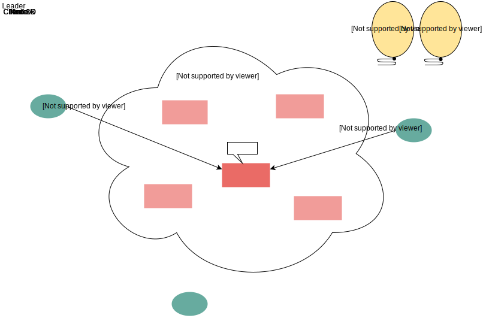

# Реплицированный конечный автомат через консенсус

В этом уроке мы объясним, как можно использовать алгоритм консенсуса для создания реплицированного конечного автомата.

В начале этой главы мы кратко описали, как алгоритм консенсуса может быть использован для решения широкого круга задач.

Это не случайно, поскольку все эти проблемы имеют общую, фундаментальную характеристику. Она заключается в том, что все они могут быть в некоторой степени смоделированы как **конечный автомат**. Это также является причиной, почему их легче решать в **централизованной** среде, но гораздо сложнее, когда мы хотим решить их в **распределённой** среде для повышения **доступности**.

## Создание реплицированного конечного автомата с использованием алгоритма консенсуса

Используя алгоритм консенсуса, мы можем создать реплицированный конечный автомат. Это набор узлов, каждый из которых получает команды и выполняет их, переходя между состояниями.

Если все узлы используют один и тот же конечный автомат, всё, что нам нужно, — это обеспечить, чтобы все узлы получали одни и те же входные данные в одном и том же порядке, и тогда мы можем гарантировать, что все узлы будут совершать одинаковые переходы. Это будет означать, что распределённая система будет выглядеть извне как единый сервер.

В результате можно получить все преимущества распределённой системы, сохраняя при этом простую модель программирования.

Следующая иллюстрация содержит высокоуровневый обзор такой системы.

Верхний уровень получает запросы от клиентов. Он создаёт предложения для уровня консенсуса, который осуществляет необходимую координацию между другими узлами системы и распространяет выбранные значения на нижний уровень, который получает эти значения в качестве входных данных и выполняет необходимые переходы состояний.

### Использование Paxos на уровне консенсуса

Давайте немного подробнее остановимся на том, что это повлечёт за собой, если предположить, что в качестве уровня консенсуса системы используется Paxos.

По сути, клиенты будут отправлять обычные запросы в систему, в зависимости от её предметной области. Эти запросы могут быть либо командами для системы, либо запросами на проверку её внутреннего состояния.

Эти запросы будут отправляться текущему лидеру системы, который будет определён на основе предыдущих экземпляров консенсуса.

Если узел, не являющийся лидером, получает запрос, он может вернуть адрес лидера, чтобы клиент мог перенаправить его.

> При начальной загрузке системы, когда экземпляры консенсуса ещё не выполнялись, лидер может быть определён из конфигурационного файла, или узлы могут конкурировать друг с другом за роль лидера.

Каждый раз, когда узел-лидер получает новую команду, он пытается выполнить новый экземпляр консенсуса, каждый раз увеличивая номер экземпляра.

1.  Три клиента и пять узлов, работающих по протоколу Paxos, где узел D выступает в роли лидера.
    

2.  Клиент 1 отправляет запрос R1 узлу C, который не является лидером.
    

3.  Узел C отвечает клиенту 1, сообщая идентификатор лидера.
    

4.  Клиент 1 повторно отправляет запрос R1 лидеру.
    

5.  Лидер запускает экземпляр Paxos 1.
    

6.  Лидер завершает экземпляр Paxos для R1.
    

7.  Лидер отправляет подтверждение клиенту 1.
    

8.  Клиент 2 отправляет запрос R2 лидеру.
    

9.  Лидер запускает экземпляр Paxos 2.
    

10. Клиент 3 отправляет еще один запрос R3 до того, как лидер завершит экземпляр Paxos для R2.
    

11. Лидер запускает экземпляр Paxos 3.
    

12. Экземпляр 3 завершается.
    

13. Поскольку экземпляр 2 еще не завершен, мы не можем отправить клиенту 2 подтверждение. Итак, экземпляр 2 завершается.
    

14. Лидер отправляет подтверждение клиенту 2 для R2.
    

15. Лидер отправляет подтверждение клиенту 3 для R3.
    

Для достижения удовлетворительной производительности несколько экземпляров консенсуса могут выполняться параллельно. Однако в некоторых местах для обеспечения корректности необходимо выполнять сериализацию.

Например, нижний уровень должен обрабатывать решение экземпляра консенсуса только тогда, когда он обработал все предыдущие экземпляры, чтобы гарантировать, что все конечные автоматы выполняют одинаковые переходы.

Аналогично, лидер должен дождаться завершения экземпляра и ответить соответствующему клиенту только после завершения всех предыдущих экземпляров.

Когда текущий лидер нестабилен и другие узлы начинают делать предложения, может возникнуть повышенная конкуренция, что, например, создаст значительные задержки для любых последующих экземпляров, которые могли бы быть завершены.

> В этих случаях узлы могут предлагать фиктивное значение, которое по сути представляет собой пустую операцию (no-op), отклоняя операцию клиента.

Эта абстракция реплицированного конечного автомата довольно мощна и потенциально может быть использована для реализации решений многих распространённых проблем в области распределённых систем.