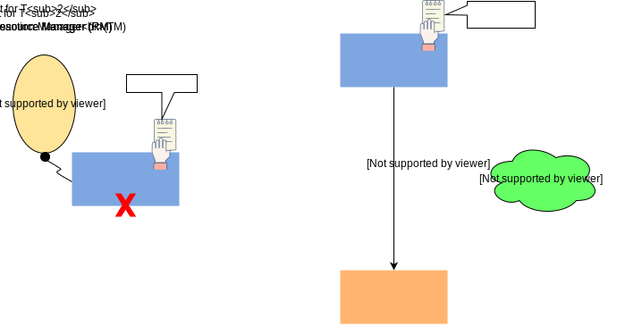

# Распределённые транзакции через консенсус

Давайте рассмотрим, как мы можем решать проблемы распределённых транзакций с помощью алгоритмов консенсуса, несмотря на различия между ними.

Во введении к этой главе упоминалось, что **проблема консенсуса** очень похожа на проблему **распределённых транзакций**.

Однако после изучения **алгоритма Paxos** можно подумать, что существует фундаментальное противоречие между *распределёнными транзакциями* и способом, которым *Paxos* решает *проблему консенсуса*.

## Ключевая характеристика распределённых транзакций
Ключевой характеристикой распределённых транзакций является ***атомарность***. Соответствующее обновление должно быть выполнено либо на всех узлах, либо ни на одном из них.

## Различие между проблемой транзакций и проблемой консенсуса
Однако алгоритм *Paxos* для принятия решения о значении полагается лишь на мажоритарный **кворум**. По словам Хадзилакоса (Hadzilacos), «Действительно, проблема *распределённых транзакций*, известная как **атомарная фиксация (atomic commit)**, и *проблема консенсуса* могут быть тесно связаны. Тем не менее, они не эквивалентны».

*   *Проблема консенсуса* требует, чтобы каждый исправный узел пришёл к одному и тому же решению, в то время как *проблема атомарной фиксации* требует, чтобы все узлы (исправные или нет) пришли к одному и тому же решению.
*   *Проблема атомарной фиксации* накладывает более строгие связи между голосами или предложениями и окончательным решением, чем *проблема консенсуса*.
*   В *консенсусе* единственное требование — согласованное значение должно быть предложено хотя бы одним из узлов. В *атомарной фиксации* решение может быть положительным только в том случае, если все голоса были положительными. Также требуется, чтобы решение было положительным, если все голоса положительны и нет сбоев.

> В результате этого различия можно подумать, что алгоритм *Paxos* ничего не может предложить в области решения проблем *распределённых транзакций*. Это не так, и в этом уроке мы попытаемся проиллюстрировать, что может предложить *Paxos* (и любой другой *алгоритм консенсуса*).

## Наибольший вклад алгоритма консенсуса
Один из полезных вкладов *алгоритма консенсуса* заключается в том, что он передает результаты **менеджеров ресурсов** обратно **менеджеру транзакций**, что требует успешного обмена данными со всеми из них, а не только с большинством.

Однако его истинная ценность заключается в отказоустойчивом хранении и передаче результата транзакции обратно *менеджерам ресурсов*, чтобы сбой одного узла (*менеджера транзакций*) не мог заблокировать систему.

### Как этого достичь
Действительно, существует очень простой способ достичь этой цели в существующем протоколе **двухфазной фиксации (2PC)**, используя *алгоритм консенсуса*.

Предположив, что мы используем *Paxos* в качестве *алгоритма консенсуса*, мы могли бы заставить *менеджера транзакций* запускать новый экземпляр *Paxos*, предлагая значение для результата транзакции, вместо того чтобы просто хранить результат локально перед отправкой его обратно *менеджерам ресурсов*.

Значением предложения было бы либо **commit** (зафиксировать), либо **abort** (откатить), в зависимости от предыдущих результатов каждого из *менеджеров ресурсов*. Сама по себе эта корректировка сделала бы протокол *двухфазной фиксации* устойчивым к сбоям *менеджера транзакций*, поскольку другой узел мог бы взять на себя роль *менеджера транзакций* и завершить протокол. Этому узлу пришлось бы прочитать результат транзакции из любого существующего экземпляра *Paxos*. Если решения нет, этот узел мог бы свободно сделать предложение *abort*.

1.  Распределённая система с двумя менеджерами ресурсов (RM) и одним менеджером транзакций (TM).
    

2.  TM создает экземпляр Paxos.
    

3.  TM принимает решение и хранит результат для транзакции T1.
    

4.  TM отправляет результат T1 (commit/abort) менеджерам ресурсов (RM).
    

5.  Транзакция T1 завершается.
    

6.  TM запускает экземпляр Paxos для транзакции T2.
    

7.  TM принимает решение и хранит результат T2.
    

8.  TM выходит из строя до отправки результата T2 менеджерам ресурсов.
    

9.  Один из RM избирается лидером.
    

10. Новый лидер считывает результат из локального экземпляра Paxos.
    

11. Если лидер не может найти результат T2 в локальном экземпляре Paxos, он принимает решение о результате транзакции самостоятельно.
    

12. Теперь новый узел-лидер имеет результат транзакции T2.
    

13. Другие RM получают результат T2.
    

14. Транзакция T2 завершается.
    

#### Дополнительный раунд сообщений
Вышеописанный метод прост и элегантен, но он потребует добавления еще одного раунда обмена сообщениями в протокол *двухфазной фиксации*.

На самом деле можно убрать дополнительный раунд сообщений, пожертвовав некоторой простотой ради повышения **производительности**.

#### Устранение дополнительного раунда сообщений
Мы могли бы убрать дополнительный раунд сообщений, по сути, «вплетая» несколько экземпляров *Paxos* в обычный протокол *двухфазной фиксации*, что практически полностью устраняет необходимость в *менеджере транзакций*.

Более конкретно, *менеджерам ресурсов* пришлось бы отправлять свой ответ на первую фазу набору ***«принимающих» (acceptors)***, вместо того чтобы отправлять его *менеджеру транзакций*. Это создает отдельный экземпляр *Paxos* для каждого *менеджера ресурсов*, участвующего в транзакции.

Аналогично, *«принимающие»* могли бы распространять выбранные значения напрямую *менеджерам ресурсов*, а не делать это косвенно через *менеджера транзакций*.

*Менеджеры ресурсов* были бы ответственны за проверку того, что все экземпляры *Paxos* от других *менеджеров ресурсов* имели положительный результат (соответствующий первой фазе *2PC*), чтобы *зафиксировать* транзакцию.

> Статья под названием «Консенсус по фиксации транзакций» (Consensus on transaction commit) исследует эту взаимосвязь между *распределёнными транзакциями* и *консенсусом* и объясняет этот подход гораздо подробнее, называя его **Paxos commit**. Эта статья также демонстрирует, почему *двухфазная фиксация* по сути является частным случаем *Paxos commit* с нулевой отказоустойчивостью к сбоям узлов (f = 0).