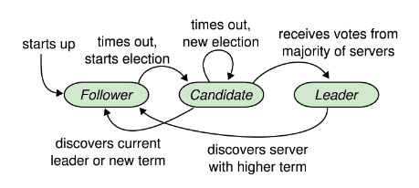

# Введение в Raft

Давайте разберёмся, зачем был создан алгоритм Raft, если для решения проблемы консенсуса уже существовал алгоритм Paxos.

## Мотивация

**Paxos** был каноническим решением **проблемы консенсуса**. Однако начальная спецификация алгоритма не охватывала некоторые аспекты, которые были критически важны для реализации алгоритма на практике; некоторые из этих аспектов были рассмотрены в последующих работах.

Алгоритм *Paxos* также повсеместно считается сложным для понимания.

В ответ на эти проблемы исследователи решили создать новый алгоритм с целью улучшения понятности и простоты реализации. Этот алгоритм, предложенный Онгаро и соавторами (Ongaro et al.), называется **Raft**.

> В этом уроке мы кратко рассмотрим *алгоритм Raft*, поскольку он послужил хорошей основой для многих практических реализаций. Он наглядно демонстрирует, как различные описанные ранее аспекты могут быть объединены в единый протокол.

## Начало работы с Raft

*Raft* делает концепцию **реплицированного конечного автомата** и связанного с ним реплицированного журнала команд первоклассными сущностями и по умолчанию поддерживает несколько последовательных раундов *консенсуса*.

Он требует наличия набора узлов, образующих **группу консенсуса**, которая называется **кластером Raft**. Каждый из этих узлов может находиться в одном из трёх состояний:

*   Лидер
*   Последователь
*   Кандидат

### Состояния узлов

Один узел избирается *лидером* и отвечает за получение записей журнала от клиентов (предложений) и их репликацию на другие узлы-***последователи*** для достижения *консенсуса*.

*Лидер* отвечает за отправку сигналов (heartbeats) другим узлам для поддержания своего лидерства.

Любой узел, который некоторое время не получал сообщений от *лидера*, предполагает, что *лидер* вышел из строя; он переходит в состояние **кандидата** и пытается стать *лидером*, инициируя новые выборы.

С другой стороны, если предыдущий *лидер* обнаруживает, что другой узел получил лидерство, он возвращается в состояние *последователя*.

Следующая иллюстрация показывает поведение узлов в зависимости от их состояния.

### Предотвращение одновременной работы двух лидеров

Чтобы предотвратить одновременную работу двух лидеров, *Raft* вводит временную концепцию **термов (сроков)**.

### Термы

Время делится на *термы*, которые нумеруются последовательными целыми числами.

Каждый *терм* начинается с выборов, в которых один или несколько *кандидатов* пытаются стать *лидерами*.

Чтобы стать *лидером*, *кандидату* необходимо получить голоса от большинства узлов. Каждый узел голосует не более чем за один узел в каждом *терме* по принципу **«первый пришёл — первый обслужен» (first-come-first-served)**. Следовательно, не более одного узла может победить на выборах в определённом *терме*, поскольку два разных большинства будут конфликтовать как минимум по одному узлу.

Если *кандидат* побеждает на выборах, он выступает в роли *лидера* до конца *терма*.

> Любой *лидер* из предыдущих термов не сможет реплицировать новые записи в журнале по всей группе, поскольку проголосовавшие за нового *лидера* узлы будут отклонять его запросы, и в конечном итоге он обнаружит, что был смещён.

Если ни одному из *кандидатов* не удаётся получить большинство голосов в *терме*, этот *терм* заканчивается без *лидера*, и сразу после этого начинается новый *терм* (с новыми выборами).