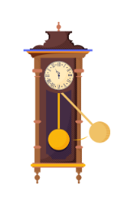
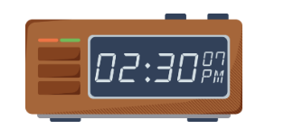
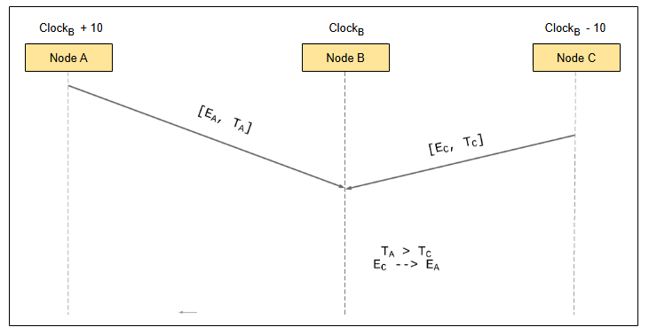

# Практический взгляд

Давайте рассмотрим практическую сторону часов и времени в распределённых системах.

Часы, используемые в реальных системах, — это то, что мы обычно называем **физическими часами**.

## Физические часы
**Физические часы** — это физический процесс в сочетании с методом измерения этого процесса для фиксации течения времени.

Большинство *физических часов* основаны на циклических процессах. Ниже приведены некоторые примеры таких устройств:

### Солнечные часы
*Солнечные часы* — одно из самых простых и понятных устройств. Они показывают время суток с помощью гномона и отслеживания тени, создаваемой солнцем.

### Песочные часы
*Песочные часы* — также простое и понятное устройство. Они измеряют время по регулируемому потоку песка через колбу.

### Маятниковые часы
*Маятниковые часы* — это распространённое часовое устройство, которое использует колеблющийся груз в качестве элемента хронометража.

### Кварцевые часы
*Кварцевые часы* — это электронная версия *маятниковых часов*, используемая в программных системах. Это устройство использует кристалл, называемый кварцевым кристаллом, который вибрирует или «тикает» с определённой частотой при подаче на него электричества.

### Атомные часы
*Атомные часы* — одно из самых точных устройств для измерения времени. Они используют частоту электронных переходов в определённых атомах для измерения времени.

~~~~

## Расхождение между часами
Все вышеперечисленные устройства полагаются на физические процессы для измерения времени. Конечно, могут быть погрешности как в измерительных инструментах, так и в самих физических процессах.

В результате, независимо от того, как часто мы синхронизируем эти часы друг с другом или с другими часами с точными методами измерения, всегда будет существовать ***расхождение (skew)*** между различными часами, задействованными в распределённой системе.

## Побочные эффекты допущения о глобальных часах в распределённых системах
При создании **распределённой системы** мы должны учитывать разницу между часами. Общая система не должна работать в предположении, что все эти часы одинаковы и действуют как единые глобальные часы.

Следующая иллюстрация содержит пример того, что может произойти в противном случае.

*E_A* — это **событие**, происходящее на узле *A*, а *T_A* — временная метка, присвоенная этому событию. То же самое справедливо и для других подобных обозначений.

Предположим, у нас есть распределённая система, состоящая из трёх разных узлов: A, B и C. Каждый раз, когда на узле происходит событие, узел присваивает ему *временную метку*, используя свои собственные часы, а затем распространяет это событие на другие узлы. Когда узлы получают события от других узлов, они сравнивают связанные с этими событиями временные метки, чтобы определить *порядок*, в котором произошли события.

Если бы все часы были абсолютно точны и показывали одно и то же время, такая схема теоретически была бы способна определить порядок.

Однако, если между часами различных узлов есть *расхождение*, корректность системы нарушается.

В частности, в нашем примере мы предполагаем, что часы узла A спешат по сравнению с часами узла B. Аналогично, часы узла C отстают от часов узла B. В результате, даже если событие на узле A произошло раньше события на узле C, узел B, сравнив соответствующие временные метки, посчитает, что событие на узле C произошло первым.

## Заключение
С практической точки зрения, лучшее, что мы можем сделать, — это принять, что разница между часами разных узлов в системе будет всегда. Затем мы можем каким-либо образом выявить эту неопределённость, чтобы различные узлы в системе могли её соответствующим образом обрабатывать.

> **Spanner** — это система, которая следует этому подходу, используя TrueTime API, который напрямую раскрывает эту неопределённость, используя временные интервалы (включающие погрешность) вместо простых временных меток.