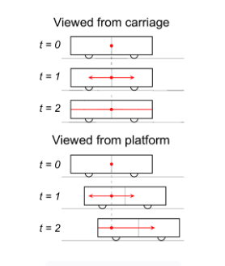

# Теоретический взгляд

В этом уроке мы рассмотрим теоретический аспект времени.

До сих пор мы рассматривали довольно практическое и упрощённое представление о **времени**.

Когда-то люди верили в абсолютное, универсальное время — единые, неизменные часы, идущие по всему космосу. Однако современная физика показала, что время относительно. Наблюдатели в разных состояниях движения или гравитационных средах могут измерять время по-разному. Таким образом, концепция универсального времени в реальности не работает.

## Законы физики
Согласно законам физики, а точнее специальной теории относительности, невозможно абсолютно утверждать, что два разных события происходят одновременно, если эти события разделены в пространстве.

Например, автокатастрофа в Лондоне и другая в Нью-Йорке, которые для наблюдателя на Земле кажутся одновременными, для наблюдателя в самолете, летящем между Лондоном и Нью-Йорком, будут казаться произошедшими в немного разное время.

Это может показаться парадоксом, но мы можем легко понять логику этой теории с помощью мысленного эксперимента, известного как **эксперимент с поездом**.

### Эксперимент с поездом
Этот эксперимент включает в себя поезд с наблюдателем в середине вагона и другого наблюдателя, стоящего на платформе, когда поезд проезжает мимо. Затем в середине вагона происходит вспышка света в тот момент, когда оба наблюдателя видят друг друга. Для наблюдателя внутри вагона обе стенки вагона находятся на одинаковом расстоянии от центра, поэтому свет достигнет обеих стенок одновременно. Для наблюдателя, стоящего на платформе, задняя стенка движется навстречу исходной точке вспышки, в то время как передняя стенка удаляется от неё, поэтому свет достигнет двух стенок в разное время. Это происходит потому, что скорость света одинакова во всех направлениях.

> В результате, то, происходят ли два пространственно разделенных события одновременно (синхронно), не является абсолютным, а зависит от системы отсчёта наблюдателя.

Ниже приведена иллюстрация эксперимента с поездом.

## Относительность в вычислительных системах
В контексте этого курса данный эксперимент в основном служит для того, чтобы подчеркнуть, что время относительно, и в **распределённой системе** не может быть абсолютного, универсального временного измерения.

Это также приводит к другому наблюдению, которое лежит в основе распределённых алгоритмов, предлагающих решения проблем упорядочивания без опоры на глобальные часы.

> Мы подробнее рассмотрим эти алгоритмы в следующей главе.

Как показано в предыдущем примере, информация в реальном мире распространяется посредством света. Если Солнце перестанет светить, человек поймёт это немного позже — примерно через 8 минут, если быть точным. Это время, которое требуется солнечному свету, чтобы достичь Земли от Солнца. Если задуматься, *распределённые системы* очень похожи. События происходят на разных узлах системы, и требуется некоторое время, чтобы другие узлы системы узнали, что эти события произошли.

> Стоит отметить различие: скорость света постоянна, а скорость, с которой информация распространяется в *распределённой системе*, переменна. Это связано с тем, что она зависит от базовой инфраструктуры и состояния сети.

В худшем случае информация может вообще не передаваться между двумя частями системы из-за сетевого разделения (network partition).