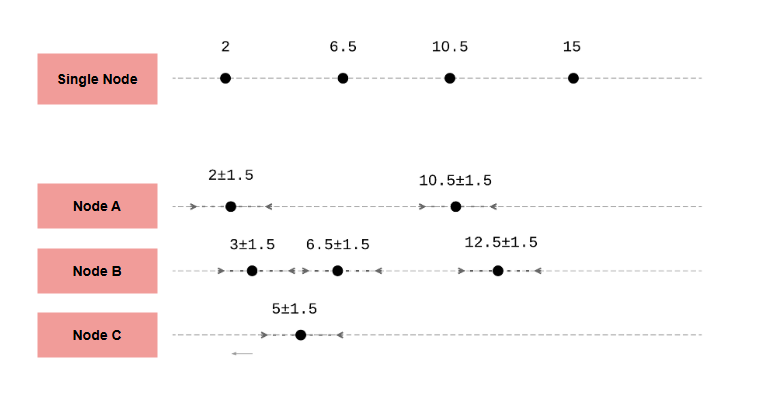

# Полное и частичное упорядочивание

В этом уроке мы объясним типы упорядочивания с примерами. Также мы рассмотрим упорядочивание, используемое распределенными системами для
определения порядка событий.

Определение **порядка** событий — это распространенная проблема, которую необходимо решать в программных системах.

Однако существует два различных типа упорядочивания: **полное упорядочивание** и **частичное упорядочивание**.

## Полное упорядочивание

*Полный порядок* — это бинарное отношение, которое сравнивает любые два элемента множества друг с другом. Прямым следствием этого свойства
является то, что мы можем использовать это отношение для вывода только одного единственного порядка для всех элементов в множестве. Именно
поэтому он называется *полным порядком*.

### Пример

Если мы полностью упорядочим множество уникальных целых чисел `{7, 9, 3, 2, 6}` с помощью отношения «меньше чем» (`<`), то соответствующий
полный порядок будет `[2, 3, 6, 7, 9]`.

## Частичное упорядочивание

*Частичный порядок* — это бинарное отношение, которое можно использовать для сравнения только некоторых элементов множества друг с другом.
Следовательно, мы можем использовать это отношение для вывода нескольких допустимых порядков для всех элементов в множестве.

### Пример

Множество, состоящее из следующих множеств целых чисел `{{0}, {1}, {2}, {0, 1}, {1, 2}}`, может быть упорядочено только частично, используя
отношение подмножества (`⊆`). Если мы выберем элементы `{0}` и `{0, 1}`, мы можем их упорядочить, так как `{0} ⊆ {0, 1}`. Однако
элементы `{0, 1}` и `{1, 2}` не могут быть упорядочены с помощью этого отношения, поскольку ни `{0, 1} ⊆ {1, 2}`, ни `{1, 2} ⊆ {0, 1}` не
является верным.

В результате, и `[{0}, {1}, {2}, {0, 1}, {1, 2}]`, и `[{2}, {1}, {0}, {1, 2}, {0, 1}]` будут допустимыми частичными упорядочиваниями.

> Могут существовать и другие последовательности, помимо этих двух.

## Полное упорядочивание событий в одноузловых системах

В системах, состоящих из одного узла, легко и интуитивно понятно определить *полный порядок* событий. Основная причина заключается в том,
что существует единственный актор, в котором происходят все события, поэтому этот актор может навязать *полный порядок* этим событиям по
мере их возникновения.

*Полные порядки* также значительно упрощают создание протоколов и алгоритмов.

## Частичное упорядочивание событий в распределенных системах

В *распределенной системе* не так просто навязать *полный порядок* событий. Это связано с тем, что в системе есть несколько узлов, и события
могут происходить одновременно на разных узлах. В результате *распределенная система* может использовать любой допустимый *частичный
порядок* происходящих событий, если нет строгой необходимости в *полном порядке*.

Следующая иллюстрация показывает, почему *полное упорядочивание* гораздо сложнее определить в *распределенной системе*.

В системе, состоящей из одного узла, который может выполнять события только последовательно, легко определить *полный порядок* всех
происходящих событий. Это потому, что между двумя событиями (e₁, e₂) одно из них начинается после того, как другое завершается. С другой
стороны, в *распределенной системе* с несколькими узлами, где события происходят одновременно, определить *полный порядок* гораздо сложнее.
Это связано с тем, что могут существовать пары событий, которые невозможно упорядочить.

Мы можем сделать интересное и важное наблюдение из вышеизложенного. Тот факт, что эти операции имеют некоторую продолжительность и
чередуются друг с другом, не является единственной проблемой, которая затрудняет достижение *полного упорядочивания*. Даже если эти операции
являются мгновенными (или линеаризуемыми), достижение полного порядка все равно нетривиально, так как нет глобальных часов.

В результате, даже если каждый узел может присваивать уникальные временные метки происходящим событиям, эти метки будут исходить от часов,
работающих с разной скоростью, что усложняет их сравнение. Это показано на следующей иллюстрации.

Вышеприведенная иллюстрация показывает, что любые **ошибки часов** можно игнорировать в одноузловой системе, поскольку используется только
одни часы. Это позволяет присваивать временные метки событиям так, как если бы они были мгновенными, и устанавливать *полный порядок*.

Однако в *распределенной системе* используется несколько часов, которые работают с разной скоростью и могут иметь разные погрешности. Это
означает, что погрешности необходимо учитывать при сравнении временных меток между разными узлами. Это усложняет установление *полного
порядка*, поскольку будут существовать пары событий, для которых мы не сможем определить, какое из них произошло раньше.

> Обратите внимание, что для простоты понимания на иллюстрации показано, что часы всех узлов имеют одинаковую ошибку, что нереалистично.