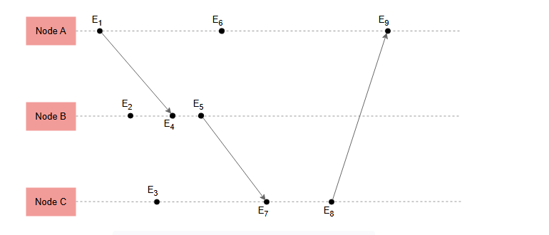

# Понятие причинности

Изучите понятие причинности в общем и в контексте распределенных систем.

## Полное упорядочивание в природных явлениях

Мы, люди, привыкли к **полному упорядочиванию**, потому что большинство природных явлений вокруг нас, кажется, подчиняются ему.

Когда мы ходим за покупками, нас ставят в очередь, чтобы обслуживать в *полном порядке*.

Аналогично, автомобили, ожидающие смены сигнала на перекрестке, также упорядочены таким же образом.

> Однако существуют сценарии, особенно распространенные в программных системах, где *полное упорядочивание* на самом деле не требуется.

## Причинное упорядочивание с использованием логических часов

Например, взгляните на некоторые платформы социальных сетей, которыми люди пользуются в наши дни, где они могут создавать посты и добавлять
комментарии к постам других людей. Действительно ли нам важен порядок, в котором нам показывают два несвязанных поста? Вероятно, нет. В
результате система потенциально может использовать **частичное упорядочивание**, при котором посты, которые на самом деле нельзя
упорядочить, отображаются в произвольно выбранном порядке.

Однако все еще существует необходимость сохранять порядок некоторых тесно связанных событий. Например, если комментарий C_B является ответом
на комментарий C_A, то мы, скорее всего, хотели бы видеть C_B после C_A. В противном случае разговор может стать запутанным и трудным для
восприятия.

## Причинность

То, что мы только что описали, — это понятие **причинности**, когда одно событие способствует возникновению другого события.

Возвращаясь к одному из вводных уроков о моделях согласованности, мы можем найти описание модели согласованности, называемой **причинной
согласованностью**. Эта модель гарантирует, что события, которые причинно связаны, наблюдаются различными узлами в едином порядке, где
причины предшествуют следствиям.

Нарушение *причинности* может привести к поведению, которое очень трудно понять пользователям системы.

> К счастью, как мы рассмотрим в следующих уроках этой главы, можно отслеживать *причинность* без необходимости использования физического
> времени.

Понятие *причинности* также присутствует в реальной жизни. Мы подсознательно используем *причинность* при планировании или определении
выполнимости плана.

### Определение причинности

*Причинность* определяется на основе набора слабо синхронизированных часов (например, наручных часов, настенных часов и т. д.) под иллюзией
глобальных часов. Кажется, что в большинстве случаев это работает, потому что продолжительность событий в реальной жизни гораздо более
грубая, а информация «течет» гораздо медленнее, чем в программных системах.

Например, сравните время, необходимое человеку, чтобы добраться из Лондона в Манчестер, и время, необходимое для передачи 10 килобайт на то
же расстояние через Интернет. Таким образом, небольшие различия между часами не создают значительных проблем в большинстве реальных
сценариев.

Однако в распределенных вычислительных системах события происходят с гораздо большей частотой и скоростью, а их продолжительность на
несколько порядков меньше. Следовательно, если физические часы различных узлов в системе не синхронизированы точно, причинно-следственная
связь между событиями может быть неточно зафиксирована.

## Причинность в распределенных системах

*Причинность* можно использовать при проектировании распределенных систем, получая два основных преимущества:

* Увеличение параллелизма
* Замена реального времени понятием логического времени, которое можно отслеживать с меньшими затратами и инфраструктурой

Как мы уже видели, распределенные системы по своей природе асинхронны. Вводя координацию и синхронизацию между ними, мы по сути снижаем
уровень параллелизма и, следовательно, их производительность. Понятие *причинности* позволяет нам оставлять эти системы асинхронными,
поддерживая при этом модель *причинной согласованности*. Это предотвращает большой набор нелогичных поведений, возникающих из-за слабой
согласованности.

Более того, поддержание синхронизации физических часов — это задача, требующая аппаратной инфраструктуры с соответствующими затратами,
причем затраты возрастают пропорционально тому, насколько точной должна быть синхронизация.

Логические часы полагаются на существующий обмен сообщениями между узлами системы, что делает их менее затратными для реализации. Конечно, у
логических часов есть свои подводные камни, так что они определенно не являются панацеей.

## Причинность событий с использованием логических часов

> В следующих уроках будут представлены некоторые виды логических часов. Важно заранее подчеркнуть, что все они имеют общие характеристики.

Абстракция логических часов состоит из двух основных частей:

* Структура данных, локальная для каждого узла, используемая для представления логического времени
* Протокол для соответствующего обновления структур данных по мере происходящих событий и течения времени

Каждый узел поддерживает структуры данных, которые обеспечивают следующие возможности:

* Локальные логические часы, которые помогают узлу измерять свой собственный прогресс
* Глобальные логические часы, которые являются хорошим представлением взгляда узла на логическое глобальное время

Аналогично, протокол состоит из двух основных правил:

* **R1**: Правило, которое определяет, как локальные логические часы обновляются узлом при выполнении им события.
* **R2**: Правило, которое определяет, как узел обновляет свои глобальные логические часы для обновления своего представления о глобальном
  времени и прогрессе. Это определяет, какая информация о логическом времени должна быть добавлена в передаваемые сообщения и как
  принимающий узел использует эту информацию.

> Различные типы логических часов имеют одинаковые основные части и описанный выше протокол, но они могут отличаться фактическими
> структурами данных, используемыми для представления логического времени, или логикой в правилах протокола.

## События в распределенных системах

События, происходящие в распределенной системе, можно разделить на три основные категории:

* **Локальные события**, которые происходят на узле и изменяют его состояние
* **События отправки**, которые представляют собой отправку узлом сообщения другому узлу для информирования об изменении
* **События получения**, которые представляют собой получение узлом сообщения от другого узла об изменении

Эти события, которыми обмениваются узлы для распространения информации, могут также распространять изменения времени между узлами.

Понятие причинности строится на основе отношения «произошло до» (happened-before) (`→`). Это строгий частичный порядок на вышеупомянутых
событиях, так что:

* Если события `a` и `b` — это два события, происходящие на одном и том же узле, то отношение `a → b` выполняется, если событие `a`
  предшествовало событию `b`.

> Обратите внимание, что для одного узла это легко определить, как было показано ранее.

* Если событие `a` — это событие отправки сообщения узлом, а событие `b` — это событие получения того же сообщения другим узлом, то `a → b`.
* Для трех событий `a`, `b` и `c`, если `a → b` и `b → c`, то `a → c`.

Мы говорим, что событие E₁ причинно предшествует событию E₂ (или эти два события причинно связаны), если E₁ → E₂. Мы говорим, что событие E₁
не связано причинно с E₂ (E₁ ∥ E₂), если ни отношение E₁ → E₂, ни E₂ → E₁ не выполняется.

Следующая иллюстрация демонстрирует, как это будет работать в распределенной системе из трех узлов.

Вот некоторые из причинно-следственных связей: E₁→E₄, E₁→E₅, E₁→E₆, E₁→E₇, E₁→E₈ и E₁→E₉.

Обратите внимание, что E₁∥E₃ и E₂∥E₆, хотя эти события и далеки друг от друга во времени, потому что между узлами не было обмена
информацией, который мог бы помочь логическим часам отследить какую-либо связь между ними. Это означает, что система должна считать эти
события одновременными, и они могли произойти в любом порядке. Это потому, что E₆ могло произойти в любой момент времени с момента сразу
после E₁ до момента прямо перед E₉, сохраняя все причинно-следственные связи нетронутыми. То же самое относится и к E₂, которое могло
произойти в любой момент времени до E₄.

## Потенциальная причинность

В общем, понятие *причинности* в распределенных системах (как оно определено в статье Лэмпорта) можно было бы назвать потенциальной
причинностью. Это потому, что оно не обязательно указывает на причинно-следственную связь, а лишь на ее возможность.

В результате, когда мы говорим, что Eᵢ → Eⱼ, мы не имеем в виду, что Eᵢ вызвало или повлияло на Eⱼ. Вместо этого мы имеем в виду, что Eᵢ
*могло* вызвать или повлиять на Eⱼ. Это связано с тем, что данное понятие является общим и не имеет контекста конкретного приложения для
вывода фактических причинно-следственных связей.

Однако приложения могут использовать алгоритмы, представленные в этой главе, и обогащать их дополнительными метаданными, которые позволяют
отслеживать *фактическую причинность* вместо *потенциальной причинности*.

> Обратите внимание, что даже возможность отслеживать *потенциальную причинность* все еще очень полезна для предотвращения поведения
> системы, которое может сбить с толку пользователей. Это просто означает, что система может хранить и передавать больше информации, чем
> необходимо для достижения этой цели.