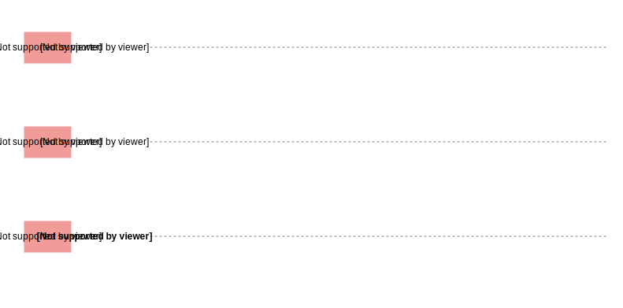
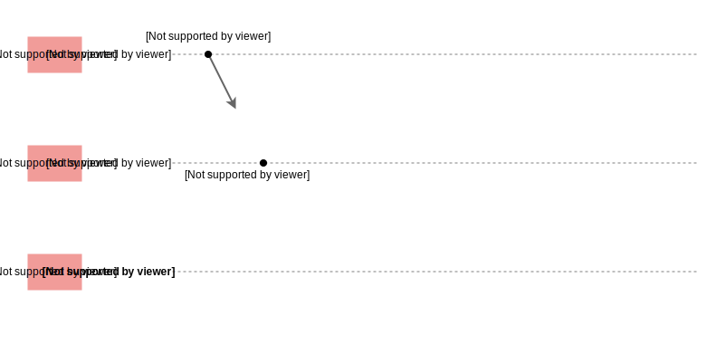
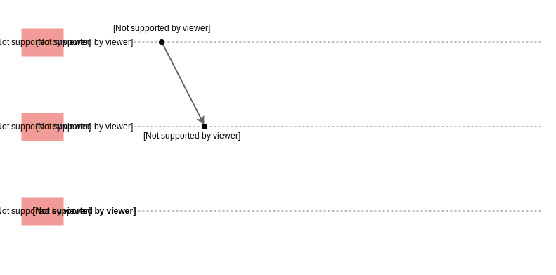
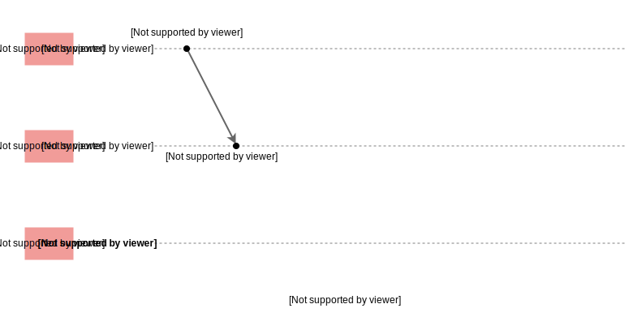
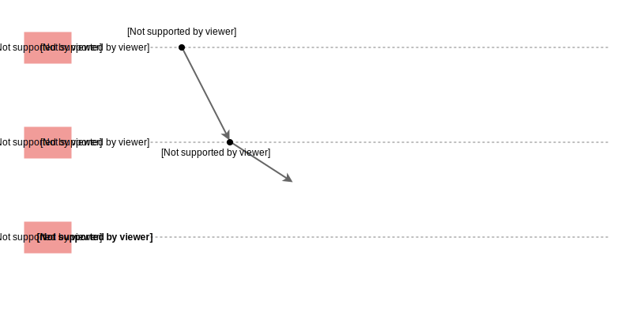
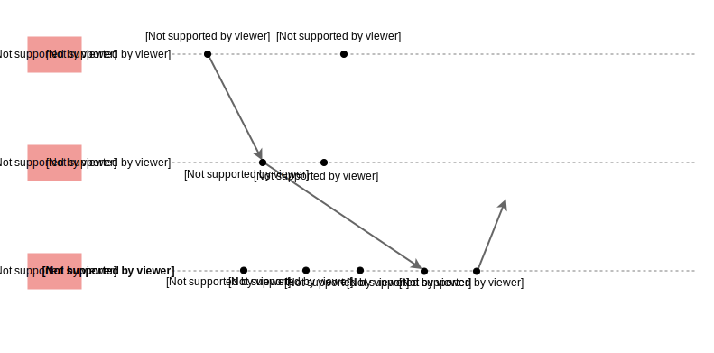
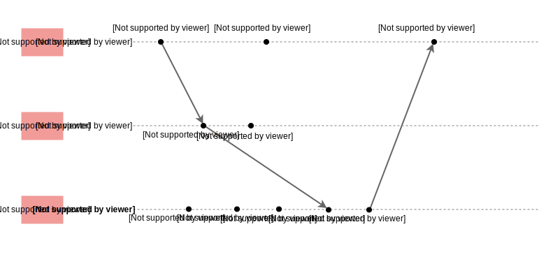
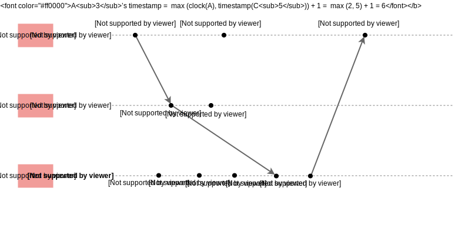

# Часы Лэмпорта

Давайте рассмотрим, что такое часы Лэмпорта и как они работают.

Лесли Лэмпорт изобрел один из первых и простейших типов логических часов, названных **часами Лэмпорта**.

В этом типе логических часов каждый узел в системе поддерживает логические часы в виде числового счетчика, который начинается с нуля при
запуске узла.

## Правила протокола

* **(R1)** Перед выполнением события (отправка, получение или локальное событие) узел увеличивает счетчик своих логических часов на
  единицу: `Cᵢ = Cᵢ + 1`.
* **(R2)** Каждое отправленное сообщение несет с собой значение часов отправителя на момент отправки. Когда узел `nᵢ` получает сообщение с
  временной меткой `C_msg`, он выполняет следующие действия:
    * Обновляет свои часы, принимая максимум из своих часов и полученных часов: `Cᵢ = max(Cᵢ, C_msg)`
    * Выполняет R1
    * Доставляет сообщение

## Условие согласованности часов

Часы Лэмпорта удовлетворяют так называемому **условию согласованности часов**.

Если одно событие `e₁` причинно предшествует другому событию `e₂`, то `C(e₁) < C(e₂)`. Однако обратное, то есть **условие строгой
согласованности**, часами Лэмпорта не удовлетворяется. Это означает, что если `C(e₁) < C(e₂)`, то это не обязательно означает, что
событие `e₁` причинно предшествует `e₂`. В результате это означает, что часы Лэмпорта не могут быть использованы для вывода **частичных
порядков**, которые являются причинно согласованными.

> Однако их все еще можно использовать для других целей, например, для создания (не причинно согласованных) **полных порядков**.

## Работа часов Лэмпорта

Чтобы лучше понять, как работают часы Лэмпорта, давайте рассмотрим пример на следующей иллюстрации. У нас есть распределенная система,
состоящая из трех узлов A, B и C, которые выполняют события локально и обмениваются сообщениями для распространения необходимой информации
по всей системе. Мы можем попробовать применить описанные выше правила и увидеть, что часы каждого узла обновляются, как показано на
иллюстрации.

**Пошаговый пример работы:**

Вот перевод предоставленного текста с описанием шагов:

1) Система из трех узлов. Изначально на каждом узле значение логических часов C установлено в ноль.
   

2) Узел A отправляет сообщение узлу B.
   

3) Узел B получает сообщение.
   

4) Временная метка B1 равна max (clock(B), timestamp(A1)) + 1, то есть 2.
   

5) Часы B1 становятся 2.
   

6) В то же время B отправляет сообщение C. Оно еще не получено.
   

7) Происходит C1, часы C становятся 1.
   

8) Происходит C2, часы C становятся 2.
   

9) Происходит B2. Часы B становятся 3.
   

10) Происходит A2, часы A становятся 2.
    

11) Происходит C3, часы C становятся 3.
    

12) Сообщение от B наконец приходит к C.
    

13) Временная метка C равна max(clock(C), timestamp(B1)) + 1, то есть 4.
    

14) Часы C становятся 4.
    

15) Узел C отправляет сообщение узлу A.
    

16) Узел A получает сообщение.
    

17) Временная метка A3 равна max (clock(A), timestamp(C5)) + 1, то есть 6.
    

18) Часы A становятся 6.
    
По сути, каждый узел «тикает» своими часами при локальных событиях и «подгоняет» их вперед, если обнаруживает, что у другого узла значение
часов больше, чем у него.

Теперь давайте обсудим представленные ранее условия более подробно.

Любые два события, которые причинно связаны, будут отражать эту связь в значении часов. Например, `A₁` причинно предшествует `B₁`, и мы
видим, что `C(A₁) = 1 < 2 = C(B₁)` (условие согласованности часов).

Мы также можем видеть, что *условие строгой согласованности* не выполняется. Например, `C(C₂) < C(B₂)` (так как `2 < 3`), но эти два события
не являются причинно зависимыми. Событие `B₂` могло произойти как до, так и после `C₂` с тем же значением часов.

## Использование часов Лэмпорта

Часы Лэмпорта могут быть использованы для создания **полного упорядочивания** событий в распределенной системе с использованием некоторого
произвольного механизма для разрешения «ничьих» в случае, если часы разных узлов имеют одинаковое значение (например, по идентификатору
узла).

Особенность заключается в том, что это **полное упорядочивание** в некоторой степени произвольно и не может выявлять причинно-следственные
связи. Это ограничивает количество практических применений часов Лэмпорта. В статье Лэмпорта демонстрируется, как их потенциально можно
использовать для решения проблем синхронизации, таких как взаимное исключение.