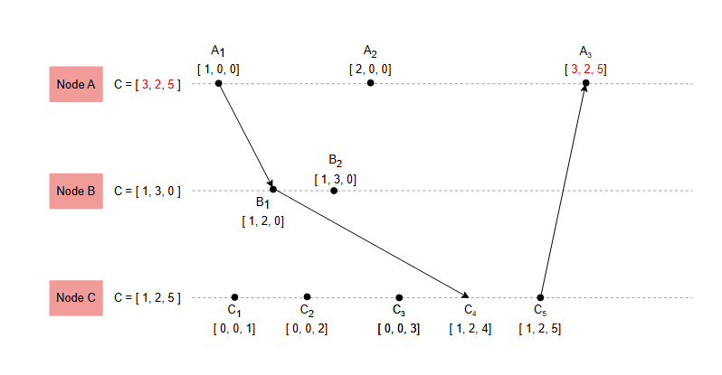

# Векторные часы

Давайте разберемся, что такое векторные часы, как они работают и удовлетворяют сильному условию часов. Также рассмотрим основное ограничение часов Лэмпорта.

## Ограничение часов Лэмпорта

Основное ограничение *часов Лэмпорта* заключается в том, что они не удовлетворяют **сильному условию часов**. Это означает, что их нельзя использовать для вывода причинно-следственных связей между событиями.

Основная причина этого в том, что как локальные, так и глобальные логические часы для каждого узла «сплющиваются» в одно число, которое не предоставляет всей необходимой информации для отслеживания причинно-следственных связей.

Поэтому нам необходимо поддерживать множество всех событий, которые причинно предшествуют каждому событию. Это известно как *причинно-следственная история* (causal history). Например, на следующей иллюстрации показана причинно-следственная история события E₇, которая представляет собой {E₁, E₂, E₃, E₄, E₅}. Нам также необходимо хранить причинно-следственную историю каждого события как можно более эффективно, используя компактную структуру данных. По мнению Колина Дж. и Фридемана, **векторные часы** являются примером такой структуры данных.

## Определение векторных часов

***Векторные часы*** — это еще один тип логических часов, где структура данных часов для каждого узла представляет собой вектор из N счетчиков [c⁰, c¹, .., cᴺ], где N — количество узлов в системе. Для часов i-го узла [cᵢ⁰, cᵢ¹, ..., cᵢᴺ]:

*   i-й элемент часов cᵢⁱ представляет собой локальные логические часы узла.
*   Остальные элементы часов [cᵢ⁰, ..., cᵢⁱ⁻¹, cᵢⁱ⁺¹, ..., cᵢᴺ] вместе образуют глобальные логические часы узла.

## Правила протокола

Правила протокола следующие:

*   (**П1**) Перед выполнением события (отправка, получение или локальное событие) узел увеличивает счетчик своих логических часов на единицу: Cᵢⁱ = Cᵢⁱ + 1.
*   (**П2**) Каждое отправляемое сообщение несет на себе значение часов отправителя на момент отправки. Когда i-й узел получает сообщение с вектором [cⱼ⁰, ..., cⱼᴺ] от j-го узла, он выполняет следующие действия:
    *   Выполняет **П1**.
    *   Обновляет каждый элемент в своем векторе, беря максимум из значения в своих собственных векторных часах и значения в векторе из полученного сообщения: Cᵢᵏ = max(cᵢᵏ, cⱼᵏ) для каждого k в [0, N].
    *   Доставляет сообщение.

## Сильное условие часов

*Векторные часы* удовлетворяют *сильному условию часов*. Это означает, что если для двух событий Eᵢ, Eⱼ с временными метками Cᵢ, Cⱼ выполняется отношение Cᵢ < Cⱼ, то Eᵢ → Eⱼ.

Единственное, что осталось рассмотреть, — это как сравнивать векторные часы друг с другом, что делается следующим образом:

*   Для двух часов Cᵢ = [cᵢ⁰, ..., cᵢᴺ] и Cⱼ = [cⱼ⁰, ..., cⱼᴺ], отношение Cᵢ < Cⱼ выполняется тогда и только тогда, когда все элементы часов Cᵢ меньше или равны всем соответствующим элементам часов Cⱼ (cᵢᵏ ≤ cⱼᵏ для всех k) и существует хотя бы один элемент Cᵢ, который строго меньше соответствующего элемента Cⱼ (cᵢˡ < cⱼˡ для хотя бы одного l в [0, N]).

## Принцип работы векторных часов

Следующая иллюстрация содержит тот же пример распределенного выполнения, который был показан на иллюстрации в уроке про часы Лэмпорта. На этот раз мы используем векторные часы.

Вот перевод предоставленного текста с описанием шагов:

1) Система из трех узлов. Векторные часы на каждом узле имеют по одной записи для каждого узла в системе и инициализированы нулями.
   

2) Узел A отправляет сообщение узлу B. На узле A произошло событие отправки, поэтому он увеличивает свою запись в своих часах.
   

3) На узле C произошло локальное событие, он увеличивает свою запись в часах.
   

4) Сообщение от узла A прибывает на узел B.
   

5) Узел B сохраняет значение временной метки отправителя (A) из сообщения в свои собственные векторные часы. Также, это первое событие на узле B, поэтому он обновляет свою собственную запись в векторных часах на 1.
   

6) В то же время узел B отправляет сообщение узлу C. Поскольку на узле B произошло событие отправки, он увеличивает свою запись в своих часах.
   

7) На узле C происходит локальное событие. Он увеличивает свою запись в своих собственных векторных часах.
   

8) На узле B происходит локальное событие. Он увеличивает свою запись в своих собственных векторных часах.
   

9) На узле A происходит локальное событие. Он увеличивает свою запись в своих собственных векторных часах.
   

10) На узле C происходит локальное событие. Он увеличивает свою запись в своих собственных векторных часах.
    

11) Сообщение от узла B наконец прибывает на узел C.
    

12) Часы узла C обновляются.
    

13) Узел C отправляет сообщение узлу A. На узле C происходит событие отправки, поэтому он увеличивает свою запись в своих собственных векторных часах.
    

14) Узел A получает сообщение от узла C и обновляет свои часы.
    

---

Каждый узел в системе поддерживает векторные часы, где первый элемент соответствует времени на узле A, второй — времени на узле B, а третий и последний элемент — времени на узле C.

> Мы можем снова потратить некоторое время, чтобы убедиться, что значения часов были присвоены в точном соответствии с описанными выше правилами.

На этот раз мы видим, что часы A₁ ([1,0,0]) меньше часов B₁ ([1,1,0]), при этом также выполняется A₁ → B₁.

Однако более важно то, что мы можем обнаруживать события, которые не связаны причинно-следственной связью. Например, B₂ ([1,2,0]) ∥ C₂ ([0,0,2]), и мы видим, что временная метка B₂ не является ни меньшей, ни большей, чем временная метка C₂. Это означает, что мы можем считать эти события параллельными, и они могли произойти в любом порядке.

## Использование векторных часов

Векторные часы могут использоваться в случаях, когда важна возможность определять, являются ли два события причинно-следственно связанными или параллельными. Они также позволяют различным узлам системы продвигаться независимо и эффективно, без узких мест, связанных с синхронизацией и координацией.

## Важные моменты

Ранее мы упоминали, что в распределенной системе из n узлов каждые векторные часы состоят из n элементов. Важно уточнить, что каждый процесс, являющийся источником параллелизма, должен рассматриваться как узел системы в контексте векторных часов. Это означает, что для этого процесса в каждых часах должна быть выделена своя запись.

Например, если наше приложение состоит из трех серверов и двух клиентов, каждые векторные часы должны содержать пять записей. В противном случае мы рискуем не суметь определить параллельные и конфликтующие операции и вместо этого будем считать их причинно-следственно связанными.

Шаррон-Бост и др. формально доказали, что «размер векторных часов должен быть не менее n для системы, состоящей из n узлов, чтобы полностью охватить причинность». Это означает, что векторные часы требуют значительного объема памяти в случаях, когда количество всех участвующих узлов велико. Это может быть актуально для некоторых современных систем, таких как веб-приложения, где каждый браузер считается клиентом системы.