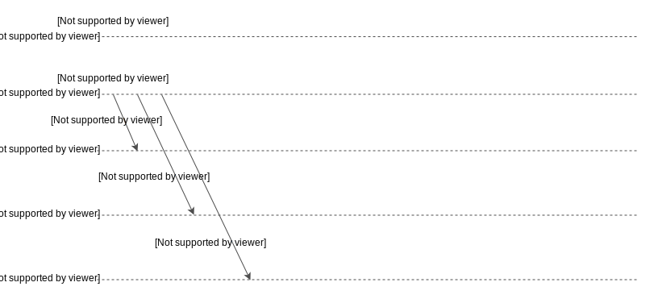
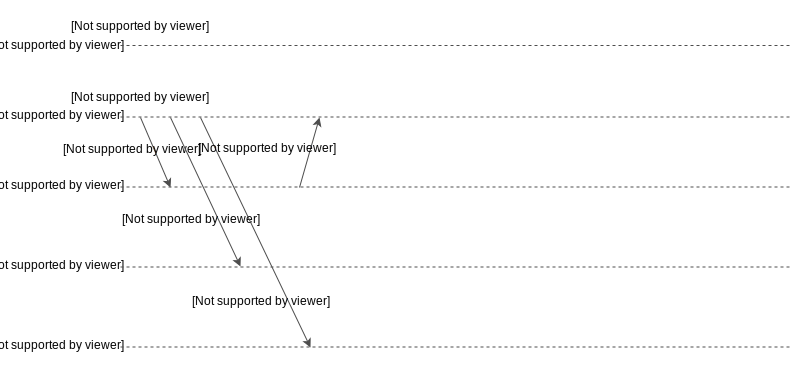
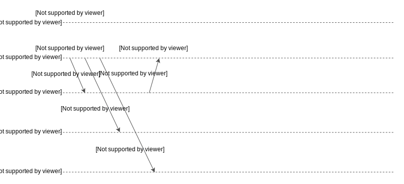
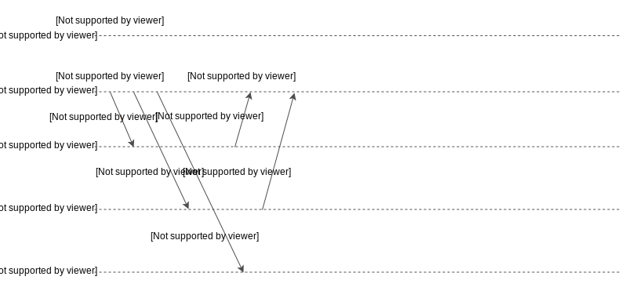
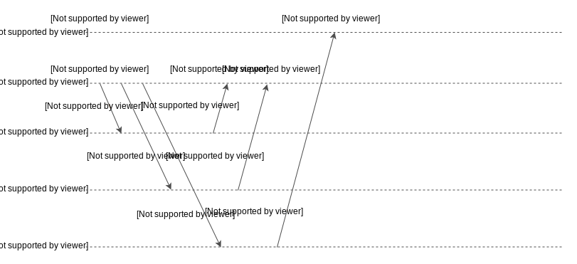
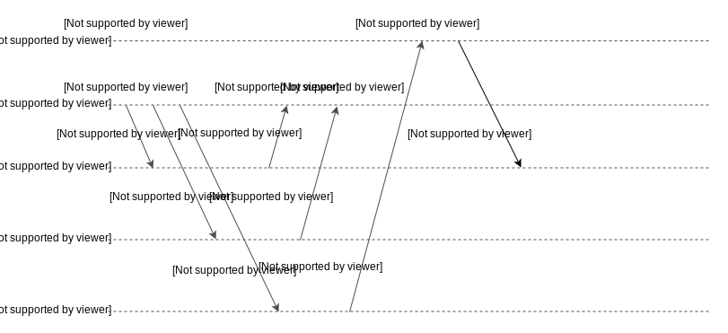
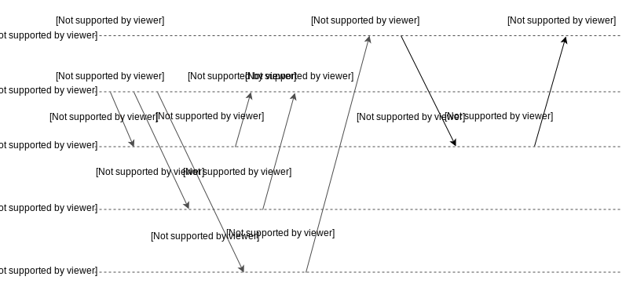
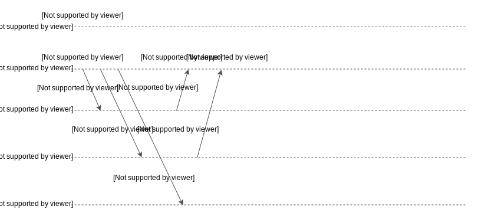
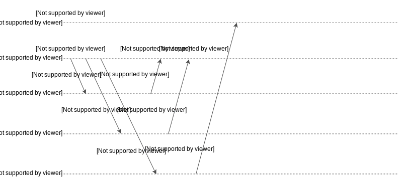
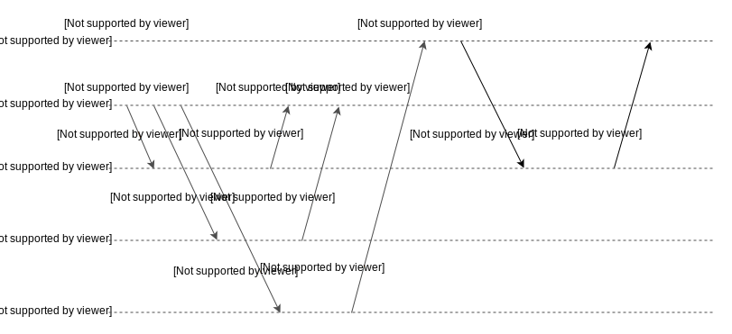

# Векторы версий

Давайте найдем сходства и различия между векторами версий и векторными часами. Мы также рассмотрим детали векторов версий и проблемы, связанные с векторными часами.

## Сравнение векторов версий с векторными часами

**Векторы версий** — это механизм, очень похожий на **векторные часы**. Структура данных, используемая *векторами версий*, и связанные с ними правила обновления очень похожи на те, что используются *векторными часами*. Однако *векторы версий* применяются для несколько иных целей.

Как объяснялось ранее, *векторные часы* используются для поддержания логической формы времени, которая затем может быть использована для определения того, когда происходят события, особенно в сравнении с другими событиями.

С другой стороны, *векторы версий* лучше подходят для приложений, хранящих данные, где каждый элемент данных помечен *вектором версий*. Таким образом, данные могут потенциально обновляться в нескольких частях системы одновременно (например, при сетевом разделе). Итак, *векторы версий* результирующих элементов данных могут помочь нам определить те элементы, которые могут быть согласованы автоматически, и те, которые требуют разрешения конфликтов.

*Векторы версий* поддерживают состояние, идентичное состоянию в *векторных часах*, и содержат одну целочисленную запись для каждого узла в системе.

## Правила протокола

Правила обновления для *векторов версий* немного отличаются: узлы могут испытывать как локальные обновления (например, запись, примененная на сервере), так и синхронизироваться с другим узлом (например, при восстановлении после сетевого раздела).

*   Изначально все элементы всех векторов установлены в ноль.
*   Каждый раз, когда узел испытывает локальное событие обновления, он увеличивает свой собственный счетчик в векторе на единицу.
*   Каждый раз, когда два узла `a` и `b` синхронизируются, они оба устанавливают элементы в своем векторе в максимум из элементов обоих векторов `V_a[x] = V_b[x] = max(V_a[x], V_b[x])`. После синхронизации оба узла будут иметь одинаковые векторы.

Кроме того, в зависимости от того, были ли исходные векторы причинно-следственно связаны или нет, один из связанных элементов заменит другой, либо будет выполнена логика *разрешения конфликтов* для сохранения одной записи, связанной с новым вектором.

## Принцип работы векторов версий

*Векторы версий* в основном полезны в системах, которые действуют как хранилища данных, поэтому узлы в системе будут принадлежать к двум основным категориям: **серверные** узлы или узлы-**реплики**, которые хранят данные и получают операции чтения/записи, и клиентские узлы, которые читают данные с узлов-реплик и отправляют инструкции по обновлению.

Во многих случаях клиенты могут даже не быть частью наших систем, например, в сценариях, когда наша система получает операции непосредственно из веб-браузеров клиентов. В результате, лучше избегать значительных накладных расходов на логику и хранение в клиентских узлах.

Механизм *векторов версий* позволяет это сделать следующим образом:

*   Поддерживается одна запись для каждого узла (как для узлов-реплик/серверов, так и для клиентских узлов).

Однако клиентские узлы могут быть без сохранения состояния (stateless), что означает, что они не хранят *векторы версий*. Вместо этого они получают *вектор версий* как часть каждой операции чтения и предоставляют этот *вектор версий* при выполнении операции обновления обратно на соответствующий узел-реплику.

>   По словам Perguica и др., это возможно только в среде, где клиентские узлы не должны испытывать никаких локальных событий, а только взаимодействовать с серверными узлами через операции чтения/записи. Это также требует семантики "чтение собственных записей" (т. е. достигаемой через кворумы чтения/записи), чтобы каждое чтение возвращало клиенту самое последнее обновление.

Этот вектор называется «контекстом», и узел-реплика использует его для соответствующего обновления своего *вектора версий*.

### Векторы версий с записями для каждого клиента

Следующая иллюстрация содержит пример выполнения в распределенной системе с использованием *векторов версий* с одной записью для каждого узла.

---

Вот перевод предоставленного текста с описанием шагов:

1) Распределенная система из двух узлов-реплик и трех клиентских узлов.
   

2) Узлы-реплики инициализированы пустым вектором версий `{ }` и значением U.
   

3) Все клиентские узлы считывают текущее значение U с соответствующим вектором версий `{ }` с узла-реплики B.
   

4) Клиентский узел C отправляет запрос на запись PUT узлу-реплике B. Первый аргумент — это вектор версий `{ }`, который он ранее считал с узла-реплики B, второй аргумент — идентификатор клиентского узла, в данном случае C, третий — V, значение для записи.
   

5) Узел-реплика B увеличивает запись в векторе. C — это идентификатор клиентского узла, 1 означает, что узел-реплика B впервые получил запрос на запись от клиента C, а V — это значение.
   

6) Аналогично, клиентский узел D отправляет запрос на запись узлу-реплике B.
   

7) Узел-реплика B обновляет вектор версий и соответствующее значение. Это новое значение W может быть сохранено вместе с другими значениями, которые были записаны параллельно, или перезаписать значения, которые причинно ему предшествуют. В данном случае W сохраняется вместе с V.
   

8) Клиентский узел E отправляет запрос на запись узлу-реплике A.
   

9) Узел-реплика A обновляет свой вектор версий и соответствующее значение.
   

10) Клиентский узел C считывает с узла-реплики A вектор версий и соответствующее значение.
    

11) Клиентский узел C отправляет запрос на запись узлу-реплике A.
    

12) Узел-реплика A увеличивает запись в векторе и перезаписывает предыдущее значение X новым значением Y.
    

---

Для простоты в примере предполагается, что существует только один элемент данных, поэтому все клиенты работают с одним и тем же элементом. Этот пример можно легко расширить на случаи с несколькими элементами, где каждый элемент имеет свой собственный *вектор версий*, и клиенты должны предоставлять идентификатор элемента для доступа.

Каждая операция чтения возвращает текущее значение с соответствующим *вектором версий*.

Каждая операция записи имеет три аргумента:

*   Вектор версий, который передается в качестве контекста
*   Идентификатор клиентского узла
*   Значение для записи

Узел-реплика отвечает за увеличение соответствующей записи в векторе (в зависимости от идентификатора клиента) и последующее сохранение нового значения.

Обратите внимание, что это новое значение может быть либо сохранено вместе с другими значениями, которые были записаны параллельно, либо перезаписать значения, которые причинно ему предшествуют.

В первом случае при последующих чтениях будут возвращены несколько значений, и следующие операции записи согласуют их и сохранят одно значение.

В приведенном выше примере, если узел `D` выполнил чтение с узла `B` (который вернет оба значения `V` и `W` и их *векторы версий*), а затем попытался записать значение `Z`, то обновление будет иметь вид `PUT({(C,1), (D,1)}, D, Z)`. Узел-реплика вычислит новый *вектор версий* `{(C,1), (D,2)}` и определит, что он заменяет оба существующих вектора версий `{(C,1)}` и `{(D,1)}`. Таким образом, он заменит значения `V` и `W` на `Z`.

>   Подход с включением записей в *вектор версий* для всех клиентских узлов является безопасным. Он позволяет успешно определять, когда две разные версии были записаны параллельно, или если одна из них причинно предшествует другой и может быть отброшена.

### Ограничение векторных часов с записями для каждого клиента

Основным ограничением *векторных часов* является то, что их размер плохо масштабируется.

В **распределенных системах**, используемых в качестве распределенных хранилищ данных, количество клиентов, как правило, на два-три порядка больше, чем количество серверных узлов. Например, во многих случаях каждый элемент данных реплицируется на трех разных серверах, в то время как тысячи клиентов обращаются к этому элементу.

Обратите внимание, что даже в случаях, когда клиентами системы являются несколько серверов приложений, для каждого сервера, выполняющего операции параллельно из нескольких потоков, необходимо поддерживать отдельную запись в векторных часах.

В результате этот подход требует значительного объема памяти.

## Преодоление ограничения

В идеале мы хотим, чтобы размер *векторных часов* масштабировался с количеством серверных узлов, а не с количеством клиентов.

### Векторы версий с записями для каждого сервера

Можем ли мы удалить записи клиентов из *векторных часов* и позволить серверам увеличивать свои собственные записи при выполнении обновлений от имени клиентов?

К сожалению, нет. Если мы так сделаем, система не сможет обнаружить, что некоторые операции были выполнены параллельно, и отбросит значения, которые должны были быть сохранены.

### Проблемы при использовании векторных часов с записями для каждого сервера

Следующая иллюстрация показывает проблемы этого подхода.

---

Вот перевод предоставленного текста с описанием шагов:

1) Распределенная система из двух узлов-реплик и трех клиентских узлов.
   

2) Узлы-реплики инициализированы пустым вектором версий `{ }` и значением U.
   

3) Все клиентские узлы считывают текущее значение U и соответствующий вектор версий `{ }` с узла-реплики B.
   

4) Клиентский узел C отправляет запрос на запись PUT узлу-реплике B. Первый аргумент — это вектор версий `{ }`, который он ранее считал с узла-реплики B, второй аргумент V — это значение для записи.
   

5) Узел-реплика B увеличивает запись в векторе, используя свой собственный идентификатор. 1 означает, что узел-реплика B впервые получил запрос на запись, а V — это значение.
   

6) Аналогично, клиентский узел D отправляет запрос на запись узлу-реплике B со значением W.
   

7) Операции записи, выполненные клиентскими узлами C и D, являются параллельными, но серверный узел B не сможет этого определить. Он считает, что вектор версий второго обновления {(B,2)} заменяет {(B,1)}, таким образом отбрасывая значение V и заменяя его значением W.
   

8) Клиентский узел E отправляет запрос на запись узлу-реплике A.
   

9) Узел-реплика A обновляет свой вектор версий и соответствующее значение.
   

10) Клиентский узел C считывает данные с узла-реплики A. Он получает вектор версий и соответствующее значение.
    

11) Клиентский узел C отправляет запрос на запись узлу-реплике A.
    

12) Узел-реплика A увеличивает запись в векторе для своего собственного идентификатора и перезаписывает предыдущее значение X новым значением Y.
    

---

Как мы видим, первые операции записи, выполненные клиентскими узлами `C` и `D`, являются параллельными. Однако серверный узел `B` не сможет это определить. Узел `B` посчитает, что вектор версий второго обновления `{(B,2)}` заменяет `{(B,1)}`, отбросив значение `V` и заменив его значением `W`.

>   Существует техника, которая позволяет успешно определять параллельные версии, а также позволяет *векторам версий* масштабироваться с количеством серверов. Она называется **пунктирные векторы версий (dotted version vectors)**, о которых мы узнаем в следующем уроке.