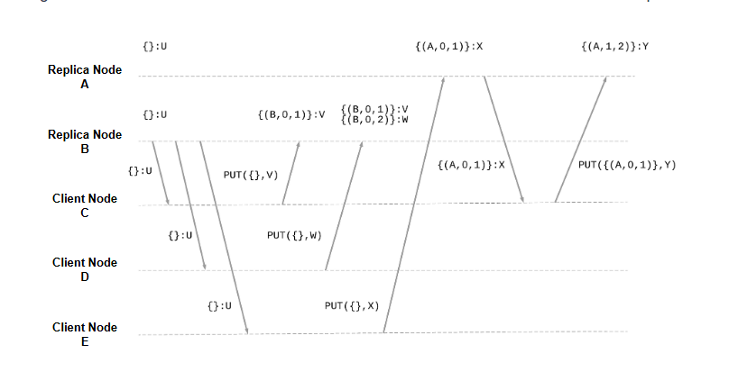

# Пунктирные векторы версий

Давайте узнаем, что такое пунктирные векторы версий и как они обеспечивают масштабирование векторов версий.

**Пунктирные векторы версий** — это техника, которая позволяет успешно определять параллельные версии и обеспечивает масштабирование векторов версий в зависимости от количества серверов.

Этого удается достичь благодаря следующей характеристике данной техники.

## Характеристика, позволяющая масштабировать векторы версий

Каждая запись в векторе теперь представляет собой не одно число, а пару чисел. Это позволяет кодировать последовательность чисел, которая не является полностью последовательной, но содержит один пробел.

Пара (n₁,n₂) представляет все числа от 1 до n₁ плюс число n₂.

Например, пара (4,7) представляет последовательность [1,2,3,4,7]. Обратите внимание, что второе число является необязательным, и некоторые записи все еще могут состоять из одного числа. Это можно использовать для отслеживания параллелизма между несколькими версиями.

Порядок между двумя версиями теперь определяется через отношение включения соответствующих последовательностей. Таким образом, для векторов v₁ и v₂ отношение v₁≤ v₂ выполняется, если последовательность, представленная вектором v₁, является подмножеством последовательности, представленной вектором v₂. А именно:

*   (m) ≤ (m′) если m ≤ m′
*   (m) ≤ (m′,n′) если m≤ m′ ∨ m=m′+1=n′
*   (m,n) ≤ (m′) если n≤ m′
*   (m,n) ≤ (m′,n′) если n≤ m′ ∨ (m≤ m′∧ n=n′)

Правило обновления, выполняемое каждым узлом-репликой при получении операции записи, также немного отличается.

Для всех индексов, кроме того, который принадлежит узлу-реплике, узел использует значение (m), где m — максимальное число среди доступных в предоставленных в контексте векторов версий.

Для индекса, соответствующего узлу-реплике, узел использует пару (m, n+1), где m — максимальное число среди доступных в предоставленных в контексте векторов версий, а n — максимальное число среди векторов версий, присутствующих на узле-реплике (по сути, значение его логических часов).

> Для более подробного анализа правил и формального доказательства безопасности этой техники обратитесь к оригинальной статье.

Следующая иллюстрация показывает, как бы выглядело решение с использованием пунктирных векторов версий в наших предыдущих примерах.

Как мы видим, операции записи клиентских узлов C и D в итоге получают векторы версий {(B,0,1)} и {(B,0,2)}, и они успешно определяются как параллельные, поскольку { (B,0,1) } ≰ { (B,0,2) } и { (B,0,2) } ≰ { (B,0,1) }.