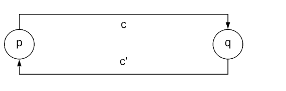

# Проблема распределенного снимка

Давайте рассмотрим проблему создания распределенных снимков.

Существует еще одна фундаментальная проблема в распределенных системах, которая тесно связана с понятиями **времени** и **порядка**. Она формулируется следующим образом.

## Проблема

Вот в чем проблема: как записать **снимок** состояния распределенной системы, состоящей из нескольких узлов, которые выполняют непрерывные вычисления?

> Существует множество других проблем в распределенных системах, которые можно выразить в терминах проблемы определения глобального состояния и связанных с ним специфических свойств. В этом уроке мы сосредоточимся только на проблеме распределенных снимков.

*Распределенные снимки* могут использоваться в качестве механизма восстановления к состоянию в прошлом при возникновении сбоев.

## Создание распределенных снимков

Основополагающим алгоритмом для создания *распределенных снимков* является **алгоритм Ченди-Лэмпорта**.

### Состояние распределенной системы

Состояние распределенной системы состоит из состояний различных узлов и любых сообщений, которые находятся в пути между узлами.

#### Сложность в записи состояния

Основная сложность в записи состояния распределенной системы заключается в том, что узлы, входящие в систему, не имеют общих часов. Поэтому они не могут записать свои локальные состояния в один и тот же момент времени.

В результате узлы должны координировать свои действия друг с другом, обмениваясь сообщениями, чтобы каждый узел записал свое состояние и состояние связанных с ним каналов связи. Таким образом, совокупность всех состояний узлов и каналов образует глобальное состояние.

Кроме того, любая коммуникация, требуемая протоколом создания *снимка*, не должна изменять лежащие в основе вычисления.

В [статье] представлена очень интересная и наглядная аналогия для этой проблемы.

##### Аналогия

Представьте себе группу фотографов, наблюдающих за панорамной, динамичной сценой, например, за небом, полным перелетных птиц. Эта сцена настолько велика, что один снимок не может ее запечатлеть. В результате фотографам приходится делать несколько *снимков* и склеивать их вместе, чтобы составить картину всей сцены. *Снимки* не могут быть сделаны одновременно, и фотографы не должны мешать процессу, который они фотографируют, то есть они не могут заставить всех птиц оставаться неподвижными, пока делаются фотографии.

Однако составное изображение должно быть осмысленным.

##### Связь аналогии с распределенными системами

Как обсуждалось в аналогии, составное изображение должно быть осмысленным. Эта потребность в осмысленном *снимке* существует и применительно к распределенным системам.

Например, нет смысла восстанавливать *снимок*, если этот *снимок* может привести систему в ошибочное или поврежденное состояние.

Осмысленный *снимок* в статье называется **согласованным снимком** (consistent snapshot), где дается формальное определение этого понятия.

Альтернативное определение — это **согласованный срез** (consistent cut) по Фридеману, который разделяет пространственно-временную диаграмму по оси времени таким образом, чтобы соблюдалась причинность. Например, для каждой пары событий `e` и `f`, если `f` находится в срезе и `e → f`, то `e` также должен находиться в срезе.

> Обратите внимание, что алгоритм Ченди-Лэмпорта создает снимки, которые также являются *согласованными срезами*.

Формальное определение *согласованного снимка* будет представлено здесь в упрощенном виде для облегчения понимания.

### Согласованный снимок

Предположим, что распределенную систему можно смоделировать как ориентированный граф, где вершины представляют узлы системы, а ребра — каналы связи.

Событие `e` в узле `p` — это атомарное действие, которое может изменить состояние самого узла `p` и состояние не более чем одного канала `c`, инцидентного узлу `p`: состояние `c` может измениться путем отправки сообщения `M` по каналу `c` (если `c` — исходящее ребро из `p`) или получения сообщения `M` по каналу `c` (если `c` — входящее ребро в `p`).

Таким образом, событие `e` можно представить в виде кортежа `<p, s, s′, M, c>`, где `s` и `s′` — это предыдущее и новое состояние узла.

Событие `eᵢ` переводит глобальное состояние системы из `Sᵢ` в `Sᵢ₊₁`.

Снимок `S_snapshot` является согласованным, если:

*   `S_snapshot` достижим из состояния `S_start`, в котором был инициирован алгоритм.
*   Состояние `S_end`, в котором алгоритм завершается, также достижимо из `S_snapshot`.

#### Пример

Давайте рассмотрим пример, чтобы лучше понять, что такое *согласованный снимок*. Предположим, у нас есть очень простая распределенная система, состоящая из двух узлов `p`, `q` и двух каналов `c`, `c′`, как показано на следующей иллюстрации.

Система содержит один токен, который передается между узлами. У каждого узла есть два возможных состояния: `s₀` и `s₁`, где `s₀` — это состояние, в котором узел не владеет токеном, а `s₁` — состояние, в котором он им владеет. На следующей иллюстрации показаны возможные глобальные состояния систем и связанные с ними переходы.

В результате:

*   *Снимок*, в котором состояние обоих узлов — `s₀`, а состояние обоих каналов — пустое, не будет согласованным, так как токен потерян.
*   Снимок, в котором состояния узлов — `s₁` и `s₀`, а канал `c` содержит токен, также не является согласованным, поскольку в системе теперь два токена.