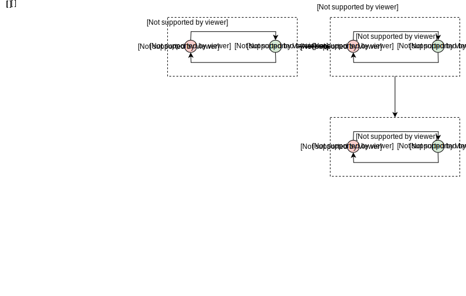

# Решение проблемы распределенного снимка

Давайте рассмотрим основополагающий алгоритм, используемый для создания распределенных снимков.

## Алгоритм Ченди-Лэмпорта

Алгоритм Ченди-Лэмпорта решает проблему создания согласованного снимка в распределенной системе.

### Идея

Алгоритм основан на следующей основной идее: между узлами по имеющимся каналам связи отправляется специальное *маркерное сообщение*, которое является инструкцией для узла записать снимок своего текущего состояния.

### Принцип работы

Алгоритм работает следующим образом:

*   Узел, инициирующий протокол, записывает свое состояние, а затем отправляет маркерное сообщение во все исходящие каналы.
    > Важно, что маркер отправляется после того, как узел записал свое состояние, и до отправки любых других сообщений по каналам.

*   Когда узел получает маркерное сообщение, его поведение зависит от того, записал ли он уже свое состояние (при отправке маркера ранее) или нет.
    *   Если узел еще не записал свое состояние, он записывает свое состояние, а затем записывает состояние канала `c`, по которому был получен маркер, как пустую последовательность. Затем он отправляет маркер во все исходящие каналы.
    *   Если узел уже записал свое состояние, он записывает состояние канала, по которому был получен маркер, как последовательность сообщений, полученных от `c` после того, как состояние узла было записано, и до того, как узел получил маркер от `c`.

На следующей иллюстрации представлен пример выполнения этого алгоритма в простой системе, описанной ранее.

---

1) Система из двух узлов, изначально токен находится у узла p.
   

2) Узел p отправляет токен по каналу, поэтому его состояние меняется на 0. Узел p инициирует протокол, записывает свое состояние и затем отправляет маркерное сообщение по каналу.
   

3) Узел q получает токен, поэтому его состояние меняется на 1.
   

4) Узел q отправляет токен по каналу, его состояние меняется на 0.
   

5) Узел q получает маркерное сообщение. Поскольку узел q еще не записывал свое состояние, он записывает свое состояние, а затем записывает состояние канала (p->q), по которому был получен маркер, как пустую последовательность.
   

6) Узел q отправляет маркер во все исходящие каналы.
   

7) Узел p получает маркерное сообщение. Поскольку узел p уже записал свое состояние ранее, он записывает состояние канала (q -> p), по которому был получен маркер, как последовательность сообщений, полученных по этому каналу после того, как состояние узла было записано, и до получения маркера от этого канала.
   
---

Узел `p` отправляет токен и сразу после этого инициирует выполнение протокола.

В результате он записывает свое состояние `s₀` и отправляет маркер по каналу `c`. Узел `q` получает токен, переходит в состояние `s₁`. Затем он отправляет токен по каналу `c′` и переходит в состояние `s₀`.

После этого он получает маркерное сообщение, записывает свое состояние `s₀` и состояние канала `c` как пустую последовательность, и отправляет маркерное сообщение по каналу `c′`.

> Обратите внимание, что это лишь один из возможных вариантов выполнения. В альтернативном варианте узел `q` мог бы обработать и токен, и маркер, записав свое состояние как `s₁` и, возможно, отправив маркер по каналу `c′` еще до отправки токена. Это привело бы к другому, но все же согласованному снимку.

Тем временем узел `p` получает токен, переходит в состояние `s₁` и буферизует токен в последовательности сообщений, полученных во время выполнения протокола создания снимка. Затем узел `p` получает маркер и записывает состояние канала `c′` как последовательность [токен].

На этом этапе протокол завершается, так как состояние всех узлов и каналов было записано, и глобальное состояние снимка следующее:

*   снимок(p): `s₀`
*   снимок(q): `s₀`
*   снимок(c): []
*   снимок(c′): [токен]