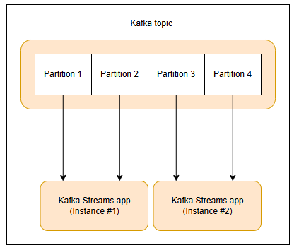
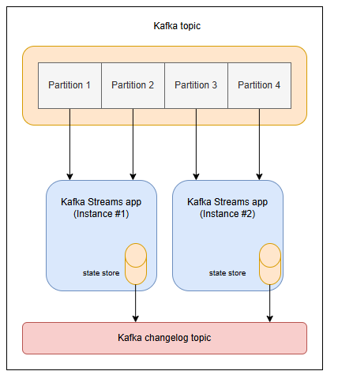

# Введение в Kafka Streams
Узнайте об основных концепциях Kafka Streams и архитектурных аспектах, таких как масштабируемость и отказоустойчивость.

# Что такое Kafka Streams
Kafka Streams — это библиотека Java для создания масштабируемых и отказоустойчивых потоковых приложений реального времени, которые обрабатывают данные в движении. Она позволяет разработчикам создавать сложные приложения потоковой обработки с помощью простого и лаконичного кода Java, используя мощь распределенной архитектуры Kafka.

Некоторые из его основных преимуществ включают в себя следующее:

1) Это всего лишь библиотека: Kafka Streams — это библиотека Java, а не платформа. Мы можем рассматривать ее как любую другую зависимость Java и включать ее в новые и/или существующие приложения. Еще одним полезным результатом того, что Kafka Streams — это всего лишь библиотека, является то, что она упрощает развертывание и масштабирование приложений Kafka Streams. Мы можем продолжать использовать наши существующие модели развертывания или выбирать из множества вариантов, включая локальные, облачные, контейнеры Docker, Kubernetes и т. д.

2) Тесная интеграция с Apache Kafka: Kafka Streams использует Apache Kafka в качестве базовой системы хранения и обмена сообщениями, что означает, что он наследует многие преимущества Kafka, такие как масштабируемость, отказоустойчивость и высокая доступность. Таким образом, Kafka является единственной зависимостью для приложений Kafka Streams, что упрощает развертывание и масштабирование приложений на практике.

3) Обработка без состояния и с состоянием: Хотя операции без состояния распространены, Kafka Streams также поддерживает вычисления с состоянием на потоковых данных. Это стало возможным благодаря сочетанию хранилищ состояний и интерактивных запросов (подробнее об этих концепциях далее в этом уроке).

# API Kafka Streams
Kafka Streams предоставляет два типа API для создания приложений потоковой обработки:

1) API DSL (язык предметной области)

2) API процессора

DSL API — это высокоуровневый API, который позволяет разработчикам создавать приложения потоковой обработки с использованием гибкого и простого в использовании синтаксиса. С помощью DSL API разработчики могут выполнять общие операции потоковой обработки, такие как фильтрация, отображение и агрегирование, а также более сложные операции, такие как объединения и оконные операции, используя простой и лаконичный код Java.

С другой стороны, API процессора — это API более низкого уровня, который обеспечивает более детальный контроль над конвейером обработки потока. С API процессора разработчики могут определять пользовательские операторы обработки потока и соединять их в направленный ациклический граф (DAG) для создания полной топологии обработки потока. Это дает разработчикам большую гибкость и контроль над конвейером обработки потока, но также требует более низкоуровневого кодирования и понимания внутренних компонентов Kafka Stream.

DSL API обычно рекомендуется для большинства вариантов использования потоковой обработки, поскольку он обеспечивает более простой и интуитивно понятный способ создания приложений потоковой обработки. Однако Processor API может быть более подходящим для определенных вариантов использования, требующих более сложной или пользовательской обработки.

# Kafka Streams: ключевые понятия
В этом уроке мы столкнемся со многими различными концепциями и терминологией, связанными с Kafka Streams. Они являются строительными блоками приложений Kafka Streams. Сейчас самое время познакомиться с ними.

1) Поток: это неограниченная, непрерывно обновляемая последовательность записей, производимых и потребляемых в реальном времени. Он содержит упорядоченную, воспроизводимую последовательность неизменяемых записей данных, где запись данных определяется как пара ключ-значение.

2) Топология: это направленный ациклический граф (DAG), представляющий конвейер обработки потока в приложении Kafka Streams. Топология состоит из набора узлов обработки потока, каждый из которых представляет определенную операцию или этап обработки в конвейере. Топологии могут быть определены с помощью API DSL или API процессора.

3) Приложение: автономное приложение Java, использующее библиотеку Kafka Streams для обработки данных в реальном времени. Приложение Kafka Streams состоит из одной или нескольких топологий потоковой обработки, которые выполняются набором экземпляров Kafka Streams, работающих в распределенной среде.

4) Раздел потока: это подмножество потока, которое содержит определенное подмножество записей в потоке. В Kafka Streams раздел потока распределяет нагрузку обработки между несколькими экземплярами приложения. Между Kafka Streams и Apache Kafka существуют тесные связи в контексте параллелизма — каждый раздел потока сопоставляется с разделом темы Kafka. Запись данных в разделе потока сопоставляется с сообщением Kafka из этой темы, а ключи записей данных определяют, как данные направляются в определенные разделы внутри тем.

5) Задача: единица работы, выполняемая экземпляром Kafka Streams. Каждый экземпляр Kafka Streams отвечает за одну или несколько задач, где каждая задача обрабатывает один или несколько разделов потока. Задачи динамически назначаются экземплярам Kafka Streams средой выполнения Kafka Streams на основе количества разделов и нагрузки обработки.

# Масштабируемость приложений Kafka Streams
Приложения Kafka Streams могут масштабироваться горизонтально, добавляя больше экземпляров приложения в кластер обработки. Kafka Streams предоставляет встроенный механизм разделения, который позволяет распределять нагрузку обработки между несколькими экземплярами приложения. В частности, Kafka Streams использует количество разделов потока в качестве основы для масштабирования. Каждый экземпляр приложения отвечает за обработку подмножества общего количества разделов потока, и нагрузка обработки равномерно распределяется между экземплярами.

Этот механизм масштабирования стал возможным благодаря базовой распределенной архитектуре Kafka. Схема разбиения Kafka гарантирует, что каждый раздел назначается определенному экземпляру приложения и что каждый экземпляр обрабатывает только те разделы, которые ему назначены. Это позволяет приложениям Kafka Streams масштабироваться горизонтально, просто добавляя больше экземпляров приложения в кластер обработки, не требуя никаких изменений в логике приложения. Кроме того, Kafka Streams обеспечивает автоматическую перебалансировку потоковых разделов при добавлении или удалении новых экземпляров приложения, гарантируя, что нагрузка обработки остается равномерно распределенной по экземплярам.

# Обработка состояния в Kafka Streams
Одной из сильных сторон Kafka Streams является поддержка вычислений с отслеживанием состояния. Это стало возможным благодаря использованию хранилищ состояний и интерактивных запросов. используются для хранения промежуточных результатов операций потоковой обработки, таких как агрегации и объединения, а также могут использоваться для поддержания пользовательской информации о состоянии для использования при обработке. Интерактивные запросы — это функция Kafka Streams, которая позволяет разработчикам запрашивать состояние приложения Kafka Streams в режиме реального времени. Они позволяют извлекать текущее состояние хранилища состояний и выполнять запросы диапазона по данным о состоянии. Интерактивные запросы можно использовать для создания панелей мониторинга в реальном времени, выполнения специального анализа и поддержки других вариантов использования, требующих доступа к текущему состоянию приложения Kafka Streams.

Каждая потоковая задача в приложении Kafka Streams может встраивать одно или несколько локальных хранилищ состояний, к которым можно получить доступ через API для хранения и запроса данных, необходимых для обработки. Вишенкой на торте является то, что Kafka Streams предлагает отказоустойчивость и автоматическое восстановление для таких локальных хранилищ состояний. Давайте посмотрим, как это работает.

# Отказоустойчивость приложений Kafka Streams
Приложения Kafka Streams построены на основе возможностей отказоустойчивости, изначально интегрированных в Kafka. Разделы Kafka высокодоступны и реплицируются. Таким образом, когда потоковые данные сохраняются в Kafka, они остаются доступными даже в случае сбоя приложения и необходимости его повторной обработки.

Задачи Kafka Streams используют возможности отказоустойчивости, предлагаемые клиентом-потребителем Kafka, для обработки сбоев. Если задача выполняется на машине, которая выходит из строя, Kafka Streams автоматически перезапускает задачу в одном из оставшихся запущенных экземпляров приложения. Это гарантирует бесперебойную работу без потери данных.

В то время как вышеизложенное работает для операций без сохранения состояния, приложения Kafka Streams с сохранением состояния являются отказоустойчивыми. Это связано с тем, что Kafka Streams обеспечивает устойчивость локальных хранилищ состояний к сбоям. Для каждого хранилища состояний он поддерживает реплицированную тему журнала изменений Kafka, в которой отслеживает любые обновления состояний. Эти темы журнала изменений разделены таким образом, что каждый экземпляр локального хранилища состояний и задача, получающая доступ к хранилищу, имеют свой собственный выделенный раздел темы журнала изменений. Сжатие журнала включено для тем журнала изменений, чтобы безопасно очищать старые данные и не допускать бесконечного роста тем.

Если задачи выполняются на машине, которая выходит из строя, и перезапускаются на другой машине, Kafka Streams гарантирует восстановление связанных с ними хранилищ состояний до содержимого до сбоя, воспроизводя соответствующие темы журнала изменений перед возобновлением обработки на вновь запущенных задачах. Это означает, что обработка сбоев полностью прозрачна для конечного пользователя.

В этом уроке мы узнали о Kafka Streams, включая его преимущества, тип поддержки API и другие ключевые концепции. Мы также изучили важные темы, связанные с общей архитектурой приложений Kafka Streams, такие как обработка состояния, масштабируемость и отказоустойчивость.

