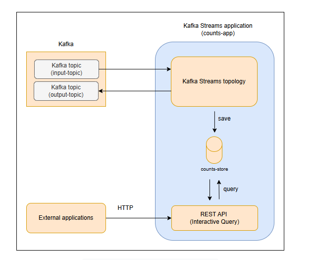

# Интерактивные запросы

Узнайте, как запрашивать состояние в приложениях Kafka Streams.

Ранее мы видели, как использовать хранилища состояний для сохранения промежуточных результатов операций с сохранением состояния, таких как агрегации и объединения. Эти хранилища реализованы как хранилища ключей и значений и могут быть как в памяти, так и на диске. Полное состояние приложения обычно разделено между множеством распределенных экземпляров приложения и множеством хранилищ состояний, управляемых локально этими экземплярами. Доступ к хранилищам состояний возможен через тему Kafka, например, преобразовав `KTable` в `KStream`, записав его в тему и прочитав данные.

Однако это не единственный способ. Kafka Streams предоставляет функцию **Interactive Queries**, которая обеспечивает доступ только для чтения к хранилищам состояний, позволяя внешним приложениям запрашивать состояние приложения потоковой обработки и извлекать определенную информацию. Например, если приложение Kafka Streams вычисляет общий объем продаж для каждого продукта, Interactive Queries позволяют внешним приложениям получать объем продаж для конкретного продукта в реальном времени.

Interactive Queries — это набор API в библиотеке Kafka Streams, предоставляющих данные хранилища состояний. Однако предоставление этих данных внешним приложениям требует дополнительной работы. Один из распространенных способов — использование REST API. Kafka Streams предоставляет встроенную конечную точку REST, через которую внешние приложения могут запрашивать данные хранилищ состояний в формате JSON.

## Архитектура приложения

Архитектура приложения, использующего Interactive Queries, включает:



1. **Основная топология Kafka Streams**: Запускает топологию потоковой обработки для поддержания состояния, например, количества просмотров продуктов.
2. **Уровень RPC**: REST API, предоставляющий данные хранилища состояний внешним приложениям.

## Пример кода

Ниже представлен пример приложения, использующего Interactive Queries для подсчета просмотров продуктов и предоставления данных через REST API.

### KafkaStreamsCountsApp.java

```java
package com.example;

import java.util.Properties;
import org.apache.kafka.common.serialization.Serdes;
import org.apache.kafka.common.utils.Bytes;
import org.apache.kafka.streams.KafkaStreams;
import org.apache.kafka.streams.StreamsBuilder;
import org.apache.kafka.streams.StreamsConfig;
import org.apache.kafka.streams.kstream.KStream;
import org.apache.kafka.streams.kstream.Materialized;
import org.apache.kafka.streams.kstream.Produced;
import org.apache.kafka.streams.state.KeyValueStore;

public final class KafkaStreamsCountsApp {

    static final String SOURCE_TOPIC = "input-topic";
    static final String TARGET_TOPIC = "output-topic";
    static final String STATE_STORE = "counts-store";
    static final String STREAMS_APP_NAME = "counts-app";
    
    public static KafkaStreams startStreamsApp() {

        Properties configurations = new Properties();
        configurations.put(StreamsConfig.APPLICATION_ID_CONFIG, STREAMS_APP_NAME);
        configurations.put(StreamsConfig.APPLICATION_SERVER_CONFIG, "localhost:8080");
        configurations.put(StreamsConfig.BOOTSTRAP_SERVERS_CONFIG, "localhost:9092");
        configurations.put(StreamsConfig.DEFAULT_KEY_SERDE_CLASS_CONFIG, Serdes.String().getClass().getName());
        configurations.put(StreamsConfig.DEFAULT_VALUE_SERDE_CLASS_CONFIG, Serdes.String().getClass().getName());

        StreamsBuilder builder = new StreamsBuilder();
        KStream<String, String> source = builder.stream(SOURCE_TOPIC);

        Materialized<String, Long, KeyValueStore<Bytes, byte[]>> store = Materialized.<String, Long, KeyValueStore<Bytes, byte[]>>as(STATE_STORE)
                .withKeySerde(Serdes.String())
                .withValueSerde(Serdes.Long());

        source.groupByKey()
              .count(store)
              .toStream()
              .to(TARGET_TOPIC, Produced.with(Serdes.String(), Serdes.Long()));

        KafkaStreams app = new KafkaStreams(builder.build(), configurations);
        app.start();
        System.out.println("Started kafka streams application");

        return app;
    }
}
```

### CountsAPI.java

```java
package com.example;

import org.apache.kafka.streams.KafkaStreams;
import org.apache.kafka.streams.state.QueryableStoreTypes;
import org.apache.kafka.streams.state.ReadOnlyKeyValueStore;
import java.util.HashMap;
import java.util.Map;

public class CountsAPI {

    public static Map<String, Long> all(KafkaStreams streams) {
        ReadOnlyKeyValueStore<String, Long> store = streams.store(
            QueryableStoreTypes.<String, Long>keyValueStore(),
            KafkaStreamsCountsApp.STATE_STORE
        );
        Map<String, Long> results = new HashMap<>();
        store.all().forEachRemaining(kv -> results.put(kv.key, kv.value));
        return results;
    }

    public static Long get(String key, KafkaStreams streams) {
        ReadOnlyKeyValueStore<String, Long> store = streams.store(
            QueryableStoreTypes.<String, Long>keyValueStore(),
            KafkaStreamsCountsApp.STATE_STORE
        );
        return store.get(key);
    }
}
```

### AppState.java

```java
package com.example;

import org.apache.kafka.streams.KafkaStreams;

public class AppState {
    private static AppState instance = null;
    private KafkaStreams streams;

    private AppState() {}

    public static synchronized AppState getInstance() {
        if (instance == null) {
            instance = new AppState();
        }
        return instance;
    }

    public void setStreams(KafkaStreams streams) {
        this.streams = streams;
    }

    public KafkaStreams getStreams() {
        return streams;
    }
}
```

### App.java

```java
package com.example;

import com.sun.net.httpserver.HttpServer;
import java.io.IOException;
import java.net.InetSocketAddress;

public class App {

    public static void main(String[] args) throws IOException {
        HttpServer server = HttpServer.create(new InetSocketAddress(8080), 0);
        server.createContext("/counts", new CountsHandler());
        server.setExecutor(null);
        server.start();

        KafkaStreams streams = KafkaStreamsCountsApp.startStreamsApp();
        AppState.getInstance().setStreams(streams);

        Runtime.getRuntime().addShutdownHook(new Thread(() -> {
            streams.close();
            server.stop(0);
        }));
    }
}
```

### CountsHandler.java (дополнительный класс для обработки HTTP-запросов)

```java
package com.example;

import com.sun.net.httpserver.HttpExchange;
import com.sun.net.httpserver.HttpHandler;
import java.io.IOException;
import java.io.OutputStream;
import java.util.Map;

public class CountsHandler implements HttpHandler {

    @Override
    public void handle(HttpExchange exchange) throws IOException {
        String response;
        String path = exchange.getRequestURI().getPath();
        
        if (path.startsWith("/counts/")) {
            String key = path.substring("/counts/".length());
            Long count = CountsAPI.get(key, AppState.getInstance().getStreams());
            response = count != null ? String.valueOf(count) : "0";
        } else {
            Map<String, Long> counts = CountsAPI.all(AppState.getInstance().getStreams());
            response = counts.toString();
        }

        exchange.sendResponseHeaders(200, response.length());
        OutputStream os = exchange.getResponseBody();
        os.write(response.getBytes());
        os.close();
    }
}
```

### Запуск и тестирование

1. Нажмите кнопку «Run» для запуска приложения. Вы должны увидеть сообщение `Started kafka streams application`.
2. Откройте терминал и запустите Kafka Consumer CLI для чтения из темы `output-topic`:

```bash
kafka-console-consumer.sh --bootstrap-server localhost:9092 --topic output-topic
```

3. Откройте другой терминал и отправьте сообщения в тему `input-topic` с помощью Kafka Producer CLI:

```bash
kafka-console-producer.sh --broker-list localhost:9092 --topic input-topic
```

Введите сообщения в формате `key:value`. Например:

```text
product_1:view
product_1:view
product_2:view
```

4. Проверьте вывод в терминале потребителя. Вы должны увидеть подсчеты, например:

```text
product_1:2
product_2:1
```

5. Используйте `curl` для запроса состояния через REST API. Например, для количества просмотров `product_1`:

```bash
curl http://localhost:8080/counts/product_1
```

Ожидаемый вывод:

```text
2
```

Для всех продуктов:

```bash
curl http://localhost:8080/counts
```

Ожидаемый вывод:

```text
{product_1=2, product_2=1}
```

## Код пояснения

### KafkaStreamsCountsApp.java

1. **Строки 3–12**: Импортируем необходимые пакеты.
2. **Строки 23–28**: Создаем объект `Properties` с конфигурацией приложения, включая идентификатор, сервер Kafka и `Serdes`.
3. **Строка 30**: Создаем `StreamsBuilder` для определения топологии.
4. **Строка 31**: Создаем `KStream` для чтения из темы `input-topic`.
5. **Строка 33**: Определяем хранилище состояний `counts-store` с `Materialized`.
6. **Строки 36–38**: Группируем данные по ключу, подсчитываем количество просмотров, сохраняем в хранилище и отправляем в тему `output-topic`.
7. **Строка 40**: Создаем и запускаем `KafkaStreams`.

### CountsAPI.java

1. **Метод `all`**: Извлекает все данные из хранилища состояний, возвращая `Map<String, Long>`.
2. **Метод `get`**: Извлекает количество для конкретного ключа.
3. Используется `ReadOnlyKeyValueStore` для доступа к хранилищу `counts-store`.

### AppState.java

1. Реализует синглтон для хранения экземпляра `KafkaStreams`.
2. Предоставляет методы для установки и получения `KafkaStreams`.

### App.java

1. Настраивает HTTP-сервер на порту 8080 для REST API.
2. Запускает топологию Kafka Streams.
3. Определяет обработчик завершения работы для корректного закрытия приложения.

### CountsHandler.java

1. Обрабатывает HTTP-запросы к `/counts` и `/counts/{key}`.
2. Возвращает данные из хранилища состояний в формате текста или JSON.

На этом уроке мы изучили Interactive Queries и рассмотрели практический пример их использования для доступа к хранилищам состояний в приложениях Kafka Streams.