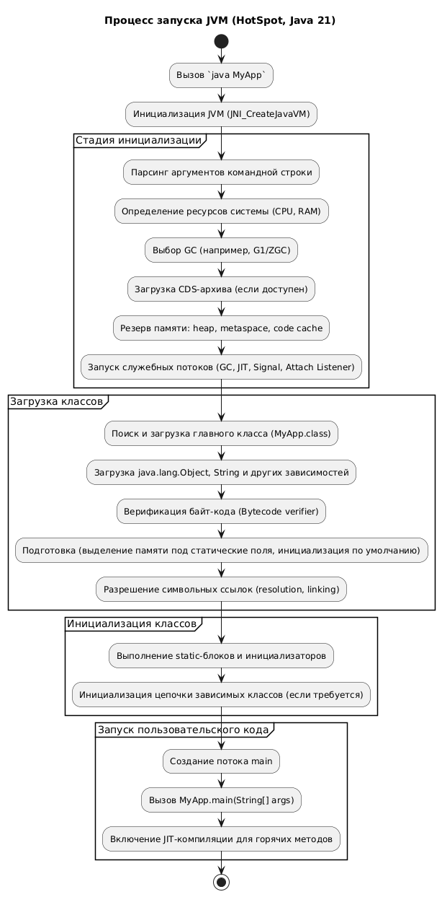

## Что такое JVM?

 
Ответ

JVM представляет собой виртуальную машину, у которой есть своя внутренняя архитектура. Она описывается через подсистемы, области памяти, исполнение инструкций и вспомогательные компоненты. Если говорить про реализацию HotSpot JVM (используемая в OpenJDK и Oracle JDK), то она состоит из трех основных подсистем:

- **Подсистема загрузчиков классов** – отвечает за нахождение и загрузку .class-файлов в память.
- **Области данных времени выполнения** – управляют памятью, необходимой для выполнения программ.
- **Механизм выполнения (Execution Engine)** – включает интерпретатор и компиляторы JIT, выполняющие байт-код, а также интегрированные сборщики мусора.

Такое разделение отражено в спецификации и помогает строго определить поведение JVM. На практике HotSpot VM реализует эти компоненты для достижения высокой производительности. Ниже приведена диаграмма общей архитектуры HotSpot JVM, показывающая взаимодействие основных частей:

Когда мы запускаем Java-программу, исходный байт-код загружается подсистемой Class Loader, затем исполняется интерпретатором либо компилируется JIT-компиляторами (C1/C2 или альтернативными). Во время исполнения JVM размещает данные в различных областях памяти (heap, stack, метаданные классов и др.), а сборщик мусора, тем временем, освобождает память от объектов, которые не используются по мере необходимости. Рассмотрим подробнее каждую составную часть.

---

## JDK, JRE, JVM, JIT и Java 11: Как связаны между собой эти аббревиатуры и что изменилось в Java 11?

 
Ответ

Жизненный цикл кода обычно описывают так:
1. Программист с помощью IDE (или блокнота) создаёт файлы с расширением .java
2. IDE или утилита javac компилирует их в байткод — файлы с расширением .class
3. JVM интерпретирует байткод в системные вызовы конкретной платформы.

Эта терминология не совсем точная. JVM — всего лишь спецификация, она предоставляет интерфейс для работы с классами, потоками, памятью, сборщиком мусора и тд. Это абстрактная сущность, физически её не существует.

Многие компании реализуют JVM - HotSpot, Azul, Excelsior и тд. Их продукт позволяет запускать программы и называется JRE (Java Runtime Environment). Помимо указанных в JVM методов JRE содержит библиотеки основных классов (rt.jar) и JIT (Just-in-time)-компилятор. JVM функции обычно интерпретируются - просто исполняются строка за строкой. JIT-компилятор оптимизирует байткод для конкретной платформы и подставляет машинные команды прямо во время работы. Это сильно увеличивает производительность.

JDK (Java Development Kit) позволяет создавать и запускать программы. Он состоит из JRE и инструментов разработки, таких как компилятор javac, дебаггер jdb, генератор документации javadoc, архиватор jar и тд.

Кратко отношения между сущностями выглядят так:
- **JVM** = спецификация
- **JRE** = реализация JVM + JIT-compiler + библиотеки
- **JDK** = JRE + инструменты разработки

JDK нужны только программистам, а тестовому окружению и продакшену для запуска программ хватает JRE. Поэтому на сайте вендоров JVM обычно представлены оба этих варианта - JDK и JRE для разных платформ.

Но всё изменилось после выхода Java 11. Теперь для скачивания доступна только JDK, а JRE отдельно не поставляется. Чтобы создать среду исполнения используется специальная утилита jlink, в ней указываются необходимые для приложения модули. Редко какой программе нужны все 75 модулей, поэтому полученная JRE занимает гораздо меньше памяти, не содержит лишних библиотек и работает быстрее.

---

## Расскажите про загрузчик классов в JVM

 
Ответ

JVM динамически загружает классы по требованию – это одна из самых мощных возможностей платформы Java. Подсистема загрузки классов (Class Loader Subsystem) ищет требуемый класс (например, по имени и пути), читает его бинарное содержимое из .class-файла и формирует в памяти внутреннюю структуру класса. Согласно спецификации JVM, загрузка классов проходит три этапа: поиск бинарного представления класса, создание класса/интерфейса на его основе и размещение этой информации в области Metaspace, где хранятся метаданные классов.

HotSpot реализует несколько уровней загрузчиков по принципу иерархии делегирования:

- **Bootstrap ClassLoader** – встроенный загрузчик, написанный на native-коде, загружает базовые классы Java из стандартной библиотеки (например, из модуля java.base). Инициализируется при старте JVM.
- **Platform/Extension ClassLoader** – загрузчик платформенных классов (в прошлых версиях – extension loader) для дополнительных библиотек расширений.
- **Application ClassLoader** – загрузчик приложений, загружает классы с указанного classpath приложения (или модульного path). Обычно реализован на Java как подкласс java.lang.ClassLoader.

Каждый загрузчик делегирует поиск классов своему родительскому загрузчику (кроме Bootstrap) – это предотвращает повторную загрузку уже загруженных классов и обеспечивает безопасность. Таким образом, если пользовательский класс обращается к классу стандартной библиотеки, Application ClassLoader сначала делегирует загрузку Bootstrap-слою.

Важно отметить, что JVM допускает создание пользовательских загрузчиков (путём наследования ClassLoader), что широко используется в современных фреймворках (OSGi, сервлет-контейнеры, JEE-серверы). Это позволяет динамически подменять или изолировать классы. Однако в данной статье мы фокусируемся на стандартном процессе загрузки с помощью bootstrap-загрузчика для простоты.

После успешной загрузки класса JVM переходит к этапам связывания и инициализации, которые рассмотрим отдельно в разделе про процесс запуска. В контексте архитектуры важно, что подсистема загрузки тесно связана с управлением памятью – загруженные классы размещаются в специальной области (метод area/метаданные), а их исполняемый код может быть скомпилирован JIT-компилятором и помещён в кодовый кэш.

---

## Какие области памяти есть в JVM?

 
Ответ

Виртуальная машина во время исполнения программы использует несколько типов областей памяти (runtime data areas), часть из которых общая для всех потоков, а часть – индивидуальна для каждого потока. В JVM (как и начиная с Java 8+) организация памяти включает следующие сегменты:

- **Heap (куча)** – основная область динамической памяти. В ней выделяется память под все объекты и массивы во время выполнения программы. Куча одна и общая для всех потоков JVM. Здесь размещаются экземпляры классов (объекты) и их нестатические поля. Куча является управляемой сборщиком мусора (GC). Размер кучи может меняться (расширяться/сжиматься) в пределах, указанных параметрами запуска (-Xms – начальный размер, -Xmx – максимальный размер). JVM по умолчанию использует алгоритм Generational Heap – делит кучу на поколения (молодое и старое), что оптимизирует сборку мусора (подробнее в разделе GC).
- **Метод area (методовая область)** – область, где JVM хранит метаданные загруженных классов: структуры классов, методы (байт-код), поля, константы, статические переменные и т.д. В HotSpot начиная с Java 8 методовая область реализована как Metaspace в нативной памяти (вне основной кучи). Эта область тоже общая для всех потоков. При загрузке нового класса JVM резервирует память в Metaspace для его описания. Размер Metaspace по умолчанию не жёстко ограничен (автоматически расширяется по потребности, ограничен лишь памятью процесса, но можно задать -XX:MaxMetaspaceSize). В JVM Metaspace улучшен по сравнению с прежней PermGen: нет фиксированного лимита по умолчанию, уменьшается вероятность OutOfMemoryError при загрузке большого количества классов.
- **Stack (стек потоков)** – у каждого потока исполнения (Java Thread) есть собственный стек JVM. В стеке хранятся кадры (stack frames) для вызванных методов, включая локальные переменные, параметры, промежуточные вычисления операндов и ссылки на пула констант класса. Каждый вызов метода помещает на стек новый фрейм, по завершении метода фрейм уничтожается. Глубина стека может быть настроена (-Xss), переполнение вызывает StackOverflowError. Стек также используется при исключениях (размотка стека). Кроме Java-стека, HotSpot выделяет Native Stack (стек native-методов) для каждого потока, где выполняется код на C/C++ или через JNI.
- **PC-регистр** – каждый поток имеет регистр счётчика программы (Program Counter), указывающий текущую исполняемую инструкцию байт-кода. Для native-потоков PC не определён (так как выполнение не управляется JVM). PC-регистр нужен JVM для отслеживания позиции исполнения, особенно при переключении контекста между потоками.
- **Кодовый кэш** – отдельная область памяти, где HotSpot хранит сгенерированный JIT-компилятором машинный код методов. Кодовый кэш (Code Cache) находится вне кучи (в native памяти процесса). Его размер ограничен флагами (ReservedCodeCacheSize, по умолчанию порядка нескольких МБ). При переполнении код-кэша JIT-компиляция может приостанавливаться. В JVM кодовый кэш используется для оптимизированного Tiered-компилированного кода, профилированного кода и даже может хранить AOT-компилированные фрагменты (если используется JAOTC или Graal AOT в ранних версиях, хотя в Java 21 встроенный AOT уже удалён, об этом позже).
- **Прочие области** – кроме вышеперечисленного, HotSpot использует «вне-heapовую память» (native heap) для своих внутренних структур, JIT-компиляторов (например, Graal JIT, если подключён, выделяет структуры в C-heap), буферов прямой памяти (NIO DirectByteBuffers) и т.д. Например, «C-Heap» упоминается как память, которую HotSpot запрашивает у ОС под собственные нужды (JVM code, internal structures, профайлеры и пр.).

Итоговая картина памяти JVM: при запуске JVM ОС выделяет процессу область адресного пространства, внутри которого JVM организует описанные сегменты – Heap (с разделением на поколения), Metaspace, Code Cache, стеки потоков и др. Некоторые области (heap, stacks) управляются автоматически GC и средой исполнения. На диаграмме ниже показано упрощённое разделение памяти на молодое/старое поколения кучи и область PermGen (в современных версиях заменена Metaspace):

Молодое поколение (Young Gen) разделено на Eden и Survivor (S0, S1), старое поколение (Old Memory) хранит долгоживущие объекты. В Java 8+ PermGen была удалена, метаданные классов хранятся в Metaspace вне кучи. Стрелками показаны сборки: Minor GC освобождает молодое поколение, Major GC – старшее; параметры -Xms/-Xmx задают размер кучи, -XX:MaxPermSize – старой PermGen (устаревший параметр).

Методическая область (PermGen/Metaspace) на диаграмме обозначена справа. В Java 21 Metaspace автоматически расширяется при загрузке большого числа классов, а при выгрузке классов (например, в контейнерах классов) может освобождать память ОС, чего не умел PermGen. За счёт этого улучшена управляемость памяти JVM в длительно работающих приложениях.

---

## Краткая характеристика областей памяти JVM?

 
Ответ

| Участок памяти | Цель | Что хранится | Типы данных | Преимущества |
| - | - | - | - | - |
| Heap (Куча) | Хранение всех объектов и массивов во время выполнения | Экземпляры классов, массивы, нестатические поля объектов | Объекты, массивы | Автоматическое управление сборщиком мусора, оптимизация через разделение на поколения |
| Metaspace | Хранение метаданных классов | Структуры классов, методы, поля, константы, статические переменные | Метаданные классов | Вынесен в native-память, масштабируется динамически, заменяет устаревший PermGen |
| JVM Stack | Обеспечение вызовов и возвратов методов (на поток) | Stack frames: локальные переменные, параметры, операнды, ссылки на константы | Примитивы, ссылки на объекты | Быстрый доступ, изоляция по потокам, эффективен для рекурсий и локальных операций |
| Native Stack | Выполнение native-кода через JNI | Данные для вызова нативных методов | Указатели, структуры, платформозависимые данные | Разделение JVM- и native-исполнения, поддержка C/C++ кода |
| PC-регистр | Указание текущей инструкции байт-кода | Адрес следующей инструкции | Смещение в методе (offset) | Точное управление порядком исполнения, поддержка многопоточности |
| Code Cache | Хранение JIT-компилированного машинного кода | Скомпилированные версии методов (машинный код) | Машинный код | Ускорение выполнения горячих методов, уменьшение интерпретации |
| C-Heap / Native Heap | Хранение внутренних структур JVM и служебных буферов | Структуры JIT, буферы DirectByteBuffer, CDS и др. | Указатели, нативные структуры | Высокая гибкость, независимость от heap, используется для собственных нужд JVM |

---

## Расскажите про Execution Engine в JVM?

 
Ответ

Execution Engine – механизм выполнения байт-кода – состоит из интерпретатора, одного или нескольких JIT-компиляторов, а также включает модуль Garbage Collection и интерфейс для вызова native-методов (JNI). В HotSpot VM исторически существуют два основных JIT-компилятора: C1 (Client Compiler) и C2 (Server Compiler), каждый оптимизирован под разные задачи. В современных сборках HotSpot они работают совместно в режиме Tiered Compilation (многоуровневая компиляция) для достижения баланса между скоростью запуска и максимальной производительностью.

- **Интерпретатор** – компонент, который запускает байт-код посредством построчной интерпретации. При интерпретации выполняется цикл: прочитать очередную инструкцию байт-кода метода, выполнить соответствующую последовательность машинных инструкций (реализующих эту семантику), затем перейти к следующей инструкции. Интерпретатор не выполняет межинструкционных оптимизаций – он просто «словари» байт-код в машинные команды на лету. Преимущество интерпретатора – моментальный старт: любой метод сразу может быть исполнен, не тратя время на компиляцию. Недостаток – медленная работа горячих участков кода, так как каждый вызов метода интерпретируется заново (если не подключается JIT).
- **JIT-компиляторы (Just-In-Time)** – компилируют горячие методы или участки байт-кода в высокопроизводительный машинный код непосредственно во время работы приложения. HotSpot имеет двух-tierовую систему: C1 (быстрый компилятор с меньшими оптимизациями) и C2 (оптимизирующий компилятор с агрессивными оптимизациями). При включённом Tiered Compilation (по умолчанию в JVM) действуют 4 уровня компиляции:
  - Tier 0: интерпретируемый код (с профилированием).
  - Tier 1-3: компиляция C1 в нескольких режимах (без профиля, с профилированием и пр.).
  - Tier 4: максимальные оптимизации C2.

  Такой подход позволяет сначала быстро скомпилировать часто вызываемый метод с помощью C1, получив умеренное ускорение, а при достаточной «нагреве» (числе запусков) – передать его C2 для тщательной оптимизации. Adaptation: C1 может собирать профили выполнения (частоты вызовов, распределение классов для виртуальных вызовов, бранчи) и передавать эти данные C2, чтобы тот сгенерировал максимально эффективный код. HotSpot JIT применяет множество оптимизаций, сходных с оптимизациями в компиляторах C++: развёртка циклов, высвёртывание методов (inlining), устранение общих подвыражений, escape-анализа (определение объектов, не покидающих метод, для размещения их на стеке) и пр. Кроме того, благодаря динамической природе JVM JIT может делать оптимизации на основе профиля: например, спекулятивно предполагать, что определённый виртуальный вызов всегда приходит к единственному классу, и встроить вызов напрямую (devirtualization). Если предположение позже нарушится (появится другой класс), JVM выполнит деоптимизацию – вернётся с машинного кода к интерпретированному исполнению для этого метода, и при необходимости перекомпилирует его заново без неверных допущений. Важная особенность JIT в HotSpot: компиляция выполняется параллельно основному коду, в фоновых потоках-компиляторах. Потому приложение не «стоит» в паузе на время JIT-компиляции, а продолжает выполняться (чаще всего интерпретатором). Однако, пока метод не скомпилирован, он работает медленнее, поэтому слишком долгие компиляции или слишком много компиляций могут влиять на общую производительность (так называемый JIT warmup time – время прогрева JIT).
- Разработчики HotSpot давно стремились уменьшить накладные расходы JIT. Например, начиная с Java 7 был введён Tiered режим, позволяющий достичь более плавного разгона производительности: сначала метод сразу интерпретируется (нулевое ожидание), затем достаточно быстро компилируется C1 (небольшая пауза, но ощутимый прирост), а спустя ещё некоторое время – C2 (ещё прирост). В результате, как правило, Java-приложение сначала показывает скромную производительность (cold start), но по мере работы, когда основные методы оптимизированы, выходит на высокий уровень (после warm-up).

Современные реализации (включая JVM) также поддерживают альтернативные JIT. Например, Graal JIT – компилятор, написанный на Java (привносится через JVMCI интерфейс, JEP 243). Graal может использоваться вместо C2 и в некоторых случаях генерирует более эффективный код. Однако в JDK 21 Graal не включён по умолчанию – ранее он был экспериментальным и убран из комплектации JDK 17 (JEP 410). Для использования Graal JIT обычно применяют GraalVM или подключают внешне. JVMCI при этом остаётся частью JVM, позволяя сторонним JIT-компиляторам интегрироваться.

- **Интерфейс JNI** – неотъемлемая часть Execution Engine. JNI (Java Native Interface) позволяет JVM вызывать нативные функции, написанные на С/С++ и других языках, и наоборот, даёт native-коду доступ к JVM. При вызове native-метода JVM передаёт управление в Native Method Interface, который использует Native Method Libraries. Это отображено на диаграмме архитектуры (блоки JNI и Native Libraries). Хотя JNI-методы исполняются вне JVM, они влияют на производительность (частые переходы через JNI дорогие) и управление памятью (нативный код должен самостоятельно управлять памятью вне кучи).

---

## Что такое режимы AOT-компиляции в JVM?

 
Ответ

Помимо JIT, в Java существует концепция Ahead-of-Time (AOT) компиляции – предварительного компилирования байт-кода в машинный код до запуска приложения. Цель AOT – сократить время прогрева и повысить предсказуемость исполнения за счёт отсутствия JIT-пауз. В чистом HotSpot исторически AOT не применялся, однако в JDK 9 был представлен экспериментальный инструмент jaotc (JEP 295) для компиляции выбранных классов заранее. Он использовал компилятор Graal для генерации native-кода, который загружался JVM при старте. Тем не менее, данная функциональность не получила широкого применения и требовала значительных усилий по сопровождению, поэтому к JDK 17 было принято решение её убрать (JEP 410). В Java 21 стандартный HotSpot не поддерживает AOT out-of-the-box. Разработчикам, нуждающимся в AOT, предлагается использовать GraalVM Native Image или иные внешние решения.

GraalVM Native Image – наиболее известное современное решение AOT-компиляции для Java. С его помощью приложение (и все используемые библиотеки) целиком компилируется в машкод на этапе сборки, формируя самодостаточный исполняемый файл. Это обеспечивает мгновенный старт (нет интерпретации и JIT) и очень низкое потребление памяти (не нужен JVM-хран, компиляторы, многие метаданные). Однако есть и минусы: длительное время компиляции, отсутствие некоторых динамических возможностей Java (рефлексия, динамическая загрузка классов – требуют дополнительных манипуляций при сборке), и самое главное – более низкая пиковая производительность в долгосрочной перспективе. Поскольку AOT-компилятор не располагает точным профилем исполнения, он вынужден генерировать более консервативный код. Практика показывает, что высоконагруженные долгоживущие сервисы под управлением классического HotSpot JIT со временем обгоняют по скорости аналогичные AOT-образа. В целом JIT обеспечивает более высокую итоговую производительность за счёт динамических оптимизаций, тогда как AOT выигрывает в быстроте запуска и экономии памяти. Поэтому выбор JIT vs AOT зависит от характера приложения:

- **JIT (HotSpot)** – оптимален для длительно работающих приложений, где важна максимальная скорость выполнения бизнес-логики после прогрева (серверные приложения, сервисы с постоянной нагрузкой). Благодаря адаптивной оптимизации JIT-компиляции код может выполняться быстрее, особенно при сложных профилируемых сценариях. Также JIT полностью поддерживает всю динамику Java (рефлексия, прокси, динамические классы) без дополнительных усилий.
- **AOT (GraalVM Native Image)** – привлекателен для сценариев, требующих мгновенной готовности и малого footprint: Serverless-функции с ограничением холодного старта, небольшие микросервисы в контейнерах, CLI-утилиты, приложения для ограниченных сред. Они запускаются практически моментально и потребляют меньше памяти, хотя на продолжительных вычислениях могут уступать JIT по скорости.

Стоит упомянуть проект OpenJ9 (JVM от Eclipse/IBM), в котором поддерживается AOT в комбинации с профилированием (он может сохранять профили между запусками, аналогично как .NET). Но в контексте стандартного HotSpot/OpenJDK 21 встроенной поддержки AOT нет. Перспективы развития AOT в Java связаны с проектом Leyden, целью которого объявлено улучшение времени старта Java-приложений, возможно путём статической компиляции. Но по состоянию на Java 21 Leyden находится в ранних исследованиях.

Таким образом, архитектура JVM представляет собой развитую систему с адаптивной JIT-компиляцией, эффективным сборщиком мусора и модульной структурой, обеспечивающей высокую производительность и масштабируемость. Далее мы подробнее рассмотрим управление памятью и сборку мусора, а затем процесс запуска JVM, где многие из описанных компонентов взаимодействуют.

---

## Как происходит сборка мусора (Garbage Collection) в JVM?

 
Ответ

Сборщик мусора (GC) в JVM отвечает за автоматическое освобождение памяти, занятой объектами, которые больше недоступны программе. Это ключевое преимущество Java над языками с ручным управлением памятью: GC избавляет от утечек памяти и ошибок освобождения, обеспечивая более надёжное управление памятью. HotSpot реализует гибкую подсистему GC с поддержкой нескольких алгоритмов, настраиваемых под разные требования по паузам и производительности. Все современные сборщики являются трэссирующими (tracing collectors) – т.е. находят «мусор» путём обхода графа объектов от корней (статические переменные, стеки, регистры) и поиска недостижимых объектов.

**Generational GC (поколения).** HotSpot с ранних версий использует поколений подход: объекты разделяются на молодое поколение (Young) и старшее поколение (Old). Молодое поколение предназначено для короткоживущих объектов: большинство новых объектов возникают и быстро становятся недостижимыми (например, временные объекты в методах). Старшее поколение хранит объекты, пережившие достаточное число циклов сборки (долгоживущие). Такой подход основан на эмпирическом факте, что «большинство объектов умирает молодым». Он позволяет применять разные алгоритмы к разным поколениям, оптимизируя работу:

- **Minor GC** – частая и быстрая сборка, очищающая молодое поколение. Выполняется сравнительно часто, но затрагивает малый объём памяти, поэтому паузы небольшие.
- **Major GC / Full GC** – более редкая, очищает старшее поколение (а иногда и весь heap). Выполняется реже, но может быть более тяжёлой.

Young-поколение в HotSpot itself разделено на Eden и два Survivor пространства (S0, S1). Новый объект сначала выделяется в Eden; при заполнении Eden запускается Minor GC: живые объекты из Eden перемещаются (копируются) в Survivor пространства (один из них, второй пустой), а Eden очищается целиком. Survivor пространства чередуются ролями (копирующий GC). Объекты, несколько раз пережившие Minor GC, перемещаются в старший heap (tenured). Старшее поколение обычно собирается алгоритмом маркировки-сжатия либо инкрементальными алгоритмами.

По умолчанию JVM использует Garbage Collector G1, который также придерживается поколений, но реализует их по-своему.

---

## Какие есть алгоритмы сборки мусора в JVM?

 
Ответ

JVM поддерживает несколько GC, каждый со своими особенностями. Кратко опишем основные сборщики:

- **Serial GC** – однопоточный маркировочно-сжатия GC. Самый простой алгоритм: останавливает все потоки приложения (Stop-The-World), обходит граф объектов (Mark), затем подряд освобождает память мусора и сжимает кучу (Compact). Подходит для небольших heaps (к примеру, в средах с одним ядром). В современных Java не используется по умолчанию, но может быть включён флагом -XX:+UseSerialGC.
- **Parallel GC (Parallel Scavenge)** – многопоточная версия, также с разделением поколений. Выполняет Minor и Major GC с использованием нескольких потоков GC параллельно, что ускоряет сборку на многоядерных машинах. При этом по-прежнему Stop-The-World. Цель – максимальная пропускная способность (Throughput). Этот GC был долгое время default в Java (до 8 включительно), и всё ещё актуален для batch-нагрузок, где допускаются паузы, но важна скорость переработки (например, офлайн вычисления). Включается -XX:+UseParallelGC.
- **CMS (Concurrent Mark-Sweep)** – ранний низколатентный сборщик, работавший параллельно с приложением на фазах mark и sweep, стараясь минимизировать паузы. Не компактировал heap (оставлял фрагментацию). CMS считался практически устаревшим: начиная с JDK 9 помечен deprecated, а в JDK 14 удалён. Его место заняли более новые алгоритмы.
- **G1 (Garbage-First)** – дефолтный GC с Java 9 по настоящее время (включая 21). G1 – региональный сборщик: он делит heap на множество равных регионов (обычно несколько тысяч), и управляет ими гибко. Молодое и старое поколения существуют логически: G1 осуществляет конкурентную маркировку объектов по всему heap, а затем регулярно выполняет эвакуацию (копирование) «молодых» объектов из одних регионов в другие, освобождая целые регионы. Отсюда название Garbage-First – он в первую очередь собирает регионы с наибольшим процентом мусора. G1 стремится делать паузы небольшой фиксированной длительности, настраиваемой параметром (-XX:MaxGCPauseMillis, по умолчанию ~200мс). При этом G1 не гарантирует паузу, но пытается ее не превышать, регулируя объём работы. В худшем случае может произойти Full GC (редко). G1 умеет работать на больших heap (до нескольких десятков гигабайт и более) с умеренными паузами.
- **Shenandoah** – альтернативный низколатентный GC, разработанный Red Hat. Появился в JDK 12 (экспериментально), с JDK 15 стал продуктивным. Shenandoah осуществляет конкурентное копирование – он умеет перемещать объекты параллельно с работой приложения, благодаря технологии load-reference barrier. Это позволяет стремиться к паузам порядка 10 мс независимо от размера heap (даже на сотнях гигабайт). Shenandoah ориентирован на сценарии, требующие крайне низких пауз (финансы, телеком). Включается опцией -XX:+UseShenandoahGC. В Java 21 Shenandoah присутствует, хотя не является дефолтным.
- **ZGC (Z Garbage Collector)** – ещё один современный GC с ультранизкими паузами, разработанный Oracle. Впервые появился в JDK 11 (экспериментально), с JDK 15 – стабильный. ZGC способен работать с очень большими кучами (до терабайтов), обеспечивая паузы не больше 10мс. Он достигает этого за счёт полностью конкурентной маркировки и уборки, без компактации (до JDK 21) или с частичной компактацией на лету. Особенность ZGC – использование цветных меток в указателях (colored pointers) для маркировки состояния объекта. В JDK 21 ZGC получил поколения (JEP 439) – теперь он разделяет молодые и старые объекты, что улучшает производительность за счёт более частого сбора короткоживущих объектов. Generational ZGC – большое усовершенствование, введённое в Java 21. Включается ZGC флагом -XX:+UseZGC (учтите, generational режим может быть опционально настраиваемым в 21).
- **Epsilon GC** – «нулевой» сборщик (JEP 318, Java 11). Он вообще не собирает мусор, просто допускает рост heap (и по достижении лимита завершает приложение). Предназначен для тестирования и измерения поведения приложений без GC пауз, а также для очень специфических случаев (например, краткоживущие процессы, где проще завершиться чем тратить время на GC). Включается -XX:+UseEpsilonGC. В реальных продакшн-системах не используется, это скорее исследовательский инструмент.

В JVM по умолчанию включён G1 GC, так как он обеспечивает сбалансированные характеристики (приемлемые паузы и высокую throughput). Однако разработчик/администратор может выбрать иной GC, исходя из потребностей приложения. Например, для latency-критичных систем можно попробовать Shenandoah или ZGC, для простых утилит с малой кучей – SerialGC, для memory-heavy batch – ParallelGC.

Важно понимать, что все сборщики (кроме Epsilon) автоматические и безопасны по типам – они никогда не освободят объекты, на которые ещё есть ссылки, что гарантируется алгоритмом трассировки. Также современные GC справляются с циклическими ссылками (в отличие от простого подсчёта ссылок), поскольку обход графа объектов обнаружит цикл как группу недостижимых снаружи объектов, и они будут очищены.

---

## Когда какой сборщик мусора использовать?

 
Ответ

| GC | Stop-the-World | Параллельность | Компактация | Поколения | Паузы | Heap Размеры | Когда использовать | Флаг |
| - | - | - | - | - | - | - | - | - |
| Serial GC | Да | Нет | Да | Да | Высокие | Малые | Однопоточность, тесты, устройства с ограниченными ресурсами | -XX:+UseSerialGC |
| Parallel GC | Да | Да (GC-потоки) | Да | Да | Средние | Средние / Большие | Batch-процессы, throughput важнее пауз | -XX:+UseParallelGC |
| CMS (устаревший) | Частично | Да | Нет | Да | Низкие | Средние | Устаревший, заменён на G1 или Shenandoah | Удалён с JDK 14 |
| G1 GC | Да (частично) | Да | Да (инкрементно) | Да (регионально) | Предсказуемые, настраиваемые | Большие (до ~32-64 ГБ и ?) | По умолчанию: сбалансированные нагрузки, предсказуемость пауз | -XX:+UseG1GC |
| Shenandoah | Минимальные | Полная (в т.ч. копирование) | Да (on-the-fly) | Нет | Очень низкие (<10мс) | Большие | Низколатентные приложения, финансовые/реалтайм-системы | -XX:+UseShenandoahGC |
| ZGC | Минимальные | Полная (все фазы GC) | Да (с JDK 21) | Да (с JDK 21) | <10мс | Очень большие (до ТБ) | Ультранизкие паузы, огромные heaps, серверные системы | -XX:+UseZGC |
| Epsilon GC | Нет | Нет | Нет | Нет | Нет | Любые (ограничен лимитом) | Тестирование, симуляция без GC, однократные short-lived задачи | -XX:+UseEpsilonGC |

---

## Тюнинг JVM, что можно настроить?

 
Ответ

HotSpot предоставляет множество флагов для настройки GC, хотя в большинстве случаев ручной тюнинг не требуется – алгоритмы адаптивны. Тем не менее, понимание их работы важно для отслеживания производительности. Параметры, которые часто учитывают:

- **Размеры поколения**: для G1 можно задавать максимальный размер региона -XX:G1HeapRegionSize, для Parallel – долю young поколения -XX:NewRatio или абсолютный -Xmn. Чрезмерно маленький young может вызвать слишком частые Minor GC, а слишком большой – замедлить Major GC.
- **Паузы vs throughput**: G1 и другие имеют цели пауз (MaxGCPauseMillis). Уменьшая цель паузы, мы жертвуем throughput, т.к. GC будет разбивать работу на более мелкие части.
- **Concurrent циклы**: Shenandoah и ZGC практически не требуют тюнинга, но можно контролировать порог использования heap при котором начинается цикл (InitiatingHeapOccupancyPercent для Concurrent Mark).
- **Логирование GC**: крайне важный инструмент – флаг -Xlog:gc* (в Java 9+), включающий подробный лог сборок. Разработчик может анализировать длительность пауз, частоту, причины триггеров. Существуют утилиты (например, gceasy.io) для парсинга GC-логов.
- **Профилирование памяти**: с Java 11 доступен JDK Flight Recorder (о нём позже), который позволяет собирать события, включая данные по GC, распределениям объектах и т.д. Также jcmd утилита (jcmd <pid> GC.heap_info и др.) может вывести текущую статистику кучи.

Начиная с Java 8, многие параметры GC объединены и упрощены (Unified Logging ввёл единый формат логов, вместо десятков флагов PrintGCDetails и т.д.). В Java 21 продолжает совершенствоваться адаптивность: например, JEP Tune меняются эвристики G1, Shenandoah и ZGC улучшаются с каждой версией, чтобы без ручного вмешательства обеспечивать оптимум. Тем не менее, в приложениях с особыми требованиями мониторинг GC и понимание его поведения – обязательная часть работы.

---

## Основные настройки JVM?

 
Ответ

HotSpot JVM предоставляет богатый набор параметров запуска (-X и -XX опции) для настройки поведения. Однако разработчику следует с осторожностью подходить к тюнингу – современные дефолты уже подходят для большинства случаев. Тем не менее, несколько ключевых областей настройки:

- **Память (Heap)**: как отмечалось, -Xmx задаёт максимум кучи, -Xms – начальный размер. По умолчанию максимум – небольшой процент от физической памяти (на серверных JVM ~25%). Для серверных приложений часто устанавливают -Xms равным -Xmx чтобы избежать постепенного роста. Также иногда увеличивают Metaspace, если приложение загружает много классов (-XX:MetaspaceSize / MaxMetaspaceSize).
- **Выбор GC**: флаги -XX:+UseG1GC (по умолчанию), +UseZGC, +UseShenandoahGC и др. Позволяют переключиться на нужный сборщик. Можно также регулировать связанные параметры (упомянутые выше).
- **JIT-компиляция**: обычно не требует вмешательства. В редких случаях отключают TieredCompilation (-XX:-TieredCompilation) – тогда используется только C2, или ограничивают уровень (-XX:TieredStopAtLevel=1 – только интерпретация и C1, без C2). Это бывает полезно для низкоресурсных сред или при отладке, но в боевых системах лучше оставлять по умолчанию. Можно управлять профилированием (флаги типа -XX:+PrintCompilation для логов JIT, -XX:CompileThreshold – пороги горячих методов, но трогать их без крайней необходимости не рекомендуется).
- **Другие флаги производительности**: например, -XX:+UseStringDeduplication (G1 умеет дедуплицировать строки в heap), -XX:+AlwaysPreTouch (протянуть память heap при старте, чтобы избежать мягких ошибках page fault на старте), -XX:+OptimizeStringConcat (оптимизация конкатенации строк), и множество других. Их воздействие минимально, либо уже включены по умолчанию, либо специфично.

Практическим подходом является измерение и профилирование вместо гадания настроек. Сначала собрать профили (CPU, heap, GC) на дефолтной конфигурации, затем понять узкие места и лишь потом применять тюнинг.

---

## Какие есть встроенные средства мониторинга (JMX, JFR, инструменты)?

 
Ответ

JVM предоставляет встроенную инструментализацию для мониторинга и управления в runtime. С помощью технологии JMX (Java Management Extensions) можно отслеживать состояние памяти, сборки мусора, потоки и пр., а также управлять некоторыми параметрами на лету. JVM содержит Platform MBeans – менеджеры, публикующие метрики VM. Например, MemoryMXBean даёт информацию о heap/Metaspace, GarbageCollectorMXBean – статистику по сборкам мусора, ThreadMXBean – данные о потоках.

Для доступа к JMX можно использовать JConsole или VisualVM – графические утилиты, входящие в JDK. JConsole подключается к запущенной JVM (при включённом JMX) и показывает графики использования heap, времени сборок, количество классов, загрузку CPU и т.д. VisualVM идёт дальше – предоставляет профайлер CPU и памяти, возможность снимать дампы heap. Эти инструменты полезны в отладке и диагностике приложений.

Начиная с JDK 11 (через JEP 328) полностью открыт и доступен Java Flight Recorder (JFR). JFR – высокопроизводительный встроенный профайлер, изначально разработанный в Oracle JRockit. Он позволяет с минимальным оверхедом (<1% overhead) записывать события исполнения: от системных (CPU, IO) до JVM-внутренних (пауз GC, JIT-компиляции, аллокации объектов, блокировки, потоки). Запись можно запустить с командной строки (-XX:StartFlightRecording=...) или динамически через jcmd (jcmd <pid> JFR.start). Данные собираются в файл .jfr, который затем анализируется в Java Mission Control (JMC) – специальной утилите/IDE для анализа профилей. С JFR можно, к примеру, увидеть подробный профиль задержек GC, горячие аллокации в heap, стектрейсы самых загрузенных потоков и многое другое – бесценная информация для оптимизации приложений.

Для on-line мониторинга часто применяются консольные команды: jstat (статистика памяти и GC), jstack (стек-потоков), jmap (дамп памяти), jcmd (универсальный инструмент отправки команд JVM, может делать всё вышеперечисленное и более). Они позволяют получать слепки состояния, которые можно проанализировать. Например, jstat -gc <pid> 1000 покажет каждые секунду информацию о заполнении Eden/Survivor/Old и количестве GC.

В продакшне всё более популярно собирать метрики JVM через платформы наблюдения – например, экспозиция через Micrometer/Prometheus или аналогичные, что в конечном итоге используют всё те же JMX-данные под капотом. Многие runtime-платформы (напр. Spring Boot) по умолчанию собирают базовые метрики JVM – потребление heap, время GC, count gc – и публикуют для мониторинга, так что команда DevOps может следить и реагировать на аномалии (например, рост времени сборок или утечки).

Подводя итог, JVM предоставляет все необходимые крючки для мониторинга: от простых (JConsole) до продвинутых (Flight Recorder). Инженеру следует использовать их проактивно, чтобы видеть реальную картину работы приложения (в отличие от пытаться предугадывать и тюнить “вслепую”).

---

## Как происходит процесс запуска JVM?

 
Ответ

Когда мы выполняем команду `java MyApp`, запускается цепочка действий внутри JVM, создающая всю описанную ранее «вселенную» для приложения, ещё до того как напечатается ваше первое “Hello, World!”.

---

## Как происходит инициализация JVM?

 
Ответ

Процесс запуска начинается с инициализации самой виртуальной машины. При вызове исполняемого файла `java` основная программа запуска вызывает функцию `JNI_CreateJavaVM()` из JNI-интерфейса. Эта функция создаёт экземпляр виртуальной машины и выполняет ряд важных шагов:

- **Валидация аргументов**: JVM проверяет входные параметры командной строки (флаги JVM, указание класса или jar-файла для запуска, classpath и пр.). Любые незнакомые или противоречивые опции вызовут ошибку ещё до запуска. С Java 9 формат опций был унифицирован (например, предупреждения при использовании deprecated-флагов). В debug-логе (-Xlog:arguments*) можно увидеть результат парсинга аргументов.
- **Детектирование ресурсов системы**: JVM определяет характеристики среды, на которой запущена. В частности, число доступных процессоров (ядер) для настройки внутренних потоков (например, GC-потоков), объём доступной памяти, размер страницы памяти, наличие/отсутствие определённых системных сервисов. Эти данные влияют, например, на выбор дефолтного GC (HotSpot может выбрать SerialGC на однопроцессорной машине) или количества потоков компиляции.
- **Подготовка среды исполнения**: HotSpot выполняет ряд внутренних инициализаций – резервирует память под Heap (согласно -Xms и т.д.), инициализирует основные структуры. Интересный факт: при старте HotSpot генерирует в памяти платформо-зависимый интерпретатор на основе шаблонов (Template Interpreter), т.е. фактически собирает низкоуровневый код для выполнения байт-кодов. Кроме того, на этом этапе JIT-компиляторы (C1, C2) загружаются и готовятся к работе: выделяют буферы, создают очереди задач. Если включена JVMCI, может загружаться JVMCI-компилятор (например, Graal, если бы он был подключён).
- **Выбор сборщика мусора**: во время старта принимается решение, какой GC будет активен. Хотя по умолчанию задан G1, JVM учитывает особые случаи. Например, в клиентском режиме на очень малой памяти может быть выбран SerialGC, или если указана опция -XX:+UseZGC – то ZGC. В логе (-Xlog:gc*) можно увидеть сообщение о выбранном сборщике. В Java 21 с добавлением Generational ZGC, если включить ZGC, то по умолчанию будет generational-режим (его можно отладочно переключать). Также JVM на старте рассчитывает размеры поколений, размер регионов (G1 автоматически подбирает размер региона на основе heap – обычно так, чтобы было ~2048 регионов).
- **Загрузка и маппинг архивов CDS**: очень важный шаг в современном запуске – Class Data Sharing (CDS). Начиная с JDK 9+, JVM поставляется с предсозданным архивом базовых классов (classes.jsa), который маппится в память при старте. В Java 21 CDS архив по умолчанию включен и содержит ~12 тыс. наиболее часто используемых классов Java SE. JVM пытается найти этот архив (в JDK) и загрузить сегмент с уже подготовленными образами классов. Это значительно ускоряет запуск, поскольку классы из архива не нужно парсить и верифицировать – они уже проверены. Если архив не найден или несовместим (бывает при изменении конфигурации), JVM продолжит без него. Также, если используется AppCDS (архив пользовательских классов, созданный заранее), он тоже подключается тут.
- **Создание Method Area (Metaspace)**: JVM выделяет первоначальный Metaspace (или PermGen в старых версиях). В HotSpot Metaspace размещается на нативной куче. На старте может быть выделен initial Metaspace (опция MetaspaceSize задаёт объём, после которого начнёт расти). Этот этап упомянут в описаниях как создание структуры method area.
- **Старт служебных потоков**: виртуальная машина запускает свои фоновые потоки: GC threads (для параллельного GC), JIT-compiler threads (C1/C2 компиляции), Signal handler thread (обрабатывает сигналы ОС), Attach Listener (для инструментов вроде jcmd), Periodic Tasks thread (занимается вспомогательными задачами). Все эти потоки запускаются прежде, чем начать выполнение кода пользователя.

Когда среда готова, JVM переходит к загрузке пользовательского класса с public static void main.

---

## Как происходит загрузка главного класса?

 
Ответ

JVM получает от launcher-а имя класса или модуль и класс, который нужно запустить (например, MyApp из команды). Далее работает подсистема Class Loader:

- **Поиск и загрузка класса приложения**. Bootstrap ClassLoader начинает поиск указанного класса MyApp в предоставленном classpath (или modulepath, если используется модульная система). Если класс не модульный, то AppClassLoader (порождённый от Bootstrap) будет фактически читать файл MyApp.class. Предположим, MyApp находится в текущей директории или в jar – класс будет найден и считан. Байты .class загружаются в память, парсится структура (проверяется магическое число, версия, заголовки). На этом шаге создаётся объект класса Class<MyApp> внутри JVM, но он пока не полностью готов к использованию.
- **Решение зависимостей**. При загрузке MyApp JVM обнаруживает, от каких других классов он зависит. Например, любой класс Java неявно наследуется от java.lang.Object. Значит, перед тем как завершить загрузку MyApp, JVM должна убедиться, что загружен java.lang.Object, а также другие используемые типы (родители, интерфейсы, типы полей). В частности, если MyApp имеет метод public static void main(String[] args), то JVM потребуется загрузить класс java.lang.String (и его зависимости) прежде, чем запустить main. Таким образом, загрузка часто рекурсивно вытягивает цепочку классов. По логам (с -Xlog:class+load=info) можно увидеть, как JVM сначала грузит java.lang.Object, затем связанные интерфейсы, потом java.lang.String и т.д., прежде чем добраться до самого MyApp. К счастью, большинство базовых классов уже лежат в CDS архиве и их загрузка сводится к маппингу страницы памяти.
- **Верификация класса (часть связывания)**. После загрузки сырого байткода JVM проводит верификацию – проверяет корректность класса по ряду правил (типы, допустимость инструкций, правильность наследования и т.п.). Это критический этап безопасности – он гарантирует, что байт-код не нарушает высокоуровневую безопасность (например, не сможет произвольно записать в чужую область памяти). Верификация описана в спецификации (раздел 5.4.1) и включает проверку форматирования, семантическую проверку, контроль потоков выполнения (асм-уровня) на предмет корректности типов стека и т.д. Если класс не проходит проверку – получим VerifyError. В CDI-архиве классы уже считаются проверенными и подготовленными, поэтому стандартные классы обычно пропускают этот шаг во время старта, что ускоряет загрузку. Однако HelloWorld (наш класс) не из архива, значит JVM выполнит его полную верификацию (в логах это можно увидеть при включенном -Xlog:class+load).
- **Подготовка (Preparation)**. Далее выполняется фаза подготовки (spec 5.4.2): для загруженного класса выделяются и инициализируются статические поля базовыми значениями. Например, если в классе MyClass есть static int X = 10;, то на этапе подготовки JVM зарезервирует память под MyClass.X и установит значение по умолчанию (для int это 0). Инициализация присвоенным константам (10) пока не производится – это будет на следующем этапе (инициализация класса). Также JVM вычисляет размер объектов, смещения полей, готовит таблицы виртуальных методов.
- **Разрешение (Resolution)**. Этот подэтап (spec 5.4.3) может происходить как лениво, так и сразу. Разрешение означает перевод всех символьных ссылок в постоянные ссылки. В .class файле ссылки на другие классы, методы и поля хранятся в символьном виде (пул констант: имена, дескрипторы). JVM может по требованию разрешать их – т.е. находить соответствующий загруженный класс, метод и ставить прямой указатель. По стандарту, JVM волен откладывать resolution до первого использования. HotSpot обычно выполняет разрешение лениво: например, вызов метода не будет разрешён, пока не вызовется. Тем не менее, некоторые реализации (или режимы) могут разрешить всё сразу после загрузки. Для нашего рассмотрения достаточно знать, что когда main начнёт вызывать что-то, JVM уже к тому моменту загрузит и свяжет требуемые сущности.

После прохождения загрузки и связывания класс считается полностью загруженным и подготовленным. На него можно ссылаться, вызывать его методы (в том числе main). Но прежде чем выполнить метод main, JVM должна выполнить инициализацию класса.

---

## Как происходит инициализация классов и запуск main?

 
Ответ

Инициализация класса (spec 5.5) – финальная фаза жизни класса перед использованием. Здесь выполняются все его статические инициализаторы: присваиваются заданные значения статическим полям и исполняется блок static { ... } если присутствует. Инициализация происходит лениво: класс инициализируется при первом активном использовании (например, при первом обращении к любому статическому полю или методу класса). Для класса, содержащего метод public static void main, инициализация происходит непосредственно перед вызовом main. В нашем примере, MyApp имеет, возможно, статические поля – они получат указанные значения. Если есть статический блок – он выполнится.

Инициализация происходит под монитором класса (для гарантии потокобезопасности). Если класс A ссылается на неинициализированный B, то в процессе инициализации A JVM может инициализировать B (это называется инициализация по требованию). Порядок сложных сценариев детально описан в спецификации, но ключевое: JVM автоматически позаботится, что все нужные классы инициализированы в корректном порядке перед использованием.

После инициализации класса MyApp, JVM создаёт основной поток выполнения (т.н. “main” thread) и вызывает метод MyApp.main(String[] args). С этого момента начинается непосредственное выполнение пользовательского кода.

---

## Какая роль JIT/AOT при старте (Cold vs Warm start)?

 
Ответ

В первые мгновения работы приложения много кода выполняется интерпретированным, поскольку JIT-компиляторы еще не успели оптимизировать методы. Такой запуск называется «холодным» (cold start) – приложение работает на полную функциональность, но медленнее, пока JVM прогревается. Прогрев – это процесс компиляции горячих методов и постепенного повышения производительности. Обычно наблюдается график: после старта throughput нарастает, достигая плато спустя некоторое время (секунды, минуты – в зависимости от приложения).

Для демо-программы “Hello World” JIT может даже не успеть сработать – она завершится раньше. В примере лога компиляций PrintCompilation мы видели, что HelloWorld.main так и не был скомпилирован, выполненный только интерпретатором, а вот несколько методов из стандартной библиотеки успели скомпилироваться (String.hashCode и др.) – JVM компилирует то, что считает горячим даже на столь коротком пробеге.

Тёплый старт (warm start) – не строго определённый термин, но обычно означает повторный запуск, при котором можно повторно использовать некоторые данные компиляции от предыдущего запуска. Классический HotSpot из коробки не сохраняет JIT-скомпилированный код между запусками (каждый старт компилирует заново). Однако механизмы, сокращающие холодный старт, существуют:

- Как упоминалось, CDS архив хранит уже проверенные и даже частично размеченные классы, что экономит время на верификации/разборе.
- JEP 445 (в будущем Java 23/24) – Stable APIs – намекает на возможность сохранения неких «stable values» для ускорения запуска.
- Проект CRaC (Coordinated Restore at Checkpoint) – не в OpenJDK по умолчанию, но в спец.сборках (например, BellSoft Liberica) – позволяет «заморозить» работающую JVM и потом быстро восстановить её состояние (по сути, снимок памяти после прогрева). Этот подход дает эффект мгновенного старта, поскольку восстанавливается уже прогретая JVM.
- GraalVM Native Image – это вообще устранение прогрева: код оптимизируется статически. Цена – возможная потеря пиковой производительности, но для некоторых сценариев оно оправдано.

В контексте стандартной JVM, быстрый старт достигается за счёт CDS, уменьшения количества загружаемых классов (modularity, более меньшие приложения загружаются быстрее) и за счёт общей оптимизации HotSpot в новых версиях. Разработчику рекомендуется профилировать приложения на старте – иногда можно выявить, что большое время старта тратится, например, на инициализацию тяжёлых структур (в самом приложении). Тогда как со стороны JVM помочь может лишь настройка CDS или использование альтернатив (как GraalVM AOT).

Отметим, что внутренние оптимизации JVM с каждой версией уменьшают время прогрева. Например, JEP 439 (Generational ZGC) в JDK 21 снижает нагрузку GC при старте, так как молодые объекты убираются быстрее. Также были работы по ускорению класслоадера, Link Resolution, и т.д. (см. JEP 483 анонсированный на JDK 24, улучшающий старт за счёт оптимизаций в linking).

---

## Какие финальные шаги запуска JVM?

 
Ответ

После вызова main() JVM переходит в режим обычного выполнения приложения. Далее уже включаются описанные ранее механизмы: методы постепенно JIT-компилируются, GC срабатывает по заполнению поколений, пользовательские потоки создаются и исполняются.

Важно, что сам процесс запуска JVM – весьма надёжный и отлаженный. Если на этапе старта происходит ошибка, как правило, это фатально (JVM не смогла запуститься или загрузить главный класс). Во время же выполнения большинство ошибок – следствие проблем приложения (NullPointerException и прочие), а JVM как платформа продолжает работать. Таким образом, этап запуска либо завершается успешно и приложение работает до нормального завершения, либо прерывается очень рано с сообщением об ошибке (например, класс не найден, VerifyError, OutOfMemory при инициализации, и т.д.).

---

## Как обнаружить причину утечки памяти (memory leak)?

 
Ответ

Как правило, следствием утечки памяти становится замедление приложения и/или появление OutOfMemoryError: xxx.

**Что может быть причиной:**
- Неверно сконфигурированная JVM - удалите все ключи jvm, и попробуйте воспроизвести проблему.
- Объективная нехватка памяти - добавьте ее в Heap (-Xmx / -Xms) и PermGen (-XX:PermSize / -XX:MaxPermSize) для версий Java 7 и ниже.
- Утечка в загрузчике классов (class loader) - ограничьте Metaspace -XX:MaxMetaSpaceSize={unlimited} для версий Java 8 и выше, чтобы ограничить потребление физической памяти и локализовать проблему.
- Ошибки проектирования - незакрытые потоки ввод-вывода, зависшие потоки (threads), ...

**Рекомендации по диагностированию:**
- Утилиты VisualVM, MissionControl, jstat, jmap - для анализа состояния JVM в моменте.
- Включение GC-логов - -XX:PrintGCDetails и других. Их можно анализировать с помощью GCLogAnalyzer или GCViewer.
- Включение создания дампа памяти при ошибке OutOfMemoryError: xxx - XX:HeapDumpOnOutOfMemoryError и -XX:HeapDumpPath=<file_name>. Анализ дампа можно производить с помощью Memory Analyzer (MAT).

