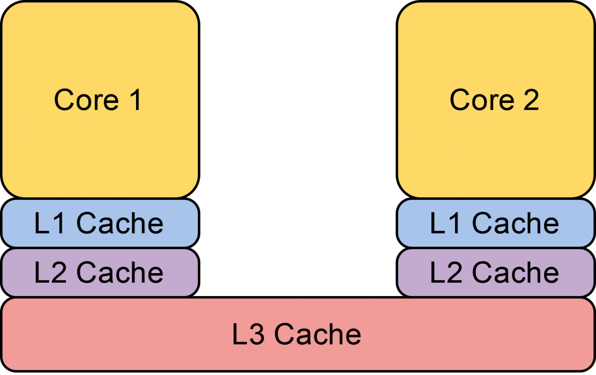
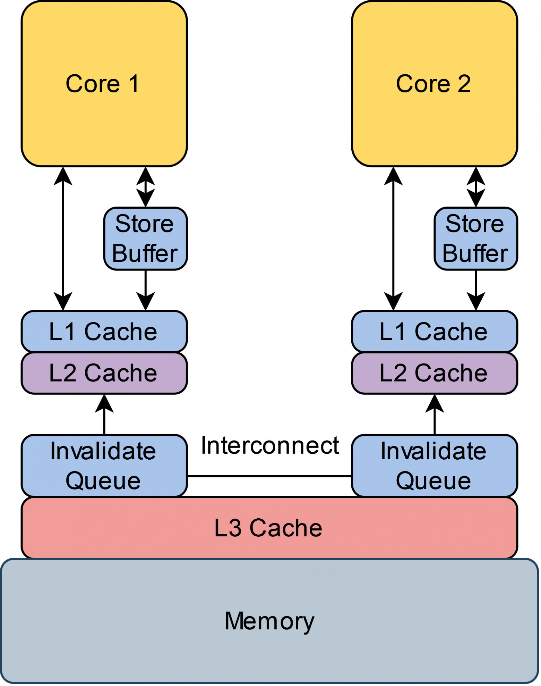
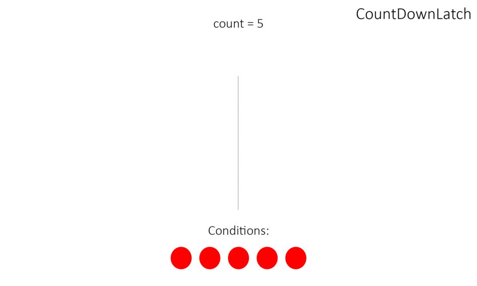

## Что такое Поток?
<details> <summary>Ответ</summary>
Поток — это поток выполнения программы. JVM поддерживает одновременное выполнение нескольких потоков. В Hotspot JVM Java-поток соответствует native-потоку ОС. После создания Java-потока (с thread-local хранилищем, буферами, объектами синхронизации, стеками и счётчиками) создаётся native-поток. ОС распределяет потоки на процессоры. После инициализации native-поток вызывает метод run() Java-потока. При завершении run() обрабатываются неперехваченные исключения, и native-поток проверяет, нужно ли завершить JVM (например, если завершился последний non-daemon поток). После завершения потока все ресурсы освобождаются.
</details>


## Почему создание потоков дорогостоящее?
<details> <summary>Ответ</summary>

Создание потока (`Thread`) в Java требует значительных ресурсов по следующим причинам:

1. **Выделение памяти для стека**:
    - Каждый поток имеет собственный стек (по умолчанию 1 МБ, настраивается через `-Xss`), используемый для локальных переменных и кадров
      вызовов. Выделение памяти требует системных вызовов, что дорого. Например, 1000 потоков = 1 ГБ для стеков.

2. **Инициализация системных ресурсов**:
    - Создание Java-потока (`new Thread()`) влечёт создание нативного потока ОС (например, через `pthread_create`). ОС регистрирует поток,
      выделяет дескрипторы и инициализирует структуры данных, что затратно.

3. **Инициализация JVM-структур**:
    - JVM создаёт объект `Thread` с метаданными (имя, приоритет, состояние) и настраивает контекст выполнения.

4. **Кэш и процессор**:
    - Новый поток вызывает промахи кэша (cache misses) и, при использовании нового ядра, затраты на синхронизацию кэшей (cache coherence).

</details>
---

## Почему переключение между потоками дорогостоящее?
<details> <summary>Ответ</summary>

Переключение контекста между потоками — ресурсоёмкая операция по следующим причинам:

1. **Сохранение/восстановление состояния**:
    - ОС сохраняет регистры CPU, указатель стека и программный счётчик одного потока и восстанавливает их для другого. Это требует системных
      вызовов и занимает 1–10 мкс.

2. **Потеря кэша**:
    - Приостановка потока приводит к недействительности данных в кэше (L1, L2, L3). Новый поток вызывает кэш-промахи, требуя загрузки данных
      из памяти.

3. **Планирование потоков**:
    - Планировщик ОС проверяет приоритеты, управляет очередями потоков и обрабатывает прерывания таймера, добавляя оверхед.

4. **Синхронизация и конкуренция**:
    - Доступ к общим ресурсам (замки, память) может вызвать дополнительные переключения контекста, если поток приостанавливается из-за
      занятого замка.

5. **NUMA и многопроцессорность**:
    - В NUMA-системах переключение на другое ядро или узел увеличивает задержки из-за доступа к удалённой памяти.

</details>
---

## Какие есть Cистемные потоки JVM?
<details> <summary>Ответ</summary>

| Вид потока | Описание |
| - | - |
| Потоки виртуальной машины | Ожидают появления операций, которые нужны JVM для достижения безопасной точки (safe-point). Причина, по которой эти операции должны выполняться в отдельном потоке, заключается в том, что все они требуют, чтобы JVM находилась в безопасной точке, где модификации кучи не могут произойти. Тип операций, выполняемых этим потоком сборка мусора "stop-the-world", дамп стека потока, приостановка потока (thread suspension) и biased locking revocation. |
| Поток периодической задачи | Отвечает за события таймера (прерывания), которые используются для планирования выполнения периодических задач. |
| GC | Сборки мусора различного типа, которые появляются в JVM |
| Потоки компилятора | Компилируют байт-код в машинный код при выполнении программы (runtime) |
| Поток диспетчера сигналов (signal dispatcher thread) | Получает сигналы отправленные JVM процессу и обрабатывает их внутри JVM, вызывая соответствующие JVM методы. |
</details>
---

## Что такое Программный счётчик (ПС)
<details> <summary>Ответ</summary>

Если метод — нативный, программный счётчик (ПС) не определён, так как выполнение происходит вне JVM. В остальных случаях ПС содержит адрес
текущей инструкции (или опкода). ПС, присущий всем процессорам, инкрементируется после каждой инструкции, указывая на адрес следующей
инструкции. JVM использует ПС для отслеживания выполнения инструкций, указывая на адрес в области методов в памяти.
</details>
---

## Что такое Стек
<details> <summary>Ответ</summary>

Каждый поток имеет собственный стек, где хранятся фреймы методов, выполняющихся в этом потоке. Стек — это LIFO-структура (последний вошёл —
первый вышел), поэтому текущий метод находится на вершине. При вызове метода создаётся новый фрейм.

Стек не модифицируется напрямую, кроме операций добавления (push) и удаления (pop) фреймов. Фреймы могут размещаться в куче (Heap), и память
для них не обязана быть непрерывной.
</details>
---

## Что такое Native стек
<details> <summary>Ответ</summary>

Не все JVM поддерживают нативные методы, но те, что поддерживают, создают нативный стек для каждого Java-потока. Если JVM использует
C-linkage модель для JNI, нативный стек аналогичен стеку в C, с таким же порядком аргументов и возвращаемым значением, как в программах на
C. Нативный метод (в зависимости от реализации JVM) может вызывать Java-метод, при этом выполнение переходит на Java-стек, где создаётся
новый фрейм, а нативный стек временно покидается.
</details>
---

## Что такое Ограничения стека
<details> <summary>Ответ</summary>

Стек потока может быть фиксированного или переменного размера. Если поток запрашивает стек больше допустимого,
возникает `StackOverflowError`. Если для нового фрейма не хватает памяти, возникает `OutOfMemoryError`.
</details>
---

## Что такое Фрейм?
<details> <summary>Ответ</summary>

Новый фрейм создаётся и добавляется (push) на вершину стека при вызове метода. Фрейм удаляется (pop), когда метод завершается штатно или при
возникновении необработанного исключения. Подробности об обработке исключений — в Таблице Исключений.

Каждый фрейм содержит:

- Массив локальных переменных
- Возвращаемое значение
- Стек операндов
- Ссылку на runtime constant pool класса текущего метода

</details>
---

## Что такое Массив локальных переменных?
<details> <summary>Ответ</summary>

Массив локальных переменных содержит все переменные, необходимые для выполнения метода: ссылку на `this` (для методов экземпляра), параметры
метода и другие локальные переменные. Для статических методов параметры начинаются с нулевого слота, а для методов экземпляра нулевой слот
зарезервирован для `this`.

Локальные переменные могут быть типов: `boolean`, `byte`, `char`, `long`, `short`, `int`, `float`, `double`, ссылка (`reference`), адрес
возврата (`returnAddress`).

Все типы занимают один слот в массиве, кроме `long` и `double`, которые занимают два последовательных слота из-за их 64-битного размера.

</details>
---

## Что такое Стек операндов?
<details> <summary>Ответ</summary>

Стек операндов используется при выполнении байт-кода JVM, действуя как регистры общего назначения в процессоре. Большинство инструкций
байт-кода оперируют со стеком операндов: добавляют (push), удаляют (pop), дублируют, меняют местами (swap) или выполняют операции,
производящие/потребляющие значения. Инструкции, перемещающие данные между массивом локальных переменных и стеком операндов, часты в
байт-коде. Например, инициализация переменной `int i;` компилируется в:

```java
0:iconst_0  // push 0 на стек операндов
1:istore_1  // pop значения со стека и сохранение в локальную переменную №1
```

</details>
---

## Что такое Constant Pool?
<details> <summary>Ответ</summary>

**Constant Pool** — это таблица констант в `.class`-файле, создаваемая компилятором `javac` для каждого класса или интерфейса. Она хранит
константы (строки, числа, ссылки на классы, методы, поля), используемые в коде.

- **Расположение**: В `.class`-файле, после заголовка (magic number, версия).
- **Формат**: Таблица с записями, каждая из которых включает:
    - Тег (1 байт) — тип константы.
    - Данные, зависящие от типа.
- **Типы записей**:
    - `CONSTANT_Utf8`: Строки (имена классов, методов, строковые литералы).
    - `CONSTANT_Integer`, `CONSTANT_Float`, `CONSTANT_Long`, `CONSTANT_Double`: Числовые значения.
    - `CONSTANT_Class`: Ссылка на класс.
    - `CONSTANT_String`: Строковый литерал (ссылается на `CONSTANT_Utf8`).
    - `CONSTANT_Fieldref`, `CONSTANT_Methodref`, `CONSTANT_InterfaceMethodref`: Ссылки на поля/методы.
    - `CONSTANT_NameAndType`: Пары имя/дескриптор.
    - `CONSTANT_MethodHandle`, `CONSTANT_MethodType`, `CONSTANT_InvokeDynamic` (с Java 7): Для динамических конструкций.
- **Назначение**: Хранит символические ссылки и константы для выполнения программы JVM.
- **Пример**: Строка `"Hello"` представлена как `CONSTANT_String`, ссылающийся на `CONSTANT_Utf8` с содержимым `"Hello"`.

Constant Pool неизменяем и формируется на этапе компиляции.
</details>
---

## Что такое Run-Time Constant Pool?
<details> <summary>Ответ</summary>

**Run-Time Constant Pool** — динамическая структура в памяти JVM, создаваемая из Constant Pool при загрузке класса в **Metaspace** (Java
8+). Она изменяема и используется во время выполнения программы.

- **Расположение**: В Metaspace.
- **Создание**: Формируется загрузчиком классов (ClassLoader) на основе Constant Pool из `.class`-файла.
- **Особенности**:
    - **Разрешение ссылок**: Символические ссылки (например, `CONSTANT_Methodref`) преобразуются в прямые адреса объектов, методов или
      полей (resolution).
    - **Интернирование строк**: Строки из `CONSTANT_String` хранятся в String Pool для экономии памяти.
    - **Поддержка динамики**: Содержит данные для `invokedynamic` (например, для lambda-выражений).
- **Назначение**:
    - Обеспечивает быстрый доступ к константам.
    - Поддерживает динамическое связывание (dynamic linking) классов, методов и полей.
    - Хранит интернированные строки и разрешённые ссылки.
- **Пример**: Вызов `System.out.println` в Run-Time Constant Pool сначала представлен символической ссылкой на `println`, а после
  разрешения — прямым адресом метода в памяти.

</details>
---

## В каком порядке выполняеться код?
<details> <summary>Ответ</summary>

В современном программировании код часто выполняется не в порядке написания из-за оптимизаций на уровнях:

- **Компилятора байт-кода** (например, `javac`): переупорядочивание инструкций для оптимизации.
- **Компилятора машинного кода** (например, JIT-компиляторы HotSpot C1/C2): применяются оптимизации, такие как **Instruction scheduling**.
- **Процессора**: используются **Out-of-order execution**, **Branch Prediction + Speculation**, **Prefetching** и другие техники.

**Локальный кэш и регистры**:

- Каждое ядро процессора имеет собственный кэш, невидимый другим ядрам. Данные могут оставаться в регистрах, не сбрасываясь в память, что
  может привести к тому, что потоки не видят изменений, сделанных другими потоками.

**Цель оптимизаций**:

- **Переупорядочивание**: минимизирует время выполнения, учитывая стоимость инструкций. Например, процессор может заранее загрузить данные
  из памяти, чтобы избежать простоев.
- **Локальный кэш и регистры**: чтение из них быстрее, чем из памяти. Локальный кэш позволяет ядрам работать независимо, избегая ожидания
  общего кэша.

Эти меры повышают производительность программ, но усложняют синхронизацию между потоками.

</details>
---

## Какие гарантии выполнения кода есть?
<details> <summary>Ответ</summary>

Java гарантирует **as-if-serial** выполнение кода: результат в однопоточной среде идентичен последовательному выполнению, независимо от
оптимизаций JDK. Процессоры также переупорядочивают инструкции, сохраняя результат выполнения для одного ядра. Механизм **Cache Coherence**
обеспечивает консистентность данных между локальными кэшами ядер, но с задержкой.

**Проблемы в многопоточной среде**:

- **As-if-serial** действует только для одного потока в изоляции. Переупорядочивание инструкций в одном потоке, безопасное для него, может
  нарушить ожидания других потоков при работе с общими данными.
- Процессор гарантирует консистентность только для одного ядра.
- **Cache Coherence** обеспечивает видимость актуальных данных, но обновление кэшей происходит с задержкой, что может привести к временной
  неконсистентности в многопоточных программах.

</details>
---
## Расскажи про кеш в процесоре?
<details> <summary>Ответ</summary>



Процессор работает с памятью только через кэш. Чтение/запись данных происходит через кэш, который загружает значения из памяти при их
отсутствии или сбрасывает изменения в память.

**Кэш**:

- Состоит из **линий кэша** (16–256 байт, в зависимости от архитектуры), которые мапятся на адреса памяти.
- Имеет фиксированный размер (например, 64 KB = 1024 линии при 64-байтных линиях). При нехватке места старые данные вытесняются.
- Организован в уровни:
    - **L1, L2**: Локальные, уникальны для каждого ядра (например, L1 — 80 KB, L2 — 1.25 MB).
    - **L3**: Общий для всех ядер (например, 24 MB).
- Доступ к уровням: L1 (~3 цикла), L2 (~12 циклов), L3 (~38 циклов). Более высокие уровни медленнее, но больше.

**Проблема локальных кэшей**:

- Ядра хранят данные в своих локальных кэшах. Если одно ядро обновляет значение, другое может читать устаревшее из своего кэша, что приводит
  к неконсистентности.
- Общий кэш (L3) устранил бы проблему, но снизил производительность: ядра ждали бы доступа к единому кэшу. Локальный кэш быстрее из-за
  близости к ядру и независимости.

Локальные кэши повышают производительность, но требуют механизмов (например, Cache Coherence) для синхронизации данных между ядрами.
</details>
---
## Расскажите про Cache Coherence?
<details> <summary>Ответ</summary>

Процессоры обеспечивают консистентность данных в локальных кэшах через механизм **Cache Coherence**, гарантирующий актуальность значений по
одному адресу памяти для всех ядер. Популярный протокол — **MESI** (и его варианты: **MESIF** у Intel, **MOESI** у AMD).

**Состояния линии кэша в MESI**:

- **Invalid**: Линия устарела, чтение невозможно.
- **Shared**: Линия актуальна, эквивалентна памяти. Доступна для чтения несколькими ядрами (реплицируется в их кэши).
- **Exclusive**: Линия актуальна, но принадлежит только одному ядру. При загрузке данных из памяти линия получает это состояние. Для
  перехода из Shared в Exclusive другие ядра помечают свои копии как Invalid.
- **Modified**: Линия изменена (dirty), содержит новое значение. Только одно ядро может держать линию в этом состоянии. При вытеснении из
  кэша изменения сбрасываются в память.

**Процесс записи**:

- Ядро, желающее изменить линию, запрашивает **Exclusive** доступ, отправляя сигнал другим ядрам пометить их копии как **Invalid**.
- После подтверждения ядро записывает новое значение, переводя линию в **Modified**. Это исключает неконсистентность, так как только одно
  ядро удерживает актуальную линию.

**Cache Coherence** обеспечивает консистентность, но вводит задержки из-за координации между ядрами.

</details>
---
## Что происходит когда любое ядро хочет прочитать какой-нибудь адрес в памяти?
<details> <summary>Ответ</summary>

Ядро сначала проверяет **L1-кэш**. Если линия кэша есть и находится в состоянии **Shared**, **Exclusive** или **Modified**, значение
читается. Если линия отсутствует или в состоянии **Invalid**, происходит **cache miss**.

Тогда ядро отправляет запрос на чтение по общей шине. Другие ядра проверяют свои кэши:

- Если значение найдено в **Shared**, **Exclusive** или **Modified**, оно возвращается.
- Если линия в **Modified**, изменения сбрасываются в память, а линия переводится в **Shared**.
- Если значения нет в кэшах, оно читается из памяти.

Читающее ядро сохраняет значение в свой L1-кэш, помечая линию как **Shared**.

**Примечание**: Это упрощённое описание. Детали зависят от микроархитектуры процессора и протокола Cache Coherence (например, MESI).
Актуальность значения в локальном кэше видна другим ядрам благодаря Cache Coherence, но с возможными задержками. Для подробностей обратитесь
к специализированным источникам.

</details>
---
## visibility проблемы на уровне процессора не существует?
<details> <summary>Ответ</summary>

Когда ядро получает запрос на инвалидацию линии кэша, он может быть помещён в **Invalidation Queue (IQ)**, а не обработан немедленно. Это
оптимизация, вызванная следующими причинами:

- Ядро может быть занято другой задачей.
- При большом числе запросов ядро не блокируется, а обрабатывает их постепенно.

Таким образом, запросы на инвалидацию **асинхронны**.

**Проблема**: Если запрос в IQ ещё не обработан, ядро может прочитать устаревшее значение из кэша, которое ещё не помечено как **Invalid**,
что нарушает актуальность данных.

</details>
---

## Что такое Store Buffer в процессоре?
<details> <summary>Ответ</summary>



В некоторых микроархитектурах (например, x86) каждое ядро имеет **FIFO Store Buffer (SB)** — буфер записи, промежуточный слой между CPU и
кэшем.
Ядро помещает записи в SB, где они ждут сброса в локальный кэш после того, как другие ядра инвалидируют свои копии и отправят подтверждение.
Это ускоряет работу пишущего ядра, минимизируя задержки.

При чтении ядро сначала проверяет **SB**, а затем локальный кэш, чтобы обеспечить **as-if-serial** гарантию в пределах одного ядра, избегая
чтения устаревших данных.

**Проблема**: Другие ядра не видят новую запись, пока она находится в SB, так как **Cache Coherence** не распространяется на SB.
В результате, пишущее ядро работает с актуальным значением, а остальные — с устаревшим, пока запись не сброшена в кэш.</details>

---
## Благодаря Cache Coherence нам гарантируется eventual visibility?
<details> <summary>Ответ</summary>

Можно наивно предположить, что благодаря Cache Coherence нам гарантируется eventual visibility и на уровне Java для обычных записей и
чтений, то есть не связанных happens-before.
Однако, это не правда, так как мы работаем на уровне языка, а не процессора. Компилятор может оптимизировать код так, что запись никогда не
станет видна другому треду.
Яркий пример — это такой busy wait, где в бесконечном цикле проверяется значение shared переменной.
</details>
---
## Расскажите о модели памяти Java?
<details> <summary>Ответ</summary>

Java Memory Model (JMM) описывает поведение потоков в Java, определяя правила выполнения многопоточных программ и взаимодействия потоков
через общую память.
JMM задаёт набор межпоточных действий (чтение/запись переменных, захват/освобождение монитора, операции с volatile, запуск потока) и
отношение happens-before.
Если операция X happens-before Y, то код после Y в одном потоке видит все изменения, сделанные другим потоком до X.
</details>
---
## Расскажите про Memory Ordering?
<details> <summary>Ответ</summary>

**Memory Ordering** описывает порядок операций с памятью, видимый программой. С точки зрения программы, операции чтения/записи выполняются в
порядке кода, а память кажется общей, с мгновенной видимостью изменений для всех потоков. Однако из-за оптимизаций (регистры, кэш,
переупорядочивание инструкций) фактический порядок (memory order) может отличаться от программного (program order), что приводит к
неконсистентным результатам.

Пример:
```
Thread 0    Thread 1
x = 1       y = 1
r1 = y      r2 = x
```

Если (r1, r2) = (0, 0), это **StoreLoad reordering**: запись выполнена после чтения. Причина (кэш, буферы) не важна — важен наблюдаемый
порядок.

**Вопросы для многопоточной программы:**

- Как сохраняется порядок операций с памятью?
- Валиден ли наблюдаемый memory order?

**Java Memory Model (JMM):**

- Без синхронизации разрешены все переупорядочивания, результат может быть неконсистентным.
- С корректной синхронизацией возможен только консистентный порядок.

**Типы Memory Reordering:**

- **LoadLoad**: перестановка чтений (r1, r2 → r2, r1).
- **LoadStore**: чтение перед последующей записью (r, w → w, r).
- **StoreStore**: перестановка записей (w1, w2 → w2, w1).
- **StoreLoad**: запись перед последующим чтением (w, r → r, w).

**Модели памяти:**

- **Sequential Consistency**: запрещает все переупорядочивания.
- **Relaxed Consistency**: разрешает некоторые.
- **Weak Consistency**: разрешает все.

JMM — слабая, без синхронизации допускает любой порядок. Процессорные модели (например, x86) строже: x86 запрещает LoadLoad, LoadStore,
StoreStore, но разрешает StoreLoad. ARM допускает все переупорядочивания. Однако JMM доминирует, так как компилятор может переупорядочивать
операции независимо от процессора. Для консистентности необходимы примитивы синхронизации.
</details>
---
## Memory Ordering vs Instructions Ordering?
<details> <summary>Ответ</summary>

Memory Ordering и Instructions Ordering — разные понятия. Instructions Ordering касается низкоуровневого переупорядочивания инструкций
процессором (например, спекулятивные чтения), но их видимый эффект (memory effect) должен соответствовать правилам Memory Ordering, заданным
моделью памяти.
Например, Intel запрещает LoadLoad переупорядочивания, но допускает спекулятивные чтения. Процессор гарантирует, что результат не нарушит
правил Memory Ordering: если нарушение возможно, он откатывает состояние, отбрасывая спекулятивные чтения и не коммитя записи в память.
Memory Ordering — высокоуровневая абстракция для упрощения понимания работы с памятью.
</details>
---
## Что такое Sequential Consistency?
<details> <summary>Ответ</summary>

**Sequential Consistency (SC)** — строгая модель памяти, исключающая переупорядочивания. По Лэмпорту (1979), результат выполнения
многопроцессорной программы должен быть таким, как если бы операции всех процессоров выполнялись последовательно, сохраняя порядок операций
каждого процессора, заданный программой.

**Интуитивно**: действия потоков выполняются в порядке программы, с возможным переключением между потоками.

**Пример (Dekker lock)**:
```
Thread 0    Thread 1
x = 1       y = 1
r1 = y      r2 = x
```

В SC допустимы только **sequentially consistent memory orders**, например:

- write(x, 1) → write(y, 1) → read(y):1 → read(x):1
- write(x, 1) → read(y):0 → write(y, 1) → read(x):1
- write(y, 1) → write(x, 1) → read(x):1 → read(y):1

**Запрещено в SC**: StoreLoad переупорядочивание, приводящее к (r1, r2) = (0, 0), например:

- read(y):0 → read(x):0 → write(x, 1) → write(y, 1)
</details>
---
## Что такое Sequential Consistency-Data Race Free?
<details> <summary>Ответ</summary>

Java Memory Model — это Sequential Consistency-Data Race Free (SC-DRF) модель: нам предоставляется sequential consistency, но только в том
случае,
если мы избавимся от всех data race в программе — про это мы еще поговорим далее.
</details>
---
## Что такое Data race в рамках JMM?
<details> <summary>Ответ</summary>

**Data race** возникает, когда два или более потока одновременно обращаются к общим данным, при этом хотя бы один выполняет запись, и
действия не синхронизированы. В таких случаях **memory order** не гарантируется, что может привести к непредсказуемым результатам.

В **Java Memory Model (JMM)** data race отличает **sequentially consistent (SC)** выполнение от не-SC: если программа не имеет гонок, её
результат всегда соответствует одному из SC-порядков.

**Как избежать data race:**

1. Связать все действия с общими данными через **synchronization order** (например, с помощью мониторов).
2. Установить **happens-before** отношение между действиями (например, используя volatile или синхронизацию).
</details>
---
## Расскажите про Happens-before?
<details> <summary>Ответ</summary>

Happens-before определяется как отношение между двумя действиями:

*   Пусть есть поток T1 и поток T2 (необязательно отличающийся от потока T1) и действия x и y, выполняемые в потоках T1 и T2 соответственно
*   Если x happens-before y, то во время выполнения y треду T2 будут видны все изменения, выполняемые в x тредом T1

Happens-before — это еще один способ, с помощью которого мы добьемся sequential consistency.

Смотрите:

*   Если мы свяжем conflicting доступ к shared переменной с помощью happens-before, то избавимся от data race
*   Если мы избавимся от data race, то получим sequential consistency
*   Если мы получим sequential consistency, то наша программа всегда будет выдавать консистентный с порядком в программе результат

Давайте сразу проясним один момент: нет, happens-before не означает, что инструкции под капотом будут действительно выполняться в таком
порядке.
Если переупорядочивание инструкций все равно приводит к консистентному результату, то такое переупорядочивание инструкций не запрещено. JLS:

Правила Happens-Before в JMM:

*   Program Order Rule: Каждая операция в потоке happens-before следующей операции в этом же потоке.
*   Monitor Lock Rule: Разблокировка монитора happens-before последующей блокировкой этого же монитора в другом потоке.
*   Volatile Variable Rule: Запись в volatile переменную happens-before последующего чтения этой же переменной.
*   Thread Start Rule: Вызов Thread.start() happens-before любой операции в запущенном потоке.
*   Thread Termination Rule: Любая операция в потоке happens-before его завершением (например, Thread.join()).
*   Transitivity: Если A happens-before B, а B happens-before C, то A happens-before C.
</details>
---
## Расскажите про Monitor lock и как работает synchronized?
<details> <summary>Ответ</summary>

Monitor lock в Java обеспечивает happens-before отношение между освобождением и взятием лока, а также действует как мьютекс, гарантируя
эксклюзивный доступ к критической секции. Каждый объект в Java имеет встроенный intrinsic lock, но использовать его напрямую нельзя — для
этого применяется ключевое слово synchronized.
</details>
---
## Как работает synchronized?
<details> <summary>Ответ</summary>

**`synchronized`** в Java основан на **мониторе** — механизме, обеспечивающем эксклюзивный доступ одному потоку к объекту в определённый
момент. Монитор действует как замок: поток захватывает его для выполнения синхронизированного кода, а другие потоки ждут освобождения.

### Формы использования:

1. **Синхронизированный метод**:
    - Нестатический: монитор — объект `this`.
    - Статический: монитор — объект `Class`.
2. **Синхронизированный блок**:
    - Монитор — указанный объект.

### Работа в JVM:

- **Захват/освобождение**: Поток вызывает `monitorenter` для захвата монитора и `monitorexit` для освобождения. Если монитор занят, поток
  блокируется в очереди ожидания.
- **Структура монитора**:
    - Владелец (текущий поток).
    - Счётчик входов (для реентерабельности).
    - Очередь ожидания (entry set).
    - Ожидающие потоки (wait set, для `wait()`).
- **Реентерабельность**: Поток может повторно захватить монитор, увеличивая счётчик входов. Монитор освобождается, когда счётчик становится
  нулём.

### Оптимизации JVM:

- **Biased Locking**: минимизация затрат для одного потока.
- **Lightweight Locking**: использование CAS при низкой конкуренции.
- **Heavyweight Locking**: системные вызовы при высокой конкуренции.
- **Lock Elimination**: удаление ненужных блокировок.
- **Lock Coarsening**: объединение синхронизированных блоков.

### Нюансы:

1. **Выбор монитора**: Используйте логически связанный объект. Избегайте примитивов (`Integer`, `String`) из-за интернирования.
2. **Deadlock**: Возможен при разном порядке захвата мониторов. Решение — единый порядок.
3. **Производительность**: Чрезмерная синхронизация снижает производительность. Альтернативы — `java.util.concurrent` (
   например, `ReentrantLock`).
4. **Ограничения**: Нет таймаутов или прерываний, в отличие от `ReentrantLock`.
5. **Статическая vs нестатическая синхронизация**: Статическая блокирует класс, нестатическая — экземпляр.

`synchronized` обеспечивает **happens-before** и мьютекс, но требует осторожного использования для избежания проблем с производительностью и
взаимными блокировками.

</details>
---
## Расскажите про Memory Barriers?
<details> <summary>Ответ</summary>

Процессор может переупорядочивать выполняемые им инструкции, даже если на уровне компилятора мы обеспечили необходимый порядок. Хотя процессор делает только такие переупорядочивания, которые не меняют итогового результата, но это гарантируется только для единственного ядра в изоляции, поэтому переупорядочивание может повлиять на другие ядра. Более того, все еще существует проблема видимости изменений, которую мы обсудили выше. Именно поэтому JMM ответственна и за синхронизацию на уровне процессора.
Для решения этих проблем Java использует готовые низкоуровневые механизмы синхронизации под названием "memory barrier", предоставляемые
самим процессором .
Задача барьеров памяти — запретить (memory) переупорядочивания, которые обычно разрешены моделью памяти процессора. Таким образом, точно так
же как мы используем примитивы синхронизации volatile/synchronized в высокоуровневом коде, сама Java под капотом тоже использует похожие
низкоуровневые примитивы синхронизации.
Memory barrier (memory fence, барьер памяти) — это тип процессорной инструкции, которая заставляет процессор гарантировать memory ordering для инструкций, работающих с памятью.
Всего существует 4 типа барьеров памяти — они напрямую матчатся в возможные memory reordering и запрещают каждый из них:

*   **LoadLoad Barrier**:
    *   Гарантирует, что операции чтения до барьера завершатся до операций чтения после барьера.
    *   Пример: Чтение двух volatile переменных подряд требует, чтобы первое чтение завершилось до второго.
*   **StoreStore Barrier**:
    *   Гарантирует, что операции записи до барьера завершатся до операций записи после барьера.
    *   Пример: Запись в две volatile переменные подряд.
*   **LoadStore Barrier**:
    *   Гарантирует, что операции чтения до барьера завершатся до операций записи после барьера.
    *   Используется, чтобы предотвратить переупорядочивание чтения и записи.
*   **StoreLoad Barrier**:
    *   Самый "тяжёлый" барьер, предотвращающий переупорядочивание записи и последующего чтения.
    *   Пример: Запись в volatile переменную, за которой следует чтение другой volatile переменной.

**volatile и Memory Barriers**
*   Запись в volatile переменную:
    *   JVM вставляет Store Barrier (или StoreStore и StoreLoad барьеры) после записи.
    *   Это гарантирует, что значение записывается в основную память и все предшествующие операции завершаются до записи.
    *   Пример: `volatileVar = 42` завершает все предыдущие записи в память, делая их видимыми другим потокам.
*   Чтение volatile переменной:
    *   JVM вставляет Load Barrier (или LoadLoad и LoadStore барьеры) перед чтением.
    *   Это обновляет локальный кэш из основной памяти, обеспечивая актуальность данных.
*   Happens-before: Запись в volatile переменную создаёт happens-before отношение с последующим чтением этой переменной, что реализуется через комбинацию барьеров.

**synchronized и Memory Barriers**
*   Вход в synchronized блок/метод:
    *   JVM использует Acquire Barrier (аналог Load Barrier), чтобы гарантировать, что все последующие операции видят актуальные данные.
    *   Это соответствует захвату монитора (monitorenter).
*   Выход из synchronized блока/метода:
    *   JVM использует Release Barrier (аналог Store Barrier), чтобы сбросить все изменения в основную память.
    *   Это соответствует освобождению монитора (monitorexit).
*   Full Barrier: В некоторых случаях JVM может использовать полный барьер для обеспечения строгой синхронизации.
</details>
---
## Расскажите про Volatile?
<details> <summary>Ответ</summary>

**volatile** в Java обеспечивает **видимость** и **упорядочивание** операций с переменными в многопоточной среде, но не гарантирует *
*взаимоисключение**, в отличие от `synchronized`.

### Основы:

- **Видимость**: запись в `volatile` переменную сбрасывается в основную память, а чтение — берётся из неё, обеспечивая актуальность данных
  для всех потоков.
- **Упорядочивание**: операции с `volatile` не переупорядочиваются относительно других операций благодаря **happens-before** отношению.

### Работа в JVM:

- **Видимость**: JVM использует **memory barriers**:
    - **Store Barrier** (при записи): сбрасывает данные в основную память.
    - **Load Barrier** (при чтении): обновляет кэш из основной памяти.
- **Упорядочивание**: запись в `volatile` создаёт **happens-before** с последующим чтением, предотвращая переупорядочивание операций.
- **Атомарность**: запись/чтение `volatile` переменной атомарны, но составные операции (например, `volatileVar++`) — нет.
- На процессорном уровне: используются инструкции вроде `LOCK` (на x86) для согласованности.

### Низкоуровневые оптимизации
Современные JVM оптимизируют работу с `volatile`:
*   **Элиминация избыточных барьеров**: Если JVM определяет, что `volatile` переменная используется только одним потоком, она может устранить ненужные барьеры памяти.
*   **Кэширование в регистрах**: На некоторых архитектурах JVM может использовать кэш процессора, но с гарантией синхронизации при записи.
*   **Поддержка 64-битных операций**: Начиная с Java 5, `volatile` поддерживает атомарные операции с 64-битными типами (`long` и `double`), которые ранее могли быть неатомарными на 32-битных системах.
</details>
---
## Расскажите про Atomicity и как это работает изнутри?
<details> <summary>Ответ</summary>

**AtomicInteger** из пакета `java.util.concurrent.atomic` предоставляет атомарные операции для работы с целочисленными значениями в
многопоточной среде без явных блокировок, предотвращая состояния гонки.

### Основы `AtomicInteger`

`AtomicInteger` используется для счетчиков, аккумуляторов и других структур, обеспечивая атомарность операций, таких как инкремент,
декремент и обновление.

### Основные методы

- `get()`: возвращает текущее значение.
- `set(int newValue)`: устанавливает новое значение.
- `incrementAndGet()`: атомарно увеличивает на 1, возвращает новое значение.
- `decrementAndGet()`: атомарно уменьшает на 1, возвращает новое значение.
- `getAndIncrement()`: возвращает текущее значение и увеличивает на 1.
- `compareAndSet(int expect, int update)`: если значение равно `expect`, устанавливает `update`, возвращает `true` при успехе.
- `addAndGet(int delta)`: атомарно прибавляет `delta`, возвращает новое значение.
- С Java 9: `updateAndGet(IntUnaryOperator)` и др. для атомарного применения функций.

### Внутренняя реализация
#### Поле и волатильность

Значение хранится в `volatile int value`, обеспечивая **видимость** изменений всем потокам.

#### Compare-And-Swap (CAS)

`AtomicInteger` использует **CAS** (Compare-And-Swap) — атомарную инструкцию:

1. Сравнивает текущее значение с ожидаемым.
2. Если совпадают, устанавливает новое значение.
3. Если нет, возвращает `false`, требуя повторной попытки.

С Java 9 используется **VarHandle** вместо `sun.misc.Unsafe` для безопасных и переносимых операций:
```java
private static final VarHandle VALUE;
static {
    try {
        VALUE = MethodHandles.lookup().findVarHandle(AtomicInteger.class, "value", int.class);
    } catch (ReflectiveOperationException e) {
        throw new ExceptionInInitializerError(e);
    }
}
```

`VarHandle` поддерживает CAS, volatile-доступ и режимы `acquire`/`release`.

#### Пример: `incrementAndGet`
```java
public final int incrementAndGet() {
    return (int) VALUE.getAndAdd(this, 1) + 1;
}
```

`getAndAdd` использует CAS в цикле:

1. Читает текущее значение.
2. Вычисляет новое (`oldValue + 1`).
3. Пытается выполнить CAS.
4. Повторяет, если CAS не удался.

### Пример работы

Два потока вызывают `incrementAndGet` на `AtomicInteger` со значением `10`:

1. Поток 1: читает `10`, CAS (`10 -> 11`) успешен.
2. Поток 2: читает `10`, CAS (`10 -> 11`) не срабатывает, так как значение уже `11`. Повторяет: читает `11`, CAS (`11 -> 12`) успешен.
   Итог: значение `12`, оба инкремента корректны.

### Оптимизации

1. **VarHandle**: с Java 9 заменяет `Unsafe`, повышая безопасность и переносимость.
2. **JMM**: уточняет поведение `volatile` и атомарных операций (Java 17+).
3. **Архитектуры**: оптимизация CAS для ARM64 (LL/SC) и x86 (`cmpxchg`).
4. **Функциональные методы**: с Java 9 поддержка `updateAndGet` для атомарных функций.

`AtomicInteger` эффективен для простых атомарных операций, обеспечивая производительность без блокировок, но не подходит для сложной
синхронизации.

</details>
---
## Какие виды Atomic есть в java?
<details> <summary>Ответ</summary>

1. **AtomicInteger**: Атомарные операции с `int` (инкремент, декремент, сравнение и замена).

2. **AtomicLong**: Аналог `AtomicInteger` для `long`.

3. **AtomicBoolean**: Атомарные операции с `boolean`.

4. **AtomicReference<V>**: Атомарные операции над ссылками на объекты типа `V`.

5. **AtomicIntegerArray**: Массив `int` с атомарными операциями над элементами.

6. **AtomicLongArray**: Аналог `AtomicIntegerArray` для `long`.

7. **AtomicReferenceArray<E>**: Массив ссылок на объекты типа `E` с атомарными операциями.

8. **AtomicDouble** (Java 21, экспериментально): Атомарные операции с `double` (часть Project Valhalla).

9. **AtomicMarkableReference<V>**: Хранит ссылку и булев маркер.

10. **AtomicStampedReference<V>**: Хранит ссылку и целочисленный штамп (версия).

</details>
---
## Атомарность базовых действий в JMM?
<details> <summary>Ответ</summary>

*   Чтения и записи reference переменных (ссылок) являются атомарными
*   Чтения и записи примитивов (кроме long/double) являются атомарными
*   Чтения и записи long/double переменных, помеченных как volatile, являются атомарными

Что же нам дают эти свойства в многопоточной среде?

Нам гарантируется, что при shared чтении переменной мы увидим или значение по умолчанию (0, false, null), или полное консистентное значение,
но не половинное значение.
Даже если в переменную пишут одновременно несколько тредов, то мы увидим результат записи одного из них, но не будет такой ситуации, что
чтение увидит первую половину битов из одной записи, а вторую половину из другой записи.

Но почему мы вообще могли бы прочитать половинное значение?

Дело в том, что некоторые типы в языке имеют размер (в битах) больший, чем длина машинного слова процессора.
Например, 32-х битный процессор оперирует словами по 32 бита, но тип long/double содержит 64 бита.
Соответственно, языку требуется совершить 2 записи по 32 бит, чтобы полностью записать значение.
</details>
---
## В чём заключаются различия между java.util.concurrent.Atomic\*.compareAndSwap() и java.util.concurrent.Atomic\*.weakCompareAndSwap()
<details> <summary>Ответ</summary>

*   weakCompareAndSwap() не создает memory barrier и не дает гарантии happens-before;
*   weakCompareAndSwap() сильно зависит от кэша/CPU, и может возвращать false без видимых причин;
*   weakCompareAndSwap(), более легкая, но поддерживаемая далеко не всеми архитектурами и не всегда эффективная операция.
</details>
---
## Что такое «потокобезопасность»?
<details> <summary>Ответ</summary>

Потокобезопасность - свойство объекта или кода, которое гарантирует, что при исполнении или использовании несколькими потоками, код будет вести себя, как предполагается. Например потокобезопасный счётчик не пропустит ни один счёт, даже если один и тот же экземпляр этого счётчика будет использоваться несколькими потоками.
</details>
---
## Что такое «кооперативная многозадачность»? Какой тип многозадачности использует Java? Чем обусловлен этот выбор?
<details> <summary>Ответ</summary>

**Кооперативная многозадачность**:

- Потоки добровольно передают управление друг другу.
- **Преимущества**: Простота реализации, низкие накладные расходы на переключение контекста.
- **Недостатки**: Зависание одного потока может заблокировать всю систему, так как другие потоки не получат управление.

**Вытесняющая многозадачность** (используется в Java):

- Операционная система решает, когда переключать потоки, независимо от их состояния.
- **Преимущества**:
    - Зависание одного потока обычно не блокирует систему.
    - Улучшает отзывчивость приложения.
    - Эффективное освобождение ресурсов.
- **Особенности реализации**: Требует обработки прерываний от аппаратного таймера для переключения контекста.

Вытесняющая многозадачность более устойчива и эффективна в современных системах, включая Java, где JVM взаимодействует с ОС для управления
потоками.
</details>
---
## Чем отличается процесс от потока?
<details> <summary>Ответ</summary>

**Процесс** — экземпляр выполняемой программы, независимый объект с выделенными системными ресурсами (процессорное время, память). Процессы
изолированы: каждый имеет собственное **виртуальное адресное пространство**, недоступное другим процессам. Для взаимодействия между
процессами используются механизмы межпроцессного взаимодействия (конвейеры, файлы, сетевые каналы). Операционная система управляет проекцией
виртуального пространства на физическую память.

**Поток (thread)** — способ выполнения кода внутри процесса, определяющий последовательность его исполнения. Потоки существуют в рамках
одного процесса, разделяют его ресурсы (код, данные, описатели объектов ядра) и требуют меньше ресурсов, чем процессы. Это делает создание
потоков предпочтительным для параллельного выполнения задач внутри процесса, минимизируя необходимость создания новых процессов.
</details>
---
## Что такое «зелёные потоки» и есть ли они в Java?
<details> <summary>Ответ</summary>

**Зелёные потоки (green threads)** — это потоки, эмулируемые виртуальной машиной Java (JVM) или средой исполнения, а не создаваемые как
реальные потоки ОС. JVM управляет переключением между green threads, работая как единый поток ОС.

### Преимущества:

- **Экономия ресурсов**: Создание green threads требует меньше ресурсов, чем native threads, особенно в POSIX-системах.
- **Быстрое переключение**: Переключение между green threads быстрее, чем между native threads.
- **Масштабируемость**: Система поддерживает больше green threads, чем потоков ОС, что полезно, например, для обработки HTTP-соединений на
  веб-сервере.

### Недостатки:

- **Отсутствие параллелизма**: Green threads не могут выполняться одновременно на нескольких процессорах, так как JVM работает в одном
  потоке ОС.
- **Ограничение производительности**: Даже при наличии нескольких процессоров только один используется для green threads, так как ОС видит
  их как один поток.

### Java и green threads:

- До Java 1.1 JVM использовала green threads.
- С Java 1.2 перешла на **native threads**, которые стали стандартом, обеспечивая истинный параллелизм за счёт использования потоков ОС.
</details>
---
## Каким образом можно создать поток?
<details> <summary>Ответ</summary>

*   Создать потомка класса Thread и переопределить его метод run();
*   Создать объект класса Thread, передав ему в конструкторе экземпляр класса, реализующего интерфейс Runnable. Эти интерфейс содержит метод run(), который будет выполняться в новом потоке. Поток закончит выполнение, когда завершится его метод run().
*   Вызвать метод submit() у экземпляра класса реализующего интерфейс ExecutorService, передав ему в качестве параметра экземпляр класса реализующего интерфейс Runnable или Callable (содержит метод call(), в котором описывается логика выполнения).
</details>
---
## Чем различаются Thread и Runnable?
<details> <summary>Ответ</summary>

Конечно, вот сокращённая версия:

`Thread` и `Runnable` — это два способа создания многопоточности в Java.

*   **`Thread`** — это **класс**, который представляет сам поток выполнения. Его нужно **наследовать** (`extends Thread`).
*   **`Runnable`** — это **интерфейс**, который представляет задачу для выполнения в потоке. Его нужно **реализовывать** (`implements Runnable`).

### Главное отличие

`Thread` — это и есть поток, а `Runnable` — это задача, которую поток должен выполнить.

В большинстве случаев **предпочтительнее использовать `Runnable`**. Это более гибкий подход, который разделяет логику задачи и механизм её выполнения, не накладывая ограничений на наследование.

### Сравнение

| Характеристика | `Thread` | `Runnable` |
| :--- | :--- | :--- |
| **Тип** | Класс | Функциональный интерфейс |
| **Использование** | Наследование (`class MyThread extends Thread`) | Реализация (`class MyTask implements Runnable`) |
| **Основной недостаток** | Ограничивает наследование от других классов | Нет |
| **Гибкость** | Низкая: логика жестко привязана к потоку | Высокая: отделяет задачу от потока, можно использовать с `ExecutorService` |
| **Рекомендация** | Для простых задач или когда нужен доступ к методам `Thread` | **Предпочтительный современный подход** |
</details>
---
## В чём заключается разница между методами start() и run()?
<details> <summary>Ответ</summary>

*   **`run()`** — это метод, который **содержит код** для выполнения в потоке.
*   **`start()`** — это метод, который **создаёт новый поток** и запускает в нём код из метода `run()`.

Проще говоря: **`run()` — это *что* делать, а `start()` — это *запустить* это делать в новом потоке.**


| Характеристика | `thread.run()` | `thread.start()` |
| :--- | :--- | :--- |
| **Основная задача** | Описать логику потока | Запустить новый поток |
| **Контекст выполнения** | Код выполняется **в текущем потоке** (синхронно) | Создаётся **новый поток**, и код выполняется в нём (асинхронно) |
| **Создание потока?** | **Нет** | **Да** |
| **Повторный вызов** | Можно вызывать сколько угодно раз | Нельзя (вызовет ошибку `IllegalThreadStateException`) |


> Чтобы запустить многопоточное выполнение, **всегда вызывайте `start()`**. Метод `run()` вызывать напрямую почти никогда не нужно.

</details>
---
## Как принудительно запустить поток?
<details> <summary>Ответ</summary>

Никак. В Java не существует абсолютно никакого способа принудительного запуска потока. Это контролируется JVM и Java не предоставляет никакого API для управления этим процессом.
</details>
---
## Дайте определение понятию «синхронизация».
<details> <summary>Ответ</summary>

Синхронизация - это процесс, который позволяет выполнять потоки параллельно.
В Java все объекты имеют одну блокировку, благодаря которой только один поток одновременно может получить доступ к критическому коду в объекте. Такая синхронизация помогает предотвратить повреждение состояния объекта. Если поток получил блокировку, ни один другой поток не может войти в синхронизированный код, пока блокировка не будет снята. Когда поток, владеющий блокировкой, выходит из синхронизированного кода, блокировка снимается. Теперь другой поток может получить блокировку объекта и выполнить синхронизированный код. Если поток пытается получить блокировку объекта, когда другой поток владеет блокировкой, поток переходит в состояние Блокировки до тех пор, пока блокировка не снимется.
</details>
---
## В каких состояниях может находиться поток?
<details> <summary>Ответ</summary>

| Состояние | Краткое описание | Основные причины |
| :--- | :--- | :--- |
| **`NEW`** (Новый) | Поток создан, но ещё не запущен. | `new Thread()` |
| **`RUNNABLE`** (Готов к выполнению) | Поток запущен и готов к работе, либо уже выполняется. | вызов `start()` |
| **`BLOCKED`** (Заблокирован) | Ждёт освобождения монитора (lock), чтобы войти в `synchronized` блок. | Попытка войти в занятый `synchronized` блок |
| **`WAITING`** (Ожидание) | Бессрочно ждёт сигнала от другого потока. | `object.wait()`, `thread.join()` |
| **`TIMED_WAITING`** (Ожидание с таймаутом) | Ждёт в течение определённого времени. | `Thread.sleep()`, `object.wait(timeout)` |
| **`TERMINATED`** (Завершён) | Поток завершил свою работу (метод `run()` закончился). | Нормальное завершение или необработанная ошибка |


`NEW` → `RUNNABLE` ⇄ (`BLOCKED` / `WAITING` / `TIMED_WAITING`) → `TERMINATED`

</details>
---
## Можно ли создавать новые экземпляры класса, пока выполняется static synchronized метод?
<details> <summary>Ответ</summary>

Да, можно создавать новые экземпляры класса, так как статические поля не принадлежат к экземплярам класса.
</details>
---
## Зачем может быть нужен private мьютекс?
<details> <summary>Ответ</summary>

Объект для синхронизации делается private, чтобы сторонний код не мог на него синхронизироваться и случайно получить взаимную блокировку.
</details>
---
## Как работают методы wait() и notify()/notifyAll()?
<details> <summary>Ответ</summary>

`wait()`, `notify()` и `notifyAll()` — это фундаментальные методы класса `Object`, предназначенные для организации взаимодействия между потоками. Они позволяют одному потоку приостановить свою работу до тех пор, пока другой поток не сообщит ему о выполнении некоторого условия.

1.  **Привязка к монитору объекта**: Каждый объект в Java имеет ассоциированный с ним **монитор** (внутренний замок или lock). Эти методы работают непосредственно с этим монитором.
2.  **Обязательная синхронизация**: `wait()`, `notify()` и `notifyAll()` **обязаны** вызываться только из `synchronized`-блока или `synchronized`-метода. Поток должен владеть монитором объекта, на котором вызываются эти методы.
    *   **Нарушение этого правила приводит к исключению `IllegalMonitorStateException`.**

### **`wait()` — приостановка и освобождение монитора**

**Назначение**: Заставляет текущий поток приостановить выполнение, освободить монитор и ожидать сигнала от другого потока.

**Механика работы:**
1.  Поток входит в `synchronized`-блок, захватывая монитор объекта.
2.  При вызове `obj.wait()` происходит следующее:
    *   Поток **немедленно освобождает монитор** объекта `obj`. Это позволяет другим потокам захватить этот монитор и войти в `synchronized`-блок.
    *   Поток переводится в состояние **`WAITING`** (или **`TIMED_WAITING`**).
    *   Поток помещается во внутренний список ожидания объекта — **wait set**.
    *   Поток "засыпает" и не потребляет ресурсы процессора.

**Условия пробуждения:**
Поток выходит из состояния ожидания, если:
*   Другой поток вызывает `notify()` или `notifyAll()` на **этом же объекте**.
*   Истекает время ожидания (для `wait(long timeout)`).
*   Поток прерывается (`Thread.interrupt()`), что вызывает `InterruptedException`.

**После пробуждения**:
Пробужденный поток **не продолжает выполнение немедленно**. Он сначала должен **повторно захватить монитор объекта**, конкурируя с другими потоками. Только после этого он продолжит выполнение кода после строчки `wait()`.

**Важнейший паттерн "Guarded Block":**
`wait()` всегда следует вызывать внутри цикла `while`, который проверяет условие ожидания.
```java
synchronized (monitor) {
    while (!condition) { // Проверка условия в цикле
        monitor.wait();
    }
    // ... выполнять действие ...
}
```
Это необходимо для защиты от **"ложных пробуждений" (spurious wakeups)** — редких ситуаций, когда поток может проснуться без явного вызова `notify()`/`notifyAll()`.

### **`notify()` и `notifyAll()` — сигналы для пробуждения**

**Назначение**: Пробудить потоки, ожидающие на мониторе объекта.

#### `notify()`
*   **Действие**: Пробуждает **один** поток из `wait set` этого объекта.
*   **Неопределенность**: Если в `wait set` находится несколько потоков, JVM выбирает для пробуждения **любой** из них. Этот выбор непредсказуем.
*   **Когда использовать**: Редко. Только если вы уверены, что любой из ждущих потоков может продолжить работу, и нет разницы, какой именно проснётся.

#### `notifyAll()`
*   **Действие**: Пробуждает **все** потоки из `wait set` этого объекта.
*   **Поведение**: Все пробужденные потоки переходят в состояние `RUNNABLE` и начинают конкурировать за захват монитора. Тот, кто первым его захватит, продолжит выполнение. Остальные будут ждать своей очереди.
*   **Когда использовать**: **Почти всегда.** Это более надежный и предсказуемый способ, который гарантирует, что нужный поток (или потоки) будет разбужен и сможет проверить условие.

**Важно**: Вызов `notify()` или `notifyAll()` **не освобождает монитор немедленно**. Текущий поток продолжает удерживать его до тех пор, пока не выйдет из `synchronized`-блока. Только после этого пробужденные потоки смогут побороться за монитор.

На уровне JVM работа этих методов обеспечивается структурой `ObjectMonitor`, связанной с каждым объектом.

*   **`ObjectMonitor` содержит:**
    *   `_owner`: Ссылка на поток, который в данный момент владеет монитором.
    *   `_WaitSet`: Список (wait set) потоков, вызвавших `wait()` и ожидающих сигнала.
    *   `_EntryList`: Очередь потоков, которые ждут возможности захватить монитор (т. е. войти в `synchronized`-блок).

*   **Как это работает:**
    1.  **`wait()`**: Поток-владелец (`_owner`) освобождает монитор, добавляется в `_WaitSet` и приостанавливается с помощью нативного системного вызова (например, `park()`).
    2.  **`notify()`/`notifyAll()`**: Поток-владелец перемещает один или все потоки из `_WaitSet` в `_EntryList`. Теперь эти потоки готовы конкурировать за монитор.
    3.  **Пробуждение**: Когда поток из `_EntryList` захватывает монитор, он становится новым `_owner` и продолжает выполнение.
    
</details>
---
## Чем отличаются методы Thread.sleep() и Thread.yield()?
<details> <summary>Ответ</summary>

Метод yield() служит причиной того, что поток переходит из состояния работающий (running) в состояние работоспособный (runnable), давая возможность другим потокам активизироваться. Но следующий выбранный для запуска поток может и не быть другим.
Метод sleep() вызывает засыпание текущего потока на заданное время, состояние изменяется с работающий (running) на ожидающий (waiting).
</details>
---
## Как работает метод Thread.join()?
<details> <summary>Ответ</summary>

Метод `Thread.join()` в Java используется для синхронизации потоков, позволяя одному потоку дождаться завершения выполнения другого потока. 
Этот метод блокирует вызывающий поток, пока целевой поток не завершит свою работу или не истечет заданное время ожидания (если используется вариант с таймаутом).

### **Назначение `Thread.join()`**
*   **Цель**: Заставляет вызывающий поток (например, главный поток `main`) ждать, пока указанный поток (на котором вызывается `join()`) не завершит выполнение (перейдет в состояние `TERMINATED`).
*   **Состояние потока**:
    *   Вызывающий поток переходит в состояние `WAITING` (без таймаута) или `TIMED_WAITING` (с таймаутом) до завершения целевого потока.
    *   Целевой поток продолжает выполнение, не затрагиваясь вызовом `join()`.
*   **Использование**: Часто применяется, когда результат работы одного потока нужен другому, или для обеспечения последовательного выполнения задач.

### **Как работает `Thread.join()`**
*   **Механизм**:
    *   Когда вызывается `thread.join()`, JVM приостанавливает выполнение текущего потока (того, который вызвал `join()`) и ожидает, пока поток `thread` не завершит выполнение метода `run()` и не перейдет в состояние `TERMINATED`.
    *   Если целевой поток уже завершен на момент вызова `join()`, метод немедленно возвращает управление, и вызывающий поток продолжает выполнение.
    *   Если указан таймаут (`join(long millis)`), вызывающий поток ждет либо завершения целевого потока, либо истечения времени.
*   **Синхронизация**:
    *   `join()` использует внутренний монитор объекта `Thread`. Вызывающий поток блокируется, ожидая уведомления о завершении целевого потока.
    *   Метод не освобождает мониторы, удерживаемые вызывающим потоком.
*   **Прерывание**:
    *   Если вызывающий поток прерывается (через `Thread.interrupt()`), `join()` выбросит `InterruptedException`, и вызывающий поток продолжит выполнение.
</details>
---
## Как проверить, удерживает ли поток монитор определённого ресурса?
<details> <summary>Ответ</summary>

Метод Thread.holdsLock(lock) возвращает true, когда текущий поток удерживает монитор у определённого объекта.
</details>
---
## Что значит «приоритет потока»?
<details> <summary>Ответ</summary>

Приоритеты потоков используются планировщиком потоков для принятия решений о том, когда какому из потоков будет разрешено работать. Теоретически высокоприоритетные потоки получают больше времени процессора, чем низкоприоритетные. Практически объем времени процессора, который получает поток, часто зависит от нескольких факторов помимо его приоритета.
Чтобы установить приоритет потока, используется метод класса Thread: final void setPriority(int level). Значение level изменяется в пределах от Thread.MIN_PRIORITY = 1 до Thread.MAX_PRIORITY = 10. Приоритет по умолчанию - Thread.NORM_PRlORITY = 5.
Получить текущее значение приоритета потока можно вызвав метод: final int getPriority() у экземпляра класса Thread
</details>
---
## Что такое «потоки-демоны»?
<details> <summary>Ответ</summary>

Потоки-демоны работают в фоновом режиме вместе с программой, но не являются неотъемлемой частью программы. Если какой-либо процесс может выполняться на фоне работы основных потоков выполнения и его деятельность заключается в обслуживании основных потоков приложения, то такой процесс может быть запущен как поток-демон с помощью метода setDaemon(boolean value), вызванного у потока до его запуска. Метод boolean isDaemon() позволяет определить, является ли указанный поток демоном или нет. Базовое свойство потоков-демонов заключается в возможности основного потока приложения завершить выполнение потока-демона (в отличие от обычных потоков) с окончанием кода метода main(), не обращая внимания на то, что поток-демон еще работает.
</details>
---
## Можно ли сделать основной поток программы демоном?
<details> <summary>Ответ</summary>

Нет. Потоки-демоны позволяют описывать фоновые процессы, которые нужны только для обслуживания основных потоков выполнения и не могут существовать без них.
</details>
---
## Что значит «усыпить» поток?
<details> <summary>Ответ</summary>

Это значит приостановить его на определенный промежуток времени, вызвав в ходе его выполнения статический метод Thread.sleep() передав в качестве параметра необходимое количество времени в миллисекундах. До истечения этого времени поток может быть выведен из состояния ожидания вызовом interrupt() с выбрасыванием InterruptedException.
</details>
---
## Что такое Callable?
<details> <summary>Ответ</summary>

`Callable<V>` — это функциональный интерфейс, определённый в пакете `java.util.concurrent`. Он представляет задачу, которая выполняется в отдельном потоке (или пуле потоков) и возвращает результат типа `V`. Также `Callable` позволяет выбрасывать исключения, что делает его более гибким по сравнению с `Runnable`.

Сигнатура интерфейса `Callable`:
```java
@FunctionalInterface
public interface Callable<V> {
    V call() throws Exception;
}
```
*   **Метод `call()`**: Единственный метод интерфейса, который выполняет задачу и возвращает результат типа `V`. Может выбрасывать любое исключение (`Exception`), что позволяет обрабатывать как проверяемые, так и непроверяемые исключения.
*   **Тип `V`**: Обобщённый тип возвращаемого значения. Если задача не возвращает результат, можно использовать `Callable<Void>`.

### Основные отличия `Callable` от `Runnable`

| **Характеристика**       | **Callable**                              | **Runnable**                              |
|--------------------------|-------------------------------------------|-------------------------------------------|
| **Метод**                | `call()`                                 | `run()`                                  |
| **Возвращаемое значение**| Возвращает результат типа `V`            | Не возвращает результат (`void`)         |
| **Исключения**           | Может выбрасывать `Exception`            | Не может выбрасывать проверяемые исключения |
| **Использование**        | Используется с `ExecutorService`         | Используется с `Thread` или `ExecutorService` |
| **Сценарий**             | Задачи с результатом или сложной логикой | Простые задачи без возврата результата   |

### Как использовать `Callable` в Java?

`Callable` обычно используется совместно с `ExecutorService`, который управляет пулом потоков и предоставляет методы для выполнения задач и получения результатов. Результат выполнения `Callable` оборачивается в объект `Future`, который позволяет:
*   Получить результат выполнения задачи.
*   Проверить, завершена ли задача.
*   Отменить задачу.
*   Обрабатывать исключения.

#### Основные шаги работы с `Callable`:
1.  Создайте класс, реализующий `Callable<V>`, или используйте лямбда-выражение.
2.  Передайте задачу в `ExecutorService` с помощью методов `submit()` или `invokeAll()`.
3.  Получите результат через объект `Future`.
</details>
---
## Что такое FutureTask?
<details> <summary>Ответ</summary>

FutureTask представляет собой отменяемое асинхронное вычисление в параллельном Java приложении. Этот класс предоставляет базовую реализацию Future, с методами для запуска и остановки вычисления, методами для запроса состояния вычисления и извлечения результатов. Результат может быть получен только когда вычисление завершено, метод получения будет заблокирован, если вычисление ещё не завершено. Объекты FutureTask могут быть использованы для обёртки объектов Callable и Runnable. Так как FutureTask реализует Runnable, его можно передать в Executor на выполнение.
</details>
---
## Как остановить поток?
<details> <summary>Ответ</summary>

Конечно, вот сокращенная версия без потери смысла:

В Java используется **уведомительный (кооперативный) механизм остановки потоков**, так как прямые методы (вроде `stop()`) устарели и небезопасны.

**Стандартный способ:**
1.  Извне вызывается метод `thread.interrupt()`. Он либо устанавливает флаг прерывания, либо, если поток спит (`sleep`, `wait`), выбрасывает исключение `InterruptedException`.
2.  Поток в своей работе должен периодически проверять флаг методом `isInterrupted()` или отлавливать `InterruptedException`.
3.  При получении сигнала поток должен самостоятельно освободить ресурсы и корректно завершить выполнение.

**Основная проблема** этого подхода — `interrupt()` не работает для потоков, заблокированных на операциях ввода-вывода. Для сетевых задач решением является использование неблокирующего ввода-вывода (Java NIO).

**Альтернативный способ** — использовать собственный `volatile` флаг (например, `boolean isRunning`). Однако этот метод не сможет прервать поток, находящийся в состоянии ожидания (`sleep`, `wait`).
</details>
---
## Почему не рекомендуется использовать метод Thread.stop()?
<details> <summary>Ответ</summary>

При принудительной остановке (приостановке) потока, stop() прерывает поток в недетерменированном месте выполнения, в результате становится совершенно непонятно, что делать с принадлежащими ему ресурсами. Поток может открыть сетевое соединение - что в таком случае делать с данными, которые еще не вычитаны? Где гарантия, что после дальнейшего запуска потока (в случае приостановки) он сможет их дочитать? Если поток блокировал разделяемый ресурс, то как снять эту блокировку и не переведёт ли принудительное снятие к нарушению консистентности системы? То же самое можно расширить и на случай соединения с базой данных: если поток остановят посередине транзакции, то кто ее будет закрывать? Кто и как будет разблокировать ресурсы?
</details>
---
## Что происходит, когда в потоке выбрасывается исключение?
<details> <summary>Ответ</summary>

Если исключение не поймано - поток «умирает» (переходит в состяние мёртв (dead)).
Если установлен обработчик непойманных исключений, то он возьмёт управление на себя. Thread.UncaughtExceptionHandler - интерфейс, определённый как вложенный интерфейс для других обработчиков, вызываемых, когда поток внезапно останавливается из-за непойманного исключения. В случае, если поток собирается остановиться из-за непойманного исключения, JVM проверяет его на наличие UncaughtExceptionHandler, используя Thread.getUncaughtExceptionHandler(), и если такой обработчик найдет, то вызовет у него метод uncaughtException(), передав этот поток и исключение в виде аргументов.
</details>
---
## В чем разница между interrupted() и isInterrupted()?
<details> <summary>Ответ</summary>

Механизм прерывания работы потока в Java реализован с использованием внутреннего флага, известного как статус прерывания. Прерывание потока вызовом Thread.interrupt() устанавливает этот флаг. Методы Thread.interrupted() и isInterrupted() позволяют проверить, является ли поток прерванным.
Когда прерванный поток проверяет статус прерывания, вызывая статический метод Thread.interrupted(), статус прерывания сбрасывается.
Нестатический метод isInterrupted() используется одним потоком для проверки статуса прерывания у другого потока, не изменяя флаг прерывания.
</details>
---
## В чем заключаются различия между cтеком (stack) и кучей (heap) с точки зрения многопоточности?
<details> <summary>Ответ</summary>

Cтек - участок памяти, тесно связанный с потоками. У каждого потока есть свой стек, которые хранит локальные переменные, параметры методов и стек вызовов. Переменная, хранящаяся в стеке одного потока, не видна для другого.
Куча - общий участок памяти, который делится между всеми потоками. Объекты, неважно локальные или любого другого уровня, создаются в куче. Для улучшения производительности, поток обычно кэширует значения из кучи в свой стек, в этом случае для того, чтобы указать потоку, что переменную следует читать из кучи используется ключевое слово volatile.
</details>
---
## Как получить дамп потока?
<details> <summary>Ответ</summary>

Отлично, вот сокращенная версия этого текста:

Для создания дампа памяти (heap dump) в формате HPROF в Java (HotSpot) существуют интерактивные и автоматические способы.

**Интерактивные (ручные) способы:**
*   **jmap:** утилита из JDK для запроса дампа у работающего процесса.
*   **JConsole:** графический инструмент, где можно вызвать операцию `dumpHeap`.
*   **Ctrl+Break** (или `kill -3`): при запуске JVM с флагом `-XX:+HeapDumpOnCtrlBreak`.
*   **Утилиты ОС:** создание файла ядра (например, через `gcore`), из которого дамп извлекается с помощью `jmap`.

**Автоматический способ (на основе события):**
*   **При `OutOfMemoryError`:** дамп создается автоматически, если JVM запущена с флагом `-XX:+HeapDumpOnOutOfMemoryError`. Этот метод считается лучшим для production-систем, так как не имеет накладных расходов и срабатывает в момент проблемы.
</details>
---
## Что такое ThreadLocal?
<details> <summary>Ответ</summary>

`ThreadLocal` — это специальный класс в Java, который позволяет создавать переменные, доступные только для одного конкретного потока (thread). Каждый поток, обращающийся к `ThreadLocal` переменной, будет видеть свою собственную, независимо инициализированную копию этой переменной.

Проще говоря, если у вас есть `ThreadLocal<String> myVar;`, то:
*   Поток A, установив `myVar.set("Hello from A")`, будет видеть "Hello from A" при вызове `myVar.get()`.
*   Поток B, установив `myVar.set("Bonjour de B")`, будет видеть "Bonjour de B" при вызове `myVar.get()`.
*   Значение, установленное потоком A, не будет видно потоку B, и наоборот.

Это принципиально отличается от обычных переменных (экземпляра или статических), которые являются общими для всех потоков, если только не предприняты специальные меры по синхронизации.

**Зачем нужны ThreadLocal?**

1.  **Хранение контекста потока:** Часто возникает необходимость хранить информацию, специфичную для текущего потока, например:
    *   ID пользователя или транзакции.
    *   Соединение с базой данных (хотя современные пулы соединений обычно справляются с этим лучше).
    *   Экземпляры не потокобезопасных классов, таких как `SimpleDateFormat` или `Random` (хотя для `Random` есть `ThreadLocalRandom`).
    *   Контекст безопасности или локализации.

2.  **Избежание передачи параметров через множество методов:** Если некий объект или значение нужно многим методам в стеке вызовов одного потока, вместо того чтобы передавать его как параметр через каждый метод, можно поместить его в `ThreadLocal`.

3.  **Достижение потокобезопасности для изменяемого состояния:** Если каждый поток работает со своей копией объекта, то проблемы синхронизации доступа к этому объекту отпадают.
</details>
---
## Как это работает "под капотом"? (ThreadLocal)
<details> <summary>Ответ</summary>

Магия `ThreadLocal` не в самом объекте `ThreadLocal`, а в том, как он взаимодействует с классом `Thread`.

1.  **`Thread.threadLocals` и `Thread.inheritableThreadLocals`:**
    Каждый объект `Thread` в Java имеет два поля типа `ThreadLocal.ThreadLocalMap` (это внутренний статический класс `ThreadLocal`):
    *   `threadLocals`: для обычных `ThreadLocal` переменных.
    *   `inheritableThreadLocals`: для `InheritableThreadLocal` переменных (о них чуть позже).

2.  **`ThreadLocalMap`:**
    *   Это специализированная хэш-карта.
    *   **Ключами** в этой карте являются сами экземпляры `ThreadLocal` (точнее, слабые ссылки на них - `WeakReference<ThreadLocal<?>>`).
    *   **Значениями** являются фактические данные, которые мы хотим сохранить для данного потока (например, строка "Hello from A").

3.  **Методы `ThreadLocal`:**
    *   **`set(T value)`:**
        1.  Получает текущий поток (`Thread.currentThread()`).
        2.  Получает `ThreadLocalMap` из этого потока.
        3.  Если карта еще не существует, она создается и присваивается полю `threadLocals` текущего потока.
        4.  В эту карту помещается пара: `this` (текущий экземпляр `ThreadLocal`) в качестве ключа и `value` в качестве значения.

    *   **`get()`:**
        1.  Получает текущий поток.
        2.  Получает `ThreadLocalMap` из этого потока.
        3.  Если карта существует и содержит запись для `this` (текущего `ThreadLocal`), возвращает соответствующее значение.
        4.  Если карта не существует или не содержит записи для `this`, вызывается метод `initialValue()`. Результат этого метода сохраняется в карте (если ее не было, она создается) и возвращается.

    *   **`remove()`:**
        1.  Получает текущий поток.
        2.  Получает `ThreadLocalMap` из этого потока.
        3.  Если карта существует, удаляет из нее запись, соответствующую `this` (текущему `ThreadLocal`). Это **очень важный** метод для предотвращения утечек памяти.

    *   **`initialValue()`:**
        1.  Защищенный метод, который по умолчанию возвращает `null`.
        2.  Его можно переопределить в анонимном классе или подклассе `ThreadLocal` для предоставления начального значения переменной, если `get()` вызывается до `set()`.
</details>
---
## Утечки памяти и `remove()` (ThreadLocal)
<details> <summary>Ответ</summary>

Представим типичный сценарий в веб-приложении:

1.  **Запрос 1 приходит:** Поток из пула (назовем его `Thread-A`) берется для обработки запроса.
2.  **`ThreadLocal` используется:** В коде обработки запроса создается некий большой объект (например, `UserData` с информацией о пользователе) и помещается в `ThreadLocal`:
    ```java
    // Допустим, userSessionData - это статическая ThreadLocal переменная
    userSessionData.set(new UserData(...)); // UserData - потенциально большой объект
    ```
3.  **Запрос 1 завершается:** Логика обработки запроса завершена. **НО! Разработчик забыл вызвать `userSessionData.remove()`.**
4.  **Поток возвращается в пул:** `Thread-A` не уничтожается, а возвращается в пул потоков. Его `ThreadLocalMap` все еще существует и содержит запись:
    *   Ключ: `WeakReference` на объект `userSessionData` (сам `ThreadLocal`).
    *   Значение: Сильная ссылка на объект `UserData`, созданный для Запроса 1.
5.  **Объект `UserData` не может быть собран сборщиком мусора:** Поскольку `Thread-A` жив и его `ThreadLocalMap` все еще ссылается (сильно) на объект `UserData`, этот объект не может быть удален сборщиком мусора, даже если он больше никому не нужен для логики приложения.
6.  **Запрос 2 приходит:** `Thread-A` (или другой поток) снова берется из пула. Если это `Thread-A`, он может перезаписать значение в `userSessionData`, но старый объект `UserData` от Запроса 1 все еще может оставаться в памяти, если не произошли определенные внутренние очистки в `ThreadLocalMap` (о них ниже). Если это другой поток, он создаст свою запись.
7.  **Накопление:** С каждым новым запросом, который обрабатывается потоками из пула и для которого не вызывается `remove()`, в `ThreadLocalMap` этих потоков накапливаются "бесхозные" объекты. Это приводит к постепенному росту потребления памяти кучи (heap) и в конечном итоге к `OutOfMemoryError`.

**Почему явный `remove()` так важен:**

Когда вы вызываете `threadLocalVariable.remove()`:

1.  Находится текущий поток.
2.  Из его `ThreadLocalMap` удаляется запись, соответствующая `threadLocalVariable`.
3.  Это приводит к тому, что сильная ссылка из `ThreadLocalMap.Entry` на ваше значение (например, `UserData`) удаляется.
4.  Если на объект `UserData` больше нет других сильных ссылок, он становится доступным для сборки мусора.
</details>
---
## Что такое «блокирующий метод»?
<details> <summary>Ответ</summary>

Блокирующий метод - метод, который блокируется, до тех пор, пока задание не выполнится, например метод accept() у ServerSocket блокируется в ожидании подключения клиента. Здесь блокирование означает, что контроль не вернётся к вызывающему методу до тех пор, пока не выполнится задание. Так же существуют асинхронные или неблокирующиеся методы, которые могут завершится до выполнения задачи.
</details>
---
## Чем полезны неизменяемые объекты?
<details> <summary>Ответ</summary>

Неизменяемость (immutability) помогает облегчить написание многопоточного кода. Неизменяемый объект может быть использован без какой-либо синхронизации. К сожалению, в Java нет аннотации @Immutable, которая делает объект неизменяемым, для этого разработчикам нужно самим создавать класс с необходимыми характеристиками. Для этого необходимо следовать некоторым общим принципам: инициализация всех полей только в конструкторе, отсутствие методов setX() вносящих изменения в поля класса, отсутствие утечек ссылки, организация отдельного хранилища копий изменяемых объектов и т.д.
</details>
---
## Что такое busy spin?
<details> <summary>Ответ</summary>

Busy spin — это подход, при котором поток в цикле проверяет состояние переменной (например, флага), пока не выполнится определённое условие. В отличие от блокирующих механизмов, таких как synchronized или Lock, busy spin не переводит поток в состояние ожидания, что позволяет избежать оверхеда переключения контекста, но увеличивает нагрузку на CPU.
</details>

---
## С какими распространенными проблемами вы столкнулись в многопоточной среде?
<details> <summary>Ответ</summary>

| Название | Описание | Пример сценария |
| - | - | - |
| Deadlock (Взаимная блокировка) | Возникает, когда два или более потока бесконечно ждут друг друга, чтобы освободить ресурсы, которые они удерживают. Это приводит к полной остановке всех задействованных потоков. | Поток 1 удерживает `lock1` и ждёт `lock2`. Поток 2 удерживает `lock2` и ждёт `lock1`. |
| Livelock | Ситуация, когда потоки активно выполняют действия, чтобы избежать конфликта, но зацикливаются, не достигая прогресса. | Два потока пытаются захватить два замка, но каждый освобождает свой замок, если не может захватить второй, что приводит к бесконечному циклу. |
| Race Condition (Состояние гонки) | Возникает, когда результат выполнения программы зависит от порядка выполнения потоков, что приводит к непредсказуемому поведению. | Два потока увеличивают общий счётчик без синхронизации, что приводит к потере обновлений. |
| Starvation (Голодание) | Возникает, когда один или несколько потоков не могут получить доступ к ресурсам из-за того, что другие потоки постоянно занимают их. | Поток с низким приоритетом не может захватить замок, так как потоки с высоким приоритетом постоянно его удерживают. |
| Thread Contention (Конкуренция потоков) | Возникает, когда множество потоков соревнуются за доступ к общему ресурсу, что приводит к снижению производительности. | Множество потоков пытаются захватить один `synchronized` блок, вызывая задержки. |
| Memory Consistency Errors (Ошибки согласованности памяти) | Эти ошибки возникают, когда разные потоки видят разные значения одной и той же переменной из-за отсутствия правильной синхронизации. | Один поток обновляет переменную, но другой поток видит устаревшее значение. |
| Thread Leaks (Утечки потоков) | Возникают, когда потоки создаются, но не завершаются должным образом, что приводит к накоплению активных потоков и потреблению ресурсов. | Пул потоков не закрывается с помощью `shutdown()`, или потоки создаются без контроля. |
| Excessive Synchronization (Избыточная синхронизация) | Слишком частое или широкое использование синхронизации может привести к снижению производительности, так как потоки будут часто ждать друг друга. | Синхронизация всего метода, когда достаточно защитить только критическую секцию. |
| InterruptedException и неправильная обработка прерываний | Неправильная обработка `InterruptedException` может привести к тому, что потоки не реагируют на сигналы прерывания, что усложняет их остановку или отмену. | Игнорирование `InterruptedException` или неправильное восстановление состояния прерывания. |
| Performance Overhead (Издержки производительности) | Неправильное использование многопоточности может привести к снижению производительности. | Создание нового потока для каждой задачи вместо использования пула потоков. |
</details>
---
## Может ли конструктор быть синхронизирован?
<details> <summary>Ответ</summary>

Нет, конструктор не может быть синхронизирован. Причина, по которой это приводит к синтаксической ошибке, заключается в том, что только конструирующий поток должен иметь доступ к создаваемому объекту.
</details>
---
## Если два потока одновременно вызывают синхронизированный метод для разных экземпляров объекта, может ли один из этих потоков блокировать?
<details> <summary>Ответ</summary>

Оба метода блокируют один и тот же монитор. Следовательно, вы не можете одновременно выполнять их на одном и том же объекте из разных потоков (один из двух методов будет блокироваться, пока другой не будет завершен).
</details>
---
## Расскажи про Future?
<details> <summary>Ответ</summary>

`Future<V>` — это интерфейс, представляющий результат асинхронной задачи, где `V` — тип возвращаемого значения. Он позволяет:
*   Получить результат выполнения задачи, когда он станет доступен.
*   Проверить, завершена ли задача.
*   Отменить задачу.
*   Обрабатывать исключения, возникшие во время выполнения.

Сигнатура интерфейса:
```java
public interface Future<V> {
    boolean cancel(boolean mayInterruptIfRunning);
    boolean isCancelled();
    boolean isDone();
    V get() throws InterruptedException, ExecutionException;
    V get(long timeout, TimeUnit unit) throws InterruptedException, ExecutionException, TimeoutException;
}
```

**Ключевые характеристики**:
*   **Асинхронность**: `Future` позволяет основному потоку продолжить выполнение, пока задача выполняется в фоновом режиме.
*   **Однократный результат**: Результат задачи можно получить только один раз, после чего он кэшируется.
*   **Обработка исключений**: Если задача выбрасывает исключение, оно оборачивается в `Exception` при вызове `get()`.

`Future` обычно используется с `ExecutorService`, который запускает задачи (`Callable` или `Runnable`) и возвращает объект `Future` для управления их выполнением.

### Основные методы `Future`

1.  **`V get() throws InterruptedException, ExecutionException`**:
    *   Блокирует вызывающий поток до завершения задачи и возвращает результат типа `V`.
    *   Выбрасывает:
        *   `InterruptedException` — если поток был прерван во время ожидания.
        *   `Exception` — если задача завершилась с исключением.

2.  **`V get(long timeout, TimeUnit unit) throws InterruptedException, ExecutionException, TimeoutException`**:
    *   Блокирует поток до завершения задачи или истечения таймаута.
    *   Выбрасывает `TimeoutException`, если время ожидания истекло.

3.  **`boolean cancel(boolean mayInterruptIfRunning)`**:
    *   Пытается отменить задачу:
        *   Если задача ещё не началась, она не будет выполнена.
        *   Если `mayInterruptIfRunning = true` и задача выполняется, поток может быть прерван (если задача обрабатывает `Thread.interrupted()`).
        *   Возвращает `true`, если отмена удалась, и `false`, если задача уже завершена или не может быть отменена.

4.  **`boolean isCancelled()`**:
    *   Возвращает `true`, если задача была отменена до завершения.

5.  **`boolean isDone()`**:
    *   Возвращает `true`, если задача завершена (успешно, с исключением или отменена).

### Как работает `Future`?

`Future` создаётся, когда задача отправляется на выполнение через `ExecutorService`. Например:
*   Метод `ExecutorService.submit(Callable)` возвращает `Future` для задачи `Callable`.
*   Метод `ExecutorService.submit(Runnable, V)` возвращает `Future` для задачи `Runnable` с заданным результатом `V`.

`Future` действует как "обещание" (promise), что результат будет доступен позже. Вызывающий поток может:
*   Продолжить выполнение и проверить результат позже через `get()`.
*   Периодически проверять статус с помощью `isDone()` или `isCancelled()`.
</details>
---
## Расскажи про CompletableFuture?
<details> <summary>Ответ</summary>

`CompletableFuture` — это мощный класс в Java, введённый в Java 8 в пакете `java.util.concurrent`. Он расширяет функциональность интерфейса `Future`, предоставляя более гибкий и удобный способ работы с асинхронными вычислениями. `CompletableFuture` поддерживает функциональный стиль программирования, цепочки операций, обработку исключений и композицию задач, что делает его предпочтительным выбором для современных многопоточных приложений по сравнению с `Future`. Он также позволяет работать в неблокирующем режиме, что особенно полезно для высокопроизводительных систем.

### Что такое `CompletableFuture`?

`CompletableFuture<V>` реализует два интерфейса:
*   **`Future<V>`**: Позволяет получать результат асинхронной задачи (как и обычный `Future`).
*   **`CompletionStage<V>`**: Предоставляет методы для создания цепочек асинхронных операций, обработки результатов и исключений в функциональном стиле.

`CompletableFuture` решает основные ограничения `Future`:
*   **Блокировка**: `Future.get()` блокирует поток, тогда как `CompletableFuture` поддерживает неблокирующие callback’и.
*   **Композиция**: Позволяет создавать цепочки операций (например, преобразование результата, запуск новых задач).
*   **Обработка исключений**: Упрощает работу с ошибками через методы, такие как `exceptionally` или `handle`.

**Ключевые особенности**:
*   **Асинхронность**: Задачи выполняются в пуле потоков (по умолчанию `ForkJoinPool.commonPool()`), но можно указать свой `Executor`.
*   **Функциональный стиль**: Методы, такие как `thenApply`, `thenCompose`, позволяют строить цепочки операций.
*   **Ручное завершение**: Можно вручную завершить задачу с помощью `complete` или `completeExceptionally`.

### Основные методы `CompletableFuture`

`CompletableFuture` предоставляет множество методов, которые можно разделить на несколько категорий:

#### 1. **Создание `CompletableFuture`**
*   **`static <U> CompletableFuture<U> supplyAsync(Supplier<U> supplier)`**:
    *   Запускает асинхронную задачу, возвращающую результат типа `U`.
*   **`static CompletableFuture<Void> runAsync(Runnable runnable)`**:
    *   Запускает асинхронную задачу без возвращаемого результата.
*   **`static <U> CompletableFuture<U> completedFuture(U value)`**:
    *   Создаёт уже завершённый `CompletableFuture` с заданным результатом.
*   **Передача `Executor`**:
    *   Все методы `supplyAsync` и `runAsync` имеют перегрузки, принимающие `Executor` для выполнения задачи в указанном пуле потоков:
        ```java
        supplyAsync(() -> "Результат", executor);
        ```

#### 2. **Цепочки операций (CompletionStage)**
*   **`thenApply(Function<T, U>)`**:
    *   Применяет функцию к результату и возвращает новый `CompletableFuture<U>`.
*   **`thenAccept(Consumer<T>)`**:
    *   Выполняет действие с результатом, не возвращая значения.
*   **`thenRun(Runnable)`**:
    *   Выполняет действие без использования результата.
*   **`thenCompose(Function<T, CompletableFuture<U>>)`**:
    *   Позволяет создавать цепочку, где результат одной задачи используется для запуска другой асинхронной задачи.
*   **`thenCombine(CompletionStage<U>, BiFunction<T, U, V>)`**:
    *   Комбинирует результаты двух `CompletableFuture`.

#### 3. **Обработка исключений**
*   **`exceptionally(Function<Throwable, T>)`**:
    *   Обрабатывает исключение и возвращает запасное значение.
*   **`handle(BiFunction<T, Throwable, U>)`**:
    *   Обрабатывает результат или исключение, возвращая новый результат.

#### 4. **Управление завершением**
*   **`complete(T value)`**:
    *   Ручное завершение задачи с указанным результатом.
*   **`completeExceptionally(Throwable ex)`**:
    *   Ручное завершение задачи с исключением.
*   **`cancel(boolean mayInterruptIfRunning)`**:
    *   Отменяет задачу (аналогично `Future.cancel`).

#### 5. **Проверка статуса**
*   **`isDone()`**:
    *   Возвращает `true`, если задача завершена.
*   **`isCancelled()`**:
    *   Возвращает `true`, если задача была отменена.
*   **`isCompletedExceptionally()`**:
    *   Возвращает `true`, если задача завершилась с исключением.

### Сравнение с `Future`

| **Характеристика**       | **Future**                               | **CompletableFuture**                    |
|--------------------------|------------------------------------------|------------------------------------------|
| **Блокировка**           | `get()` блокирует                       | Неблокирующие методы (`thenApply`, etc.) |
| **Цепочки операций**     | Не поддерживает                         | Поддерживает функциональный стиль        |
| **Создание**             | Через `ExecutorService`                 | Через `supplyAsync`, `runAsync`, вручную |
| **Обработка исключений** | Через `ExecutionException`              | Через `exceptionally`, `handle`          |
| **Отмена**               | Ограниченная (`cancel`)                 | Более гибкая (`completeExceptionally`)   |
</details>
---
## Какие Синхронизаторы есть в java?
<details> <summary>Ответ</summary>

| Название         | Описание                                                                 |
|------------------|--------------------------------------------------------------------------|
| **Semaphore**    | Объект синхронизации, ограничивающий количество потоков, которые могут «войти» в заданный участок кода. |
| **CountDownLatch** | Объект синхронизации, разрешающий вход в заданный участок кода при выполнении определенных условий. |
| **CyclicBarrier** | Объект синхронизации типа «барьер», блокирующий выполнение определенного кода для заданного количества потоков. |
| **Exchanger**    | Объект синхронизации, позволяющий провести обмен данными между двумя потоками. |
| **Phaser**       | Объект синхронизации типа «барьер», но в отличие от `CyclicBarrier`, предоставляет больше гибкости. |
</details>
---
## Объект синхронизации Semaphore?
<details> <summary>Ответ</summary>

**Semaphore** в Java — это объект-счетчик, который позволяет ограниченному количеству потоков одновременно выполнять определенный участок
кода или получать доступ к ресурсу.


`Semaphore` управляет доступом к ресурсам с помощью счётчика разрешений (permits). Основные характеристики:
*   **Счётчик разрешений**: Указывает, сколько потоков могут одновременно получить доступ к ресурсу.
*   **Приобретение (acquire)**: Поток запрашивает разрешение; если разрешений нет, поток блокируется до их появления.
*   **Освобождение (release)**: Поток возвращает разрешение, позволяя другим потокам получить доступ.
*   **Гибкость**: Поддерживает как справедливую (fair), так и несправедливую (non-fair) политику выдачи разрешений.

`Semaphore` часто используется для:
*   Ограничения числа одновременно выполняющихся задач (например, ограничение числа соединений к базе данных).
*   Реализации пула ресурсов.
*   Координации потоков (например, в сценариях producer-consumer).

#### **Ключевые методы**
*   **`acquire(int permits)`**: Запрашивает указанное количество разрешений. Если их недостаточно, поток блокируется.
*   **`release(int permits)`**: Освобождает указанное количество разрешений, позволяя другим потокам продолжить.
*   **`tryAcquire(int permits, long timeout, TimeUnit unit)`**: Пытается получить разрешения с таймаутом.
*   **`availablePermits()`**: Возвращает текущее число доступных разрешений.
*   **`drainPermits()`**: Забирает все доступные разрешения, возвращая их количество.</details>
---
## Объект синхронизации CountDownLatch
<details> <summary>Ответ</summary>

**CountDownLatch** в Java — это объект синхронизации, который позволяет одному или нескольким потокам ждать, пока заданное количество
операций, выполняемых в других потоках, не будет завершено.



### **Что такое CountDownLatch?**

`CountDownLatch` — это синхронизационный примитив, который:
*   Инициализируется с заданным количеством событий (счётчиком).
*   Позволяет потокам **ожидать** (`await`), пока счётчик не станет равным нулю.
*   Уменьшает счётчик с помощью метода `countDown()`, вызываемого при завершении каждого события.
*   "Открывает защёлку", когда счётчик достигает нуля, позволяя ожидающим потокам продолжить выполнение.

**Основные сценарии использования**:
*   Ожидание завершения нескольких задач перед продолжением (например, инициализация системы).
*   Координация старта нескольких потоков (например, запуск теста одновременно).
*   Синхронизация в стиле "все или ничего" (все потоки должны завершить работу, прежде чем главный поток продолжит).

#### **Ключевые методы**
*   **`await()`**: Блокирует вызывающий поток, пока счётчик не станет равным нулю.
*   **`await(long timeout, TimeUnit unit)`**: Ожидает с таймаутом; возвращает `true`, если счётчик достиг нуля, или `false`, если время ожидания истекло.
*   **`countDown()`**: Уменьшает счётчик на 1. Если счётчик становится равным 0, все ожидающие потоки разблокируются.
*   **`getCount()`**: Возвращает текущее значение счётчика.

#### **Атомарность**
*   Все операции с счётчиком (`state`) выполняются атомарно через CAS, что обеспечивает потокобезопасность без необходимости явных блокировок.
*   Например, метод `countDown()` использует `compareAndSetState` для уменьшения счётчика.

#### **Одноразовость**
*   После того как счётчик достигает нуля, защёлка остаётся открытой навсегда.
*   Последующие вызовы `countDown()` не изменяют состояние, а вызовы `await()` завершаются немедленно.
    Если нужен многоразовый барьер, где потоки могут собираться вместе несколько раз, для этого есть другой инструмент — CyclicBarrier.</details>
---
## Объект синхронизации CyclicBarrier
<details> <summary>Ответ</summary>

**CyclicBarrier** (Циклический барьер) — это точка синхронизации (сбора), в которой группа потоков должна дождаться друг друга, прежде чем
продолжить выполнение вместе. После того как все потоки собрались и были "отпущены", барьер автоматически сбрасывается и может быть
использован снова для следующей точки сбора.


`CyclicBarrier` позволяет заданному числу потоков (участников) синхронизироваться в точке барьера. Каждый поток, достигая барьера, вызывает метод `await()` и блокируется, пока все участники не достигнут барьера. После этого барьер "открывается", все потоки разблокируются, и может быть выполнен опциональный действие барьера (`barrierAction`). Поскольку барьер многоразовый, он сбрасывается и может быть использован снова для следующего цикла.

**Основные характеристики**:
*   **Число участников**: Задаётся при создании барьера (`parties`) и определяет, сколько потоков должны достичь барьера для его открытия.
*   **Многоразовость**: После открытия барьер сбрасывается и готов к следующему использованию.
*   **Опциональное действие**: Можно указать `Runnable`, выполняемый при открытии барьера.
*   **Обработка исключений**: Поддерживает механизмы для обработки сбоев (например, прерывания или таймаута).

**Сценарии использования**:
*   Параллельные вычисления с несколькими фазами (например, итеративные алгоритмы).
*   Тестирование, где несколько потоков должны стартовать одновременно.
*   Моделирование процессов, где этапы выполнения требуют синхронизации всех участников.

#### **Ключевые методы**
*   **`await()`**: Блокирует поток, пока все `parties` потоков не вызовут `await()`. Возвращает индекс прибытия потока (от 0 до `parties-1`).
*   **`await(long timeout, TimeUnit unit)`**: Ожидает с таймаутом; выбрасывает `TimeoutException`, если время ожидания истекло.
*   **`reset()`**: Сбрасывает барьер в исходное состояние, ломая текущий цикл и создавая новый.
*   **`isBroken()`**: Проверяет, сломан ли барьер (например, из-за прерывания или таймаута).
*   **`getNumberWaiting()`**: Возвращает текущее число потоков, ожидающих на барьере.
*   **`getParties()`**: Возвращает общее число участников барьера.

#### **Обработка сбоев**
*   Если поток прерывается во время `await()`, барьер становится "сломанным" (`broken = true`), и все ожидающие потоки получают `BrokenBarrierException`.
*   Если таймаут истекает в `await(long timeout, TimeUnit unit)`, поток также вызывает "ломку" барьера.
*   Сломанный барьер можно сбросить с помощью `reset()`.

#### **Потокобезопасность**
*   Все операции (`await`, `reset`, `getNumberWaiting`) защищены `ReentrantLock`, что обеспечивает атомарность и отсутствие гонок данных.
*   `Condition trip` позволяет эффективно управлять ожиданием и уведомлением потоков.
</details>
---
## Объект синхронизации Exchanger
<details> <summary>Ответ</summary>

**Exchanger** в Java — `Exchanger` предоставляет точку синхронизации, где два потока могут обменяться объектами. Каждый поток вызывает
метод `exchange()` и передаёт свой объект, затем блокируется, пока второй поток не вызовет `exchange()` и не предоставит свой объект. После
этого потоки обмениваются данными и продолжают выполнение.


**Основные характеристики**:
*   **Парный обмен**: Работает только с двумя потоками одновременно.
*   **Блокировка**: Поток, вызвавший `exchange()`, ждёт, пока второй поток не достигнет точки обмена.
*   **Многоразовость**: `Exchanger` можно использовать многократно для повторных обменов.
*   **Обработка исключений**: Поддерживает прерывания и таймауты.

**Сценарии использования**:
*   Обмен данными между двумя потоками (например, буферами в паттерне producer-consumer).
*   Алгоритмы, такие как генетические алгоритмы или сортировка, где потоки обмениваются промежуточными результатами.
*   Тестирование, где два потока должны синхронизировать свои действия.

#### **Ключевые компоненты**

1.  **Node**:
    *   Внутренний класс, представляющий узел, связанный с потоком, который ожидает обмена.
    *   Содержит:
        *   `item`: Объект, который поток предлагает для обмена.
        *   `match`: Ссылка на объект, полученный от другого потока.
        *   `parked`: Ссылка на поток, который заблокирован в ожидании (`Thread`).
        *   `hole`: Атомарная ссылка (`AtomicReference`) для управления состоянием узла.

2.  **Arena**:
    *   Массив (`arena`) из атомарных ссылок (`AtomicReference`), используемый для предотвращения конфликтов при конкурентном доступе.
    *   Введён в Java 9 для повышения производительности на многоядерных системах, где конкуренция за одну точку обмена может вызывать узкие места.
    *   Каждый элемент массива представляет "слот" для обмена, и потоки распределяются по слотам для минимизации конфликтов.

3.  **AtomicReference и CAS**:
    *   `Exchanger` использует `AtomicReference` для атомарного обновления состояния (например, для установки узлов или обмена данными).
    *   CAS-операции (`compareAndSet`) обеспечивают потокобезопасность без явных блокировок.

4.  **spinCount и bound**:
    *   `spinCount`: Количество итераций спин-блокировки (активного ожидания) перед использованием блокировки (`LockSupport.park()`).
    *   `bound`: Параметр для управления размером `arena`, связанный с количеством процессоров (`Runtime.getRuntime().availableProcessors()`).

5.  **arenaBuffer**:
    *   Специальный объект-заглушка, используемый для инициализации и очистки слотов в `arena`.

#### **Ключевые методы**
*   **`exchange(V x)`**: Вызывается потоком для обмена объектом `x`. Блокирует поток, пока второй поток не вызовет `exchange()`. Возвращает объект, полученный от второго потока.
*   **`exchange(V x, long timeout, TimeUnit unit)`**: То же, что и `exchange(V x)`, но с таймаутом. Выбрасывает `TimeoutException`, если второй поток не достиг точки обмена в указанное время.
*   **Исключения**:
    *   `InterruptedException`: Если поток прерывается во время ожидания.
    *   `TimeoutException`: Если истекает таймаут в версии с ограничением времени.
</details>
---
## Объект синхронизации Phaser
<details> <summary>Ответ</summary>

**Phaser** позволяет синхронизировать потоки, работающие в фазах, где каждая фаза завершается, когда все зарегистрированные участники
достигают точки синхронизации (барьера). После завершения фазы потоки могут продолжить выполнение следующей фазы, а `Phaser` может выполнять
опциональное действие. В отличие от `CyclicBarrier`, `Phaser` поддерживает динамическое изменение числа участников и может быть завершён
явно.


`Phaser` оперирует двумя основными понятиями: **фазы (phases)** и **участники (parties)**.

* **Фаза:** Это просто номер итерации, который начинается с 0. Когда все участники текущей фазы собрались у барьера, номер фазы
  увеличивается, и начинается следующая.
* **Участник:** Это поток, зарегистрированный в `Phaser`.

#### Основные методы

Вместо одного `await()` у `Phaser` есть целый набор методов для "прибытия" к барьеру:

1. `arriveAndAwaitAdvance()`: **"Я пришел и буду ждать всех остальных"**.
   Это самый распространенный метод, аналог `CyclicBarrier.await()`. Поток прибывает и блокируется, пока все остальные зарегистрированные
   участники не прибудут.

2. `arrive()`: **"Я пришел, но ждать не буду, у меня еще дела"**.
   Поток сообщает о своем прибытии (уменьшая счетчик необходимых прибытий для текущей фазы), но **не блокируется**. Он может продолжить
   выполнять какую-то другую работу. Это полезно для потоков-координаторов.

3. `arriveAndDeregister()`: **"Я пришел, выполнил свою работу и покидаю группу"**.
   Это главная "фишка". Поток прибывает к барьеру и одновременно сообщает, что в следующей фазе он участвовать не будет. `Phaser`
   автоматически уменьшит количество ожидаемых участников для всех будущих фаз.

#### Регистрация и завершение

* **Регистрация:**
    * `new Phaser(int parties)`: Создать `Phaser` и сразу зарегистрировать в нем `parties` участников.
    * `register()`: Зарегистрировать нового участника. Теперь `Phaser` будет ждать еще одного.
    * `bulkRegister(int parties)`: Зарегистрировать сразу несколько новых участников.

* **Завершение (Termination):**
    * `onAdvance(int phase, int registeredParties)`: Это метод, который можно переопределить. Он вызывается автоматически, когда одна фаза
      завершается, но до того, как потоки будут отпущены. Если этот метод возвращает `true`, то `Phaser` переходит в состояние "завершен" (
      terminated) и больше не работает. Это позволяет гиду сказать: "Так, мы посетили все города, тур окончен!".
</details>
---
## Расскажи на чем основаны обьекты синхранизации? (AbstractQueuedSynchronizer)
<details> <summary>Ответ</summary>
**`AbstractQueuedSynchronizer` (AQS) — это каркас для создания блокировок в Java.**

Представьте его как **"конструктор для охранника"**.

У него есть две готовые детали:
1.  **Счетчик (state):** Простое число, чтобы считать, занят ресурс или нет.
2.  **Очередь:** Для потоков, которые ждут своей очереди.

**Что делает сам AQS:** Берёт на себя всю сложную работу — ставит потоки в очередь, "усыпляет" их и "будит", когда ресурс освободился.

**Что делаете вы:** Просто пишете для этого "охранника" два простых правила:
1.  Как именно захватить ресурс (например, изменить счетчик с 0 на 1).
2.  Как именно его освободить (изменить счетчик обратно).

</details>
---
## Что такое Lock?
<details> <summary>Ответ</summary>

`Lock` это интерфейс из пакета `java.util.concurrent.locks`, введённый в Java 5 предоставляет явный механизм блокировки, где поток должен явно захватить блокировку (`lock()`) перед доступом к критической секции и освободить её (`unlock()`) после завершения. Это контрастирует с `synchronized`, где блокировка и освобождение происходят автоматически при входе и выходе из блока или метода.

Основные характеристики:
*   **Явное управление**: Поток сам решает, когда захватить и освободить блокировку.
*   **Гибкость**: Поддерживает различные стратегии захвата (блокирующий, неблокирующий, с таймаутом, прерываемый).
*   **Условия (`Condition`)**: Позволяет создавать объекты `Condition` для координации потоков (аналог `wait()`/`notify()`).
*   **Потокобезопасность**: Гарантирует, что только один поток может владеть блокировкой в данный момент.

Ключевой интерфейс `Lock`:
```java
public interface Lock {
    void lock(); // Блокирующий захват
    void lockInterruptibly() throws InterruptedException; // Прерываемый захват
    boolean tryLock(); // Неблокирующая попытка захвата
    boolean tryLock(long time, TimeUnit unit) throws InterruptedException; // Попытка с таймаутом
    void unlock(); // Освобождение блокировки
    Condition newCondition(); // Создание объекта Condition
}
```
</details>
---
## Что такое ReentrantLock?
<details> <summary>Ответ</summary>

`ReentrantLock` — Он предоставляет потокобезопасный механизм синхронизации, позволяющий управлять доступом к общим ресурсам в многопоточной
среде. `ReentrantLock` является более гибкой альтернативой встроенному механизму `synchronized`, обеспечивая такие возможности, как
прерываемость, таймауты, неблокирующие попытки захвата и поддержка условий (`Condition`). Название "reentrant" отражает его способность
поддерживать **повторный вход** (reentrancy), то есть поток, уже владеющий блокировкой, может захватить её снова без блокировки самого себя.

`ReentrantLock` позволяет потоку явно захватывать блокировку (`lock()`) для выполнения критической секции кода и освобождать её (`unlock()`) после завершения. Основные характеристики:
*   **Явное управление**: В отличие от `synchronized`, где блокировка и освобождение происходят автоматически, `ReentrantLock` требует ручного вызова `lock()` и `unlock()`.
*   **Повторный вход**: Поток, уже владеющий блокировкой, может захватить её снова, увеличивая счётчик входов.
*   **Гибкость**: Поддерживает неблокирующие попытки (`tryLock`), прерываемые блокировки (`lockInterruptibly`), таймауты и справедливый режим (fair mode).
*   **Условия (`Condition`)**: Позволяет создавать объекты `Condition` для координации потоков, аналогично `wait()`/`notify()`.

#### **Условия (`Condition`)**
*   Метод `newCondition()` создаёт объект `Condition`, связанный с `ReentrantLock`.
*   `Condition` используется для координации потоков:
    *   `await()`: Освобождает блокировку и переводит поток в ожидание.
    *   `signal()`/`signalAll()`: Разбуживает один или все ожидающие потоки.
*   Используется, например, в `ArrayBlockingQueue` для ожидания непустой (`notEmpty`) или незаполненной (`notFull`) очереди.
</details>
---
## Как использовать ReadWriteLock?
<details> <summary>Ответ</summary>

`ReadWriteLock` — это интерфейс в Java из пакета `java.util.concurrent.locks`, введённый в Java 5, который предоставляет механизм синхронизации, разделяющий доступ к ресурсу на два типа блокировок: **чтение** (`readLock`) и **запись** (`writeLock`). Он предназначен для сценариев, где операции чтения значительно преобладают над операциями записи, позволяя множеству потоков одновременно читать данные, но только одному потоку выполнять запись. Это обеспечивает более высокую конкурентность по сравнению с обычной блокировкой, такой как `ReentrantLock`, которая эксклюзивно блокирует доступ для всех операций. Основная реализация `ReadWriteLock` — это класс `ReentrantReadWriteLock`.

`ReadWriteLock` разделяет доступ к ресурсу на:
*   **Read Lock** (`readLock`): Позволяет множеству потоков одновременно читать данные, если нет активной записи. Это повышает производительность в сценариях с частым чтением.
*   **Write Lock** (`writeLock`): Эксклюзивная блокировка, позволяющая только одному потоку выполнять запись, блокируя все операции чтения и другие записи.

Ключевые характеристики:
*   **Многопоточное чтение**: Несколько потоков могут удерживать `readLock` одновременно, если нет активного `writeLock`.
*   **Эксклюзивная запись**: Только один поток может удерживать `writeLock`, и он блокирует все операции чтения и записи.
*   **Потокобезопасность**: Гарантирует отсутствие состояний гонки при конкурентном доступе.
*   **Гибкость**: Поддерживает повторный вход (reentrancy), справедливый режим (fairness) и условия (`Condition`) для `writeLock`.

### **Основная реализация: `ReentrantReadWriteLock`**
`ReentrantReadWriteLock` — это основная реализация `ReadWriteLock`, которая:
*   Поддерживает повторный вход: поток, удерживающий `readLock` или `writeLock`, может снова захватить ту же блокировку.
*   Использует **AbstractQueuedSynchronizer (AQS)** для управления состоянием и очередью ожидающих потоков.
*   Поддерживает два режима:
    *   **Nonfair** (по умолчанию): Новый поток может захватить блокировку, даже если другие ждут, что повышает производительность, но может привести к голоданию.
    *   **Fair**: Потоки получают блокировку в порядке очереди, минимизируя голодание, но снижая производительность.

#### **Условия (`Condition`)**
*   `writeLock` поддерживает создание объектов `Condition` через `writeLock().newCondition()`.
*   `readLock` не поддерживает `Condition`, так как это редко нужно для операций чтения.
*   `Condition` используется для ожидания определённых условий, как в `ReentrantLock`.
</details>
---
## Когда используется StampedLock?
<details> <summary>Ответ</summary>

`StampedLock` — предоставляет более гибкий и производительный механизм синхронизации по сравнению с `ReentrantLock`
и `ReentrantReadWriteLock`. Он предназначен для сценариев, где требуется высокая конкурентность, особенно при большом количестве операций
чтения и редких операциях записи. В отличие от других блокировок, `StampedLock` поддерживает **оптимистическое чтение** (optimistic read),
что позволяет минимизировать блокировки в сценариях с низкой вероятностью конфликтов. Однако он не реализует интерфейс `Lock`, что делает
его использование менее стандартным, но более эффективным в определённых случаях.

`StampedLock` предоставляет три типа доступа к ресурсу:
*   **Write Lock**: Эксклюзивная блокировка для записи, аналогичная `writeLock` в `ReentrantReadWriteLock`. Только один поток может удерживать её, блокируя все другие операции.
*   **Read Lock**: Блокировка для чтения, позволяющая множеству потоков читать одновременно, если нет активной записи. Аналогична `readLock` в `ReentrantReadWriteLock`.
*   **Optimistic Read**: Неблокирующий режим чтения, который проверяет, не было ли изменений данных во время чтения, без захвата блокировки.

Ключевые характеристики:
*   **Штампы (stamps)**: Каждая операция блокировки возвращает `long` (штамп), который используется для проверки или освобождения блокировки.
*   **Оптимистичное чтение**: Позволяет читать данные без блокировки, проверяя их консистентность позже, что повышает производительность в сценариях с редкими конфликтами.
*   **Не reentrant**: В отличие от `ReentrantLock` и `ReentrantReadWriteLock`, `StampedLock` не поддерживает повторный вход (reentrancy), что делает его менее интуитивным, но более лёгким.
*   **Высокая производительность**: Оптимизирован для сценариев с преобладанием чтения, минимизируя накладные расходы на синхронизацию.
</details>
---
## Зачем выбирать ReentrantLock вместо synchronized?
<details> <summary>Ответ</summary>

| Характеристика            | `ReentrantLock`                          | `synchronized`                          |
|---------------------------|------------------------------------------|----------------------------------------|
| **Тип блокировки**        | Явная, ручное управление                 | Неявная, автоматическое управление     |
| **Повторный вход**        | Поддерживается                           | Поддерживается                         |
| **Прерываемость**         | Да (`lockInterruptibly`)                 | Нет                                    |
| **Неблокирующая попытка** | Да (`tryLock`)                           | Нет                                    |
| **Таймаут**               | Да (`tryLock(time, unit)`)               | Нет                                    |
| **Условия**               | Множественные `Condition`                | Ограничено `wait()`/`notify()`         |
| **Справедливость**        | Настраиваемая (`fair`)                   | Нет (несправедливая)                   |
| **Производительность**    | Гибкая, но сложнее                       | Простая, оптимизирована JVM            |
</details>
---
## Что такое Executor?
<details> <summary>Ответ</summary>

`Executor` — это интерфейс, определённый в пакете `java.util.concurrent`. Его основная задача — отделить выполнение задач от их непосредственного запуска в потоках. Вместо того чтобы вручную создавать и управлять потоками (`Thread`), вы передаёте задачу (в виде объекта `Runnable` или `Callable`) в `Executor`, а он решает, как и когда её выполнить.

Интерфейс `Executor` очень прост и содержит всего один метод:
```java
void execute(Runnable command);
```

*   **`command`** — это задача, представленная в виде объекта, реализующего интерфейс `Runnable`. Задача не возвращает результата (void).
*   `Executor` сам решает, в каком потоке или контексте будет выполнена задача.

Пример простого использования:
```java
Executor executor = Executors.newSingleThreadExecutor();
executor.execute(() -> System.out.println("Задача выполняется в отдельном потоке"));
```
</details>
---
## Что такое ExecutorService?
<details> <summary>Ответ</summary>

**ExecutorService** — это интерфейс в Java из пакета `java.util.concurrent`, расширяющий базовый интерфейс `Executor`. Он предоставляет более продвинутые возможности для управления выполнением задач и жизненным циклом пулов потоков по сравнению с простым `Executor`. `ExecutorService` является ключевой частью **Executor Framework**, предназначенного для упрощения работы с многопоточностью.
В отличие от `Runnable`, задачи `Callable` могут возвращать результат и выбрасывать проверяемые исключения.

**Расширение Executor**:
*   Наследует метод `execute(Runnable)` от `Executor`.
*   Добавляет методы для более сложных операций, таких как выполнение задач с возвратом результата, управление жизненным циклом пула и массовое выполнение задач.

**Ключевые методы**:
*   **`submit(Runnable/Callable)`**: Запускает задачу и возвращает объект `Future`, через который можно получить результат выполнения (для `Callable`) или проверить статус задачи.
*   **`invokeAll(Collection<Callable>)`**: Выполняет список задач и возвращает список `Future` с результатами.
*   **`invokeAny(Collection<Callable>)`**: Выполняет список задач и возвращает результат первой успешно завершённой.
*   **`shutdown()`**: Инициирует плавное завершение пула, позволяя выполнить все задачи в очереди, но не принимая новые.
*   **`shutdownNow()`**: Пытается немедленно остановить пул, прерывая выполняющиеся задачи.
*   **`isShutdown()` / `isTerminated()`**: Проверяют состояние пула.
*   **`awaitTermination()`**: Ожидает завершения всех задач в течение заданного времени.

### Основные реализации
`ExecutorService` обычно создаётся через утилитный класс `Executors`:
*   **`Executors.newFixedThreadPool(int n)`**: Пул с фиксированным числом потоков.
*   **`Executors.newCachedThreadPool()`**: Пул, создающий потоки по мере необходимости, с переиспользованием неактивных.
*   **`Executors.newSingleThreadExecutor()`**: Один поток для последовательного выполнения задач.
*   **`Executors.newScheduledThreadPool(int n)`**: Пул для задач с планированием (расширяет `ScheduledExecutorService`).

Также можно создать кастомный пул с помощью класса `ThreadPoolExecutor`, позволяющего настроить параметры (число потоков, очередь задач, политику отклонения).
</details>
---
## Что такое ThreadPoolExecutor и зачем он нужен?
<details> <summary>Ответ</summary>

**ThreadPoolExecutor** — это класс в Java из пакета `java.util.concurrent`, реализующий интерфейс `ExecutorService`. Он предоставляет гибкий и настраиваемый пул потоков для выполнения задач, позволяя разработчикам контролировать такие аспекты, как количество потоков, очередь задач, обработка переполнения и поведение при завершении. Это основа большинства реализаций пулов потоков, создаваемых через утилитный класс `Executors`, но `ThreadPoolExecutor` даёт больше возможностей для тонкой настройки.

`ThreadPoolExecutor` — это реализация пула потоков, которая:
*   Управляет набором рабочих потоков (worker threads), выполняющих задачи (`Runnable` или `Callable`).
*   Хранит задачи в очереди, если все потоки заняты.
*   Позволяет настраивать параметры пула, такие как минимальное и максимальное число потоков, время жизни неактивных потоков и политику обработки переполнения.

Основное преимущество `ThreadPoolExecutor` — возможность оптимизировать выполнение задач под конкретные потребности приложения, избегая накладных расходов на создание новых потоков и управляя ресурсами.

Основной конструктор `ThreadPoolExecutor` выглядит так:
```java
ThreadPoolExecutor(int corePoolSize,
                   int maximumPoolSize,
                   long keepAliveTime,
                   TimeUnit unit,
                   BlockingQueue<Runnable> workQueue,
                   ThreadFactory threadFactory,
                   RejectedExecutionHandler handler)
```
*   **`corePoolSize`**: Минимальное количество потоков, которые всегда активны в пуле, даже если нет задач.
*   **`maximumPoolSize`**: Максимальное количество потоков, которое может быть создано при переполнении очереди.
*   **`keepAliveTime`**: Время (в единицах `unit`), в течение которого неактивные потоки сверх `corePoolSize` будут жить перед удалением.
*   **`unit`**: Единица измерения времени для `keepAliveTime` (например, `TimeUnit.SECONDS`).
*   **`workQueue`**: Очередь для хранения задач, ожидающих выполнения.
*   **`threadFactory`**: Фабрика для создания новых потоков (обычно `Executors.defaultThreadFactory()`).
*   **`handler`**: Политика обработки задач, которые не могут быть приняты (например, при переполнении очереди и достижении `maximumPoolSize`).

#### **Основные компоненты**
1.  **Пул потоков**:
    *   Состоит из рабочих потоков (`Worker`), которые выполняют задачи.
    *   Каждый `Worker` — это внутренний класс, представляющий поток, который берёт задачи из очереди и выполняет их.
    *   Пул поддерживает от `corePoolSize` до `maximumPoolSize` потоков.

2.  **Очередь задач (`workQueue`)**:
    *   Используется для хранения задач, если все потоки заняты.
    *   Типы очередей:
        *   **`LinkedBlockingQueue`**: Неограниченная очередь (по умолчанию в `FixedThreadPool`).
        *   **`ArrayBlockingQueue`**: Ограниченная очередь с фиксированным размером.
        *   **`SynchronousQueue`**: Очередь без буфера, передающая задачи напрямую потокам (используется в `CachedThreadPool`).
        *   **`PriorityBlockingQueue`**: Очередь с приоритетами для задач.

3.  **Политика выполнения задач**:
    *   Когда задача подаётся через `execute(Runnable)`:
        1.  Если число активных потоков меньше `corePoolSize`, создаётся новый поток.
        2.  Если число потоков равно `corePoolSize`, задача помещается в очередь.
        3.  Если очередь заполнена и число потоков меньше `maximumPoolSize`, создаётся дополнительный поток.
        4.  Если очередь заполнена и достигнут `maximumPoolSize`, применяется `RejectedExecutionHandler`.

4.  **RejectedExecutionHandler**:
    *   Определяет, что делать с задачей, если она не может быть принята. Стандартные политики:
        *   **`AbortPolicy`**: Выбрасывает `RejectedExecutionException` (по умолчанию).
        *   **`CallerRunsPolicy`**: Выполняет задачу в потоке вызывающего кода.
        *   **`DiscardPolicy`**: Тихо отбрасывает задачу.
        *   **`DiscardOldestPolicy`**: Удаляет самую старую задачу из очереди и добавляет новую.

    **ThreadFactory**:
    *   Отвечает за создание новых потоков.
    *   Позволяет настраивать параметры потоков (например, имена, приоритет, демонические потоки).

#### **Внутренний механизм Worker**
*   Каждый рабочий поток (`Worker`) — это объект, реализующий `Runnable` и содержащий `Thread`.
*   `Worker` циклически берёт задачи из `workQueue` с помощью метода `getTask()` и выполняет их.
*   Если задача не найдена (например, очередь пуста и истекло `keepAliveTime`), поток может быть удалён, если число потоков превышает `corePoolSize`.


### **Отличия от других реализаций ExecutorService**

*   **`FixedThreadPool`**: Эквивалент `ThreadPoolExecutor` с `corePoolSize = maximumPoolSize` и неограниченной очередью.
*   **`CachedThreadPool`**: Использует `SynchronousQueue` и `maximumPoolSize = Integer.MAX_VALUE`.
*   **`SingleThreadExecutor`**: `ThreadPoolExecutor` с `corePoolSize = maximumPoolSize = 1`.

`ThreadPoolExecutor` предоставляет более детальный контроль, чем эти реализации, но требует ручной настройки.
</details>
---
## Расскажи про FixedThreadPool?
<details> <summary>Ответ</summary>

**Executors.newFixedThreadPool(int n)** — это статический метод утилитного класса `Executors` из пакета `java.util.concurrent`, который создаёт пул потоков с фиксированным количеством потоков (`n`). Этот пул является реализацией интерфейса `ExecutorService` и основан на классе `ThreadPoolExecutor`. Он предназначен для выполнения задач в многопоточной среде с ограниченным числом потоков, что делает его подходящим для приложений с предсказуемой нагрузкой.


`Executors.newFixedThreadPool(int n)` эквивалентен следующей ручной настройке `ThreadPoolExecutor`:
```java
new ThreadPoolExecutor(n, n, 0L, TimeUnit.MILLISECONDS, new LinkedBlockingQueue<Runnable>());
```

**Ключевые аспекты**:
*   **Фиксированное число потоков**: Пул всегда содержит ровно `n` потоков. Если все потоки заняты, новые задачи помещаются в очередь.
*   **Неограниченная очередь**: Используется `LinkedBlockingQueue`, которая может расти без ограничений (теоретически до исчерпания памяти).
*   **Отсутствие завершения потоков**: Поскольку `corePoolSize` равно `maximumPoolSize` и `keepAliveTime` равно 0, потоки не завершаются, пока пул активен.
*   **Обработка задач**: Задачи, поданные через `execute(Runnable)` или `submit(Callable)`, выполняются в одном из `n` потоков или ожидают в очереди.


</details>
---

## Расскажи про Executors.newCachedThreadPool()?
<details> <summary>Ответ</summary>

**`Executors.newCachedThreadPool()`** — это статический метод утилитного класса `Executors` из пакета `java.util.concurrent`, который создаёт пул потоков с динамическим количеством потоков. Этот пул является реализацией интерфейса `ExecutorService` и основан на классе `ThreadPoolExecutor`. Он предназначен для выполнения множества короткоживущих задач, автоматически создавая и переиспользуя потоки по мере необходимости. 

`Executors.newCachedThreadPool()` эквивалентен следующей ручной настройке `ThreadPoolExecutor`:
```java
new ThreadPoolExecutor(0, Integer.MAX_VALUE, 60L, TimeUnit.SECONDS, new SynchronousQueue<Runnable>());
```

**Ключевые аспекты**:
- **Динамическое масштабирование**: Пул начинает с нуля потоков и создаёт новый поток для каждой задачи, если нет свободных.
- **`SynchronousQueue`**: Это не очередь в традиционном смысле, а механизм передачи задач напрямую от вызывающего потока к рабочему потоку. Если нет свободного потока, создаётся новый.
- **Время жизни потоков**: Неиспользуемые потоки завершаются через 60 секунд, что позволяет освобождать ресурсы при снижении нагрузки.
- **Неограниченное число потоков**: Теоретически пул может создать до `Integer.MAX_VALUE` потоков, что может привести к проблемам при очень высокой нагрузке.

</details>
---

## Расскажи про SingleThreadExecutor?
<details> <summary>Ответ</summary>

**`Executors.newSingleThreadExecutor()`** — это статический метод утилитного класса `Executors` из пакета `java.util.concurrent`, который создаёт пул потоков, содержащий ровно один рабочий поток. Этот пул является реализацией интерфейса `ExecutorService` и основан на классе `ThreadPoolExecutor`. Он предназначен для последовательного выполнения задач в одном потоке, обеспечивая их строгую очерёдность (FIFO — first-in, first-out). Давайте разберёмся углублённо в его назначение, внутреннюю реализацию, особенности и сценарии использования.


`Executors.newSingleThreadExecutor()` эквивалентен следующей ручной настройке `ThreadPoolExecutor`:
```java
new ThreadPoolExecutor(1, 1, 0L, TimeUnit.MILLISECONDS, new LinkedBlockingQueue<Runnable>());
```

**Ключевые аспекты**:
- **Один поток**: Пул содержит ровно один рабочий поток (`Worker`), который выполняет задачи по очереди.
- **Неограниченная очередь**: Если поток занят, новые задачи помещаются в `LinkedBlockingQueue`, которая может расти без ограничений (теоретически до исчерпания памяти).
- **Сохранение потока**: Поскольку `corePoolSize` = 1 и `keepAliveTime` = 0, поток не завершается, пока пул активен.
- **Последовательность**: Задачи выполняются строго в порядке подачи, что эквивалентно выполнению в одном потоке без параллелизма.

</details>
---

## Зачем нужен ScheduledExecutorService?
<details> <summary>Ответ</summary>

**`Executors.newScheduledThreadPool(int n)`** — это статический метод утилитного класса `Executors` из пакета `java.util.concurrent`, который создаёт пул потоков с фиксированным количеством потоков (`n`), предназначенный для выполнения задач по расписанию. Этот пул является реализацией интерфейса `ScheduledExecutorService`, который расширяет `ExecutorService`, добавляя функциональность для планирования задач с задержкой или периодическим выполнением. Он основан на классе `ScheduledThreadPoolExecutor`, который, в свою очередь, является специализированной версией `ThreadPoolExecutor`. 

`Executors.newScheduledThreadPool(int n)` эквивалентен созданию:
```java
new ScheduledThreadPoolExecutor(n);
```

**Ключевые аспекты**:
- **`ScheduledThreadPoolExecutor`**: Это подкласс `ThreadPoolExecutor`, специализированный для задач с планированием. Он использует `DelayedWorkQueue` — внутреннюю реализацию очереди, основанную на приоритетной куче (`PriorityQueue`), которая упорядочивает задачи по времени их выполнения.
- **Фиксированное число потоков**: Пул поддерживает ровно `n` потоков. Если все потоки заняты, задачи ждут в очереди до освобождения потока.
- **`DelayedWorkQueue`**: Очередь хранит задачи в порядке их запланированного времени выполнения. Задачи извлекаются, только когда наступает время их запуска.
- **Периодические задачи**: Для `scheduleAtFixedRate` и `scheduleWithFixedDelay` задачи автоматически повторно добавляются в очередь после выполнения, с учётом заданного интервала или задержки.

</details>
---

## Что делает метод shutdown() и shutdownNow() у ExecutorService?
<details> <summary>Ответ</summary>


**`shutdown()`**
Вызов метода инициирует остановку `ExecutorService`. Все задачи, которые уже были отправлены на обработку, будут завершены, новые задачи приниматься не будут.

**`List<Runnable> shutdownNow()`**
Вызов метода инициирует остановку `ExecutorService`. Все задачи, которые уже были отправлены на обработку, получат команду `Thread.interrupt()`. Задачи, находящиеся в очереди, возвращаются в виде списка как результат вызова метода.
Метод не ожидает завершения всех задач, которые находятся "в работе" на момент вызова метода.
</details>
---

## Какого размера должен быть пул потоков?
<details> <summary>Ответ</summary>


Оптимальный размер пула потоков — это компромисс между недогрузкой и перегрузкой системы. Он зависит от количества ядер процессора (`N`) и характера задач.

*   **Для вычислительных задач (CPU-bound):**
    Оптимальное число потоков — **`N` или `N+1`**. Это позволяет максимально загрузить ядра процессора.

*   **Для задач с ожиданием ввода-вывода (I/O-bound):**
    Требуется **больше потоков**, чтобы процессор не простаивал, пока один из потоков ждет (например, ответа от сети или диска). Приблизительная формула для расчета:
    **`Количество потоков = N * (1 + Время ожидания / Время вычислений)`**

**Важно помнить:** помимо CPU, размер пула ограничен и другими системными ресурсами, такими как **доступная память**, **количество сокетов** или **соединений с базой данных**.
</details>
---

## В чём заключается различие между методами submit() и execute() у пула потоков?
<details> <summary>Ответ</summary>


Оба метода являются способами подачи задачи в пул потоков, но между ними есть небольшая разница.
- `execute(Runnable command)` определён в интерфейсе `Executor` и выполняет поданную задачу и ничего не возвращает.
- `submit()` - перегруженный метод, определённый в интерфейсе `ExecutorService`. Способен принимать задачи типов `Runnable` и `Callable` и возвращать объект `Future`, который можно использовать для контроля и управления процессом выполнения, получения его результата.
</details>
---

## Какими коллекциями пользоваться в многопоточной среде?
<details> <summary>Ответ</summary>


Первый вариант - превратить в синхронизированную обычную коллекцию, вызвав соответствующий ее типу метод `Collections.synchronized*()`. Самый общий и самый примитивный способ, создает обертку с синхронизацией всех операций с помощью `synchronized`.

Если работа с коллекцией состоит в основном из чтения, лучшая в плане производительности альтернатива - `CopyOnWriteArrayList`, и содержащий его в реализации `CopyOnWriteArraySet`.
Потокобезопасность достигается копированием внутреннего массива при любой модификации, оригинальный массив остается immutable.
Program order достигается модификатором `volatile` на внутреннем массиве.

Третий вариант - использование Concurrent-коллекций:
-   Неблокирующие хэш-таблицы `ConcurrentSkipListMap`, `ConcurrentHashMap` и `ConcurrentSkipListSet` (хэш-таблица в основе реализации)
-   Неблокирующие очереди `ConcurrentLinkedQueue` и `ConcurrentLinkedDeque`
-   Большой набор различных блокирующих очередей `ArrayBlockingQueue`, `LinkedBlockingQueue`
</details>
---

## Как внутри работает CopyOnWriteArrayList?
<details> <summary>Ответ</summary>

`CopyOnWriteArrayList` основан на концепции "копирование при записи" (copy-on-write). Это означает, что:
- Внутренние данные хранятся в массиве (`Object[]`).
- При любой модификации (добавление, удаление, обновление) создаётся **новая копия массива**, в которую вносятся изменения, а исходный массив остаётся неизменным.
- Операции чтения (например, `get`, итерация) выполняются на текущем массиве без блокировок, так как он не изменяется во время чтения.

Этот подход обеспечивает:
- **Потокобезопасность**: Все операции чтения и записи безопасны без необходимости явной синхронизации со стороны пользователя.
- **Консистентность данных**: Итераторы работают со "снимком" данных на момент их создания, не видя последующих изменений.
- **Высокую производительность чтения**: Чтение не требует блокировок, что делает его быстрым в многопоточной среде.

Однако за это приходится платить:
- Высокая стоимость операций записи из-за копирования массива.
- Большое потребление памяти при частых модификациях, особенно для больших списков.

### **Внутренняя структура**
`CopyOnWriteArrayList` использует следующие ключевые элементы:

- **Массив `Object[] array`**: Основное хранилище данных. Все элементы списка хранятся в этом массиве.
- **`ReentrantLock lock`**: Используется для синхронизации операций записи, чтобы предотвратить одновременное изменение массива несколькими потоками.
- **`Volatile` поле для массива**: Ссылка на массив помечена как `volatile`, чтобы гарантировать видимость изменений для всех потоков после завершения записи.
</details>
---

## Как внутри работает CopyOnWriteArraySet?
<details> <summary>Ответ</summary>

`CopyOnWriteArraySet` — это обёртка над `CopyOnWriteArrayList`, которая обеспечивает функциональность множества (Set), то есть гарантирует уникальность элементов. Основные характеристики:

</details>
---

## Как внутри работает ConcurrentHashMap?
<details> <summary>Ответ</summary>


`ConcurrentHashMap` оптимизирован для конкурентного доступа, обеспечивая:
- **Высокую производительность чтения**: Операции чтения (например, `get`) обычно выполняются без блокировок, благодаря использованию `volatile` полей и атомарных операций.
- **Конкурентные записи**: Операции записи (например, `put`, `remove`) используют блокировки, но только на уровне отдельных сегментов (или
  бакетов), а не всей структуры. Если бакет пуст, новый узел добавляется атомарно через CAS (без блокировки). Если бакет занят,
  используется `synchronized` на первом узле бакета
- **Отсутствие полной блокировки**: В отличие от `Hashtable` или `Collections.synchronizedMap`, которые блокируют всю карту, `ConcurrentHashMap` применяет сегментированную блокировку (lock striping) или неблокирующие алгоритмы (в Java 8+).
- **Потокобезопасность без `null`**: Не допускает `null` в ключах или значениях, чтобы избежать неоднозначностей при конкурентном доступе.

Ключевой принцип: **разделение данных на сегменты (бакеты)** и использование минимально необходимых блокировок для обеспечения конкурентности.

### **Внутренняя структура**
`ConcurrentHashMap` хранит данные в массиве бакетов (таблице), где каждый бакет может содержать связный список или красно-чёрное дерево (в случае высокой коллизии). Основные компоненты:

- **Массив `Node[] table`**: Основное хранилище, где каждый элемент (бакет) — это либо `Node` (для связного списка), либо `TreeBin` (для красно-чёрного дерева).
- **`Volatile` поля**: Поля, такие как `table` и `nextTable` в узлах, помечены как `volatile` для обеспечения видимости изменений между потоками.
- **CAS-операции** (Compare-And-Swap): Используются для атомарных обновлений, например, при инициализации таблицы или изменении размера.
- **`CounterCells`**: Специальная структура для подсчёта количества элементов (`size`) в многопоточной среде.

Упрощённая структура (на основе исходного кода JDK):
```java
public class ConcurrentHashMap<K,V> extends AbstractMap<K,V> implements ConcurrentMap<K,V>, Serializable {
    // Основной массив бакетов
    private transient volatile Node<K,V>[] table;
    // Временный массив для ресайзинга
    private transient volatile Node<K,V>[] nextTable;
    // Счётчик элементов (для size())
    private transient volatile long baseCount;
    // Массив для конкурентного подсчёта
    private transient volatile CounterCell[] counterCells;
    // Состояние ресайзинга и инициализации
    private transient volatile int sizeCtl;
}

static class Node<K,V> implements Map.Entry<K,V> {
    final int hash;
    final K key;
    volatile V val; // Значение помечено как volatile
    volatile Node<K,V> next; // Ссылка на следующий узел
}
```
</details>
---

## Как внутри работает ConcurrentSkipListMap?
<details> <summary>Ответ</summary>


`ConcurrentSkipListMap` использует **skip list** — вероятностную структуру данных, которая обеспечивает эффективный поиск, вставку и удаление (в среднем O(log n)) за счёт многоуровневой организации узлов. Основные характеристики:
- **Потокобезопасность**: Операции чтения и записи выполняются без полной блокировки, используя атомарные операции (Compare-And-Swap, CAS) и `volatile` поля.
- **Упорядоченность**: Ключи хранятся в отсортированном порядке (по естественному порядку или с использованием компаратора).
- **Конкурентность**: Поддерживает высокую степень параллелизма благодаря отсутствию глобальных блокировок и использованию неблокирующих алгоритмов.
- **Отсутствие `null`**: Не допускает `null` в ключах или значениях для устранения неоднозначностей при конкурентном доступе.

Ключевой принцип: **skip list** сочетает простоту связного списка с эффективностью поиска, близкой к бинарному дереву, а потокобезопасность достигается через атомарные обновления и логические удаления.

### **Внутренняя структура**
`ConcurrentSkipListMap` основана на структуре skip list, которая представляет собой многоуровневый связный список, где каждый уровень ускоряет поиск за счёт "пропуска" части узлов. Основные компоненты:

- **Узлы (`Node`)**: Хранят пары ключ-значение и ссылки на следующий узел на том же уровне.
- **Индексные узлы (`Index`)**: Формируют дополнительные уровни skip list, указывая на узлы нижних уровней и ускоряя поиск.
- **Голова (`HeadIndex`)**: Указатель на верхний уровень skip list, с которого начинается обход.
- **`Volatile` поля**: Используются для обеспечения видимости изменений между потоками.
- **CAS-операции**: Применяются для атомарного обновления ссылок и значений.

Упрощённая структура (на основе исходного кода JDK):
```java
public class ConcurrentSkipListMap<K,V> extends AbstractMap<K,V>
    implements ConcurrentNavigableMap<K,V>, Cloneable, Serializable {
    // Голова skip list (указатель на верхний уровень)
    private transient volatile HeadIndex<K,V> head;

    // Компаратор для сортировки ключей
    final Comparator<? super K> comparator;

    // Базовый узел, хранящий ключ и значение
    static final class Node<K,V> {
        final K key;
        volatile Object value; // Значение или маркер удаления
        volatile Node<K,V> next; // Ссылка на следующий узел
    }

    // Индексный узел для уровней skip list
    static final class Index<K,V> {
        final Node<K,V> node; // Связь с базовым узлом
        final Index<K,V> down; // Ссылка на нижний уровень
        volatile Index<K,V> right; // Ссылка на следующий индекс на том же уровне
    }

    // Голова skip list
    static final class HeadIndex<K,V> extends Index<K,V> {
        final int level; // Уровень в skip list
    }
}
```

- **Skip List**: Каждый узел может быть связан с несколькими уровнями. Верхние уровни содержат меньше узлов, что ускоряет поиск.
- **Вероятностная структура**: Новые узлы получают случайный уровень (обычно с геометрическим распределением, где вероятность добавления на следующий уровень = 1/2).
- **Маркер удаления**: Вместо физического удаления узлов используется логическое удаление (значение узла помечается как `null` или специальный маркер).

### **Как работает Skip List**
Skip list — это многоуровневый связный список, где:
- **Нижний уровень (уровень 0)**: Содержит все узлы в порядке сортировки, как обычный связный список.
- **Высшие уровни**: Содержат подмножество узлов, что позволяет "перепрыгивать" через узлы при поиске, приближая сложность к O(log n).
- **Вероятностное распределение**: Каждый узел случайным образом получает высоту (количество уровней), что обеспечивает балансировку без сложных операций, как в деревьях.

Пример структуры skip list:
```
Level 3:  Head ----> [10] ----------------> [50]
Level 2:  Head ----> [10] ----> [30] ----> [50]
Level 1:  Head ----> [10] -> [20] -> [30] -> [50]
Level 0:  Head -> [5] -> [10] -> [15] -> [20] -> [30] -> [40] -> [50]
```

- Поиск начинается с верхнего уровня, переходя на нижний, если следующий узел на текущем уровне слишком далеко.
</details>
---

## Как внутри работает ConcurrentLinkedDeque?
<details> <summary>Ответ</summary>


`ConcurrentLinkedDeque` представляет собой двусвязный список, где элементы можно добавлять или удалять с обоих концов (head и tail). Основные характеристики:
- **Потокобезопасность**: Все операции (добавление, удаление, чтение) выполняются без блокировок, используя CAS для атомарного обновления ссылок.
- **Двусторонняя очередь**: Поддерживает операции с начала (`head`) и конца (`tail`) очереди, такие как `addFirst`, `addLast`, `pollFirst`, `pollLast`.
- **Неограниченный размер**: Очередь не имеет фиксированного размера, растёт по мере добавления элементов.
- **Отсутствие `null`**: Не допускает `null` элементы для устранения неоднозначностей при конкурентном доступе.
- **Lock-free алгоритм**: Использует CAS для координации изменений, что минимизирует конкуренцию между потоками.

Ключевой принцип: **неблокирующий двусвязный список**, где атомарные операции обеспечивают корректность изменений даже при одновременном доступе множества потоков.

### **Внутренняя структура**
`ConcurrentLinkedDeque` основана на двусвязном списке, где каждый узел содержит элемент и ссылки на предыдущий и следующий узлы. Основные компоненты:

- **Узлы (`Node`)**: Хранят элемент и ссылки на соседние узлы (`prev` и `next`).
- **`Head` и `Tail`**: Указатели на первый и последний узлы списка, обновляемые атомарно.
- **`Volatile` поля**: Ссылки в узлах (`item`, `prev`, `next`) помечены как `volatile` для обеспечения видимости изменений.
- **CAS-операции**: Используются для атомарного обновления ссылок и элементов.

Упрощённая структура (на основе исходного кода JDK):
```java
public class ConcurrentLinkedDeque<E> extends AbstractCollection<E> implements Deque<E>, Serializable {
    // Указатели на начало и конец списка
    private transient volatile Node<E> head;
    private transient volatile Node<E> tail;

    // Узел двусвязного списка
    private static final class Node<E> {
        volatile E item; // Элемент (или null для удалённых узлов)
        volatile Node<E> prev; // Ссылка на предыдущий узел
        volatile Node<E> next; // Ссылка на следующий узел
    }
}
```

- **`Head` и `Tail`**: Указывают на первый и последний активные узлы, но могут временно быть несогласованными из-за конкурентных операций.
- **`Node`**: Каждый узел хранит элемент и ссылки, причём `item` может быть `null` для обозначения логически удалённого узла.
- **CAS**: Используется через `Unsafe` или `VarHandle` для атомарного обновления полей `prev`, `next` и `item`.
</details>
---

## Как внутри работает ArrayBlockingQueue?
<details> <summary>Ответ</summary>


`ArrayBlockingQueue` — это ограниченная очередь (bounded queue), которая:
- Хранит элементы в массиве фиксированного размера, заданного при создании.
- Поддерживает FIFO (First-In-First-Out) порядок.
- Использует **одну блокировку** (`ReentrantLock`) для синхронизации всех операций (чтения и записи).
- Применяет **условия** (`Condition`) для блокировки потоков, когда очередь полна (для `put`) или пуста (для `poll`).
- Обеспечивает потокобезопасность, но с меньшей конкурентностью по сравнению с lock-free структурами, такими как `ConcurrentLinkedDeque`.

Ключевой принцип: **блокирующая очередь с фиксированным размером**, где операции добавления и извлечения синхронизируются через одну блокировку, а потоки могут ожидать выполнения условий (например, появления свободного места или элементов).

### **Внутренняя структура**
`ArrayBlockingQueue` использует циклический массив (circular buffer) для хранения элементов, что позволяет эффективно переиспользовать пространство. Основные компоненты:

- **Массив `Object[] items`**: Фиксированного размера, хранит элементы очереди.
- **Индексы**:
    - `takeIndex`: Индекс, указывающий на следующий элемент для извлечения (голова очереди).
    - `putIndex`: Индекс, указывающий на место для добавления следующего элемента (хвост очереди).
- **Счётчик `count`**: Количество элементов в очереди.
- **`ReentrantLock lock`**: Единая блокировка для всех операций.
- **`Condition notEmpty`, `notFull`**: Условия для координации потоков (сигнализируют, когда очередь становится непустой или незаполненной).
- **`Volatile` поля**: Поля, такие как `count`, могут быть помечены как `volatile` для видимости изменений, хотя основная синхронизация идёт через `lock`.


### **Как работает циклический массив**
`ArrayBlockingQueue` использует циклический массив, где:
- Элементы добавляются в `putIndex`, который увеличивается и оборачивается (modulo размер массива), если достигает конца.
- Элементы извлекаются из `takeIndex`, который также оборачивается.
- Это позволяет эффективно использовать фиксированный массив без необходимости сдвига элементов.

Пример:
```
items: [A, B, C, null, null]
takeIndex: 0 (указывает на A)
putIndex: 3 (указывает на следующее свободное место)
count: 3
capacity: 5
```

После добавления `D`:
```
items: [A, B, C, D, null]
takeIndex: 0
putIndex: 4
count: 4
```

После извлечения `A` и добавления `E`:
```
items: [E, B, C, D, null]
takeIndex: 1
putIndex: 0 (обернулся)
count: 4
```
</details>

---

## Даны 3 потока Т1, Т2 и Т3? Как реализовать выполнение в последовательности Т1, Т2, Т3?
<details> <summary>Ответ</summary>


Такой последовательности выполнения можно достичь многими способами, например просто воспользоваться методом `join()`, чтобы запустить поток в момент, когда другой уже закончит своё выполнение. Для реализации заданной последовательности, нужно запустить последний поток первым, и затем вызывать метод `join()` в обратном порядке, то есть Т3 вызывает Т2.join, а Т2 вызывает Т1.join, таким образом Т1 закончит выполнение первым, а Т3 последним.
</details>
---

## Напишите минимальный неблокирующий стек (всего два метода — push() и pop()).
<details> <summary>Ответ</summary>


```java
class NonBlockingStack<T> {
    private final AtomicReference<Element<T>> head = new AtomicReference<>(null);

    Stack<T> push(final T value) {
        final Element<T> current = new Element<>();
        current.value = value;
        Element<T> recent;
        do {
            recent = head.get();
            current.previous = recent;
        } while (!head.compareAndSet(recent, current));
        return this;
    }

    T pop() {
        Element<T> result;
        Element<T> previous;
        do {
            result = head.get();
            if (result == null) {
                return null;
            }
            previous = result.previous;
        } while (!head.compareAndSet(result, previous));
        return result.value;
    }

    private static class Element<T> {
        private T value;
        private Element<T> previous;
    }
}
```
</details>
---

## Напишите минимальный неблокирующий стек (всего два метода — push() и pop()) с использованием Semaphore.
<details> <summary>Ответ</summary>


```java
import java.util.concurrent.Semaphore;

class SemaphoreStack<T> {
    private final Semaphore semaphore = new Semaphore(1);
    private Node<T> head = null;

    SemaphoreStack<T> push(T value) {
        semaphore.acquireUninterruptibly();
        try {
            head = new Node<>(value, head);
        } finally {
            semaphore.release();
        }
        return this;
    }

    T pop() {
        semaphore.acquireUninterruptibly();
        try {
            Node<T> current = head;
            if (current != null) {
                head = head.next;
                return current.value;
            }
            return null;
        } finally {
            semaphore.release();
        }
    }

    private static class Node<E> {
        private final E value;
        private final Node<E> next;

        private Node(E value, Node<E> next) {
            this.value = value;
            this.next = next;
        }
    }
}
```
</details>
---

## Напишите минимальный неблокирующий ArrayList (всего четыре метода — add(), get(), remove(), size()).
<details> <summary>Ответ</summary>


```java
import java.util.Arrays;

class NonBlockingArrayList<T> {
    private volatile Object[] content = new Object[0];

    NonBlockingArrayList<T> add(T item) {
        return add(content.length, item);
    }

    NonBlockingArrayList<T> add(int index, T item) {
        if (index < 0) {
            throw new IllegalArgumentException();
        }
        Object[] currentContent = content; // Read volatile field once
        boolean needsModification = index >= currentContent.length; // Check if index is out of bounds for adding
                                                               // or if it is within bounds and needs modification

        if (!needsModification && index < currentContent.length) { // Only check for modification if index is within current bounds
            if (item == null) {
                needsModification = currentContent[index] != null;
            } else {
                needsModification = !item.equals(currentContent[index]); // Corrected logic: modify if not equal
            }
        } else if (index >= currentContent.length && item == null) { // If adding null at new extended position
             needsModification = true; // Always needs modification to extend and set null
        } else if (index >= currentContent.length && item != null) {
             needsModification = true; // Always needs modification to extend and set item
        }


        if (needsModification) {
            final Object[] newContent;
            if (index >= currentContent.length) { // Extending the array
                newContent = Arrays.copyOf(currentContent, index + 1);
            } else { // Modifying within existing bounds or adding at the end (index == currentContent.length)
                newContent = Arrays.copyOf(currentContent, Math.max(currentContent.length, index + 1));
            }
            newContent[index] = item;
            content = newContent; // Single volatile write
        }
        return this;
    }

    NonBlockingArrayList<T> remove(int index) {
        Object[] currentContent = content; // Read volatile field once
        if (index < 0 || index >= currentContent.length) {
            throw new IllegalArgumentException();
        }
        int newSize = currentContent.length - 1;
        if (newSize < 0) newSize = 0; // Should not happen if length check is correct
        final Object[] newContent = new Object[newSize];
        System.arraycopy(currentContent, 0, newContent, 0, index);
        if (index < newSize) { // Corrected condition: only copy if there are elements after the removed one
            System.arraycopy(currentContent, index + 1, newContent, index, currentContent.length - (index + 1));
        }
        content = newContent; // Single volatile write
        return this;
    }

    @SuppressWarnings("unchecked")
    T get(int index) {
        Object[] currentContent = content; // Read volatile field once
        if (index < 0 || index >= currentContent.length) { // Added bounds check for get
             throw newArrayIndexOutOfBoundsException(index);
        }
        return (T) currentContent[index];
    }

    private static ArrayIndexOutOfBoundsException newArrayIndexOutOfBoundsException(int index) {
        return new ArrayIndexOutOfBoundsException("Index " + index + " out of bounds for length " + 0); // Placeholder length
    }


    int size() {
        return content.length; // Direct read of volatile field is fine for size
    }
}
```
*Примечание: представленный `NonBlockingArrayList` является упрощенной иллюстрацией. Для реального использования такой структуры требуется более тщательное рассмотрение гонок состояний, особенно в методе `add` при одновременных операциях. `CopyOnWriteArrayList` из `java.util.concurrent` является стандартной и более надежной реализацией этой концепции.*
</details>
---

## Напишите потокобезопасную реализацию класса с неблокирующим методом BigInteger next(), который возвращает элементы последовательности: [1, 2, 4, 8, 16, ...].
<details> <summary>Ответ</summary>


```java
import java.math.BigInteger;
import java.util.concurrent.atomic.AtomicReference;

class PowerOfTwo {
    private final AtomicReference<BigInteger> current = new AtomicReference<>(null);

    BigInteger next() {
        BigInteger recent, nextValue;
        do {
            recent = current.get();
            nextValue = (recent == null) ? BigInteger.ONE : recent.shiftLeft(1);
        } while (!current.compareAndSet(recent, nextValue));
        return nextValue;
    }
}
```
</details>
---

## Напишите простейший многопоточный ограниченный буфер с использованием synchronized.
<details> <summary>Ответ</summary>


```java
class QueueSynchronized<T> {
    private volatile int size = 0;
    private final Object[] content;
    private final int capacity;
    private int out; // Index of the next element to take
    private int in;  // Index of the next position to put

    // Separate lock objects for wait/notify can lead to missed signals or complex logic.
    // It's generally safer and simpler to use the queue instance itself or a dedicated lock object
    // for all condition waits. Here, we'll use this instance as the monitor for wait/notify.
    // private final Object isEmpty = new Object(); // Not recommended for this pattern
    // private final Object isFull = new Object(); // Not recommended for this pattern

    QueueSynchronized(final int capacity) {
        if (capacity <= 0) {
            throw new IllegalArgumentException("Capacity must be positive");
        }
        this.capacity = capacity;
        content = new Object[this.capacity];
        out = 0;
        in = 0;
        size = 0;
    }

    private int cycleInc(int index) {
        return (++index == capacity) ? 0 : index;
    }

    @SuppressWarnings("unchecked")
    T get() throws InterruptedException {
        synchronized (this) {
            while (size == 0) {
                // Wait for an item to become available
                this.wait();
            }
            final Object value = content[out];
            content[out] = null; // Help GC
            out = cycleInc(out);
            size--;
            // Notify threads waiting to put an item
            this.notifyAll(); // Notify all, as either condition (not empty or not full) might change
            return (T) value;
        }
    }

    QueueSynchronized<T> put(T value) throws InterruptedException {
        if (value == null) throw new NullPointerException(); // Or handle as per requirements
        synchronized (this) {
            while (size == capacity) {
                // Wait for space to become available
                this.wait();
            }
            content[in] = value;
            in = cycleInc(in);
            size++;
            // Notify threads waiting to get an item
            this.notifyAll(); // Notify all, as either condition (not empty or not full) might change
            return this;
        }
    }

    // Optional: method to get current size (synchronized for consistency)
    public synchronized int getSize() {
        return size;
    }
}
```
</details>
---

## Напишите простейший многопоточный ограниченный буфер с использованием ReentrantLock.
<details> <summary>Ответ</summary>


```java
import java.util.concurrent.locks.Condition;
import java.util.concurrent.locks.ReentrantLock;

class QueueReentrantLock<T> {
    private volatile int size = 0; // count of elements
    private final Object[] content;
    private final int capacity;
    private int out; // content[out] is the next item to be taken
    private int in;  // content[in] is the next position to put item

    private final ReentrantLock lock = new ReentrantLock();
    private final Condition notEmpty = lock.newCondition(); // For waiting when queue is empty
    private final Condition notFull = lock.newCondition();  // For waiting when queue is full

    QueueReentrantLock(int capacity) {
        if (capacity <= 0) {
            throw new IllegalArgumentException("Capacity must be positive");
        }
        // No need to lock in constructor unless shared state is accessed by other threads
        // during construction, which is not the case here.
        this.capacity = capacity;
        content = new Object[capacity];
        out = 0;
        in = 0;
        // size is already initialized to 0
    }

    private int cycleInc(int index) {
        return (++index == capacity) ? 0 : index;
    }

    @SuppressWarnings("unchecked")
    T get() throws InterruptedException {
        lock.lockInterruptibly();
        try {
            while (size == 0) {
                notEmpty.await(); // Wait until queue is not empty
            }
            final Object value = content[out];
            content[out] = null; // Help GC
            out = cycleInc(out);
            size--;
            notFull.signal(); // Signal that the queue is no longer full
            return (T) value;
        } finally {
            lock.unlock();
        }
    }

    QueueReentrantLock<T> put(T value) throws InterruptedException {
        if (value == null) throw new NullPointerException(); // Or handle as per requirements

        lock.lockInterruptibly();
        try {
            while (size == capacity) {
                notFull.await(); // Wait until queue is not full
            }
            content[in] = value;
            in = cycleInc(in);
            size++;
            notEmpty.signal(); // Signal that the queue is no longer empty
            return this;
        } finally {
            lock.unlock();
        }
    }

    // Optional: method to get current size (needs lock for consistent read)
    public int getSize() {
        lock.lock();
        try {
            return size;
        } finally {
            lock.unlock();
        }
    }
}
```
</details>
---

## Что такое double checked locking Singleton?
<details> <summary>Ответ</summary>


Double checked locking Singleton - это один из способов создания потокобезопасного класса реализующего шаблон Одиночка. Данный метод пытается оптимизировать производительность, блокируясь только случае, когда экземпляр одиночки создаётся впервые.

```java
class DoubleCheckedLockingSingleton {
    private static volatile DoubleCheckedLockingSingleton instance;

    static DoubleCheckedLockingSingleton getInstance() {
        DoubleCheckedLockingSingleton current = instance; // Первая проверка (без блокировки)
        if (current == null) {
            synchronized (DoubleCheckedLockingSingleton.class) {
                current = instance; // Вторая проверка (с блокировкой)
                if (current == null) {
                    instance = current = new DoubleCheckedLockingSingleton();
                }
            }
        }
        return current;
    }
}
```

Следует заметить, что требование `volatile` обязательно. Проблема Double Checked Lock заключается в модели памяти Java, точнее в порядке создания объектов, когда возможна ситуация, при которой другой поток может получить и начать использовать (на основании условия, что указатель не нулевой) не полностью сконструированный объект. Хотя эта проблема была частично решена в JDK 1.5, однако рекомендация использовать `volatile` для Double Cheсked Lock остаётся в силе.
</details>
---

## Как создать потокобезопасный Singleton?
<details> <summary>Ответ</summary>


**Static field (Eager initialization)**
```java
public class Singleton {
    public static final Singleton INSTANCE = new Singleton();
    private Singleton() {} // Private constructor
}
```

**Enum Singleton**
```java
public enum Singleton {
    INSTANCE;
    // Можно добавить методы и поля
    public void doSomething() {
        // ...
    }
}
```
*Этот подход считается наиболее надежным и простым для реализации потокобезопасного Singleton, а также обеспечивает защиту от сериализации и рефлексии.*

**Synchronized Accessor (Lazy initialization)**
```java
public class Singleton {
    private static Singleton instance;
    private Singleton() {} // Private constructor

    public static synchronized Singleton getInstance() {
        if (instance == null) {
            instance = new Singleton();
        }
        return instance;
    }
}
```
*Простой, но может быть неэффективным из-за синхронизации при каждом вызове `getInstance()`.*

**Double Checked Locking & volatile (Lazy initialization)**
```java
public class Singleton {
    private static volatile Singleton instance;
    private Singleton() {} // Private constructor

    public static Singleton getInstance() {
        Singleton localInstance = instance;
        if (localInstance == null) {
            synchronized (Singleton.class) {
                localInstance = instance;
                if (localInstance == null) {
                    instance = localInstance = new Singleton();
                }
            }
        }
        return localInstance;
    }
}
```
*Более производительный, чем Synchronized Accessor, но требует `volatile` для корректной работы в Java 5+.*

**On Demand Holder Idiom (Lazy initialization)**
```java
public class Singleton {
    private Singleton() {} // Private constructor

    private static class SingletonHolder {
        public static final Singleton HOLDER_INSTANCE = new Singleton();
    }

    public static Singleton getInstance() {
        return SingletonHolder.HOLDER_INSTANCE;
    }
}
```
*Ленивая инициализация, потокобезопасность обеспечивается загрузчиком классов Java. Считается одним из лучших подходов.*
