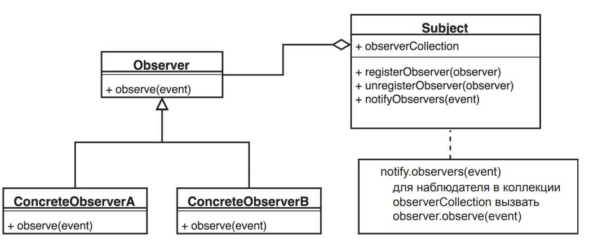
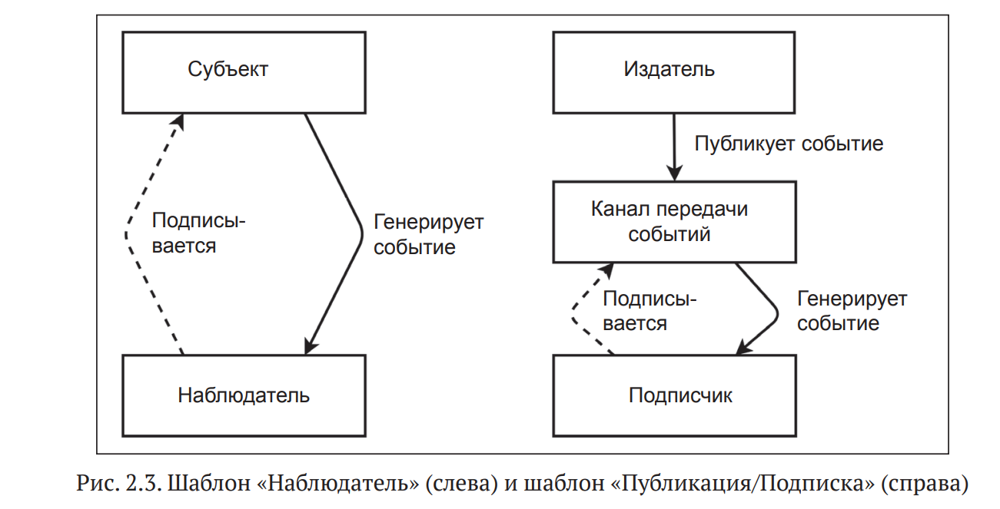

1)Что такое реактивное программирование?

Реактивное программирование - это неблокирующие приложения, которые являются асинхронными и управляемыми событиями и требуют небольшого количества потоков для масштабирования. Ключевым аспектом этого определения является концепция противодавления (backpressure), которая является механизмом, гарантирующим, что производители не перегружают потребителей.

--------------------------------------------------------------------------------------------------------------------

2)Что может блокировать поток?

Такой же тип потерь также возникает при ожидании завершения других типов операций ввода-вывода, таких как вызов базы данных или чтение из файла. Во всех этих ситуациях поток, выполняющий запрос ввода-вывода, будет заблокирован и будет ожидать, пока операция ввода-вывода не будет завершена, это называется блокирующим вводом-выводом. Такие ситуации, когда выполняющийся поток блокируется, просто ожидая ответа, означают потерю потоков и, следовательно, потерю памяти.

Другой проблемой традиционного императивного программирования является время отклика, когда службе необходимо выполнить более одного запроса ввода-вывода. Например, службе A может потребоваться вызвать службы B и C, а также выполнить поиск в базе данных, а затем вернуть в результате некоторые агрегированные данные. Это будет означать, что время ответа службы A, помимо времени ее обработки, будет суммой следующих значений:
время отклика услуги B (задержка сети + обработка)
время отклика службы C (задержка сети + обработка)
время ответа на запрос к базе данных (сетевая задержка + обработка)

--------------------------------------------------------------------------------------------------------------------

3)Вкратце как работает программированием с использованием асинхронных потоков данных

Допустим, служба A хочет получить некоторые данные из службы B. При подходе в стиле реактивного программирования служба A отправит запрос службе B, которая немедленно вернет управление (неблокирующий и асинхронный запрос). Затем запрошенные данные будут доступны службе A в виде потока данных, где служба B будет публиковать событие onNext для каждого элемента данных один за другим. Когда все данные будут опубликованы, об этом просигнализирует событие onComplete. В случае ошибки будет опубликовано событие onError, и больше никаких элементов не будет.
Реактивное программирование использует подход функционального стиля (аналогично Streams API), который дает возможность выполнять различные виды преобразований в потоках. Один поток можно использовать как вход для другого. Потоки можно объединять, отображать и фильтровать (операции merge, map и filter).

--------------------------------------------------------------------------------------------------------------------

4)Чем асинхронность отличается от реактивного программирования?

Асинхронность и реактивное программирование являются связанными концепциями, но имеют различия в своем контексте и фокусе.
Асинхронность относится к подходу, при котором операции выполняются независимо друг от друга, без блокировки потока выполнения. В асинхронном программировании задачи могут выполняться параллельно или последовательно, но без ожидания завершения предыдущей задачи для начала следующей. Это позволяет улучшить отзывчивость системы, так как не блокируются потоки выполнения на длительное время, ожидая завершения операции. В асинхронном программировании используются механизмы, такие как коллбэки, промисы, асинхронные функции и асинхронные потоки, чтобы управлять асинхронными операциями.
С другой стороны, реактивное программирование - это более широкий подход, который охватывает не только асинхронность, но и другие принципы, такие как отзывчивость, устойчивость и ориентация на сообщения. Реактивное программирование фокусируется на работе с асинхронными данными и изменениями в потоках данных.

--------------------------------------------------------------------------------------------------------------------

5)Чем отличается реактивное программирование от обычного?

Обычное программирование и реактивное программирование имеют несколько ключевых отличий:
Асинхронность: В реактивном программировании основное внимание уделяется работе с асинхронными операциями и потоками данных. В обычном программировании большинство операций являются синхронными, то есть программы последовательно выполняются от начала до конца.
Реактивность на изменения: Реактивное программирование предоставляет механизмы для автоматической реакции на изменения данных. Это означает, что когда данные изменяются, реактивная система автоматически обновляет связанные с ними компоненты или процессы. В обычном программировании изменения обычно обрабатываются явно, с помощью конструкций условных операторов и циклов.
Поток данных: Реактивное программирование работает с непрерывными потоками данных, которые могут быть преобразованы и комбинированы. Обычное программирование, в свою очередь, склонно работать с отдельными значениями или наборами данных.
Отзывчивость: Реактивное программирование стремится к отзывчивости и быстрой обработке данных. Это особенно важно для пользовательских интерфейсов и систем, где требуется немедленная реакция на действия пользователя. В обычном программировании отзывчивость может быть достигнута, но требует явного управления потоками выполнения и обработки событий.

--------------------------------------------------------------------------------------------------------------------

6)Что такое реактивный манифест?

Реактивный манифест - это набор принципов и ценностей, сформулированных сообществом разработчиков для описания основных идей и подходов реактивного программирования.

--------------------------------------------------------------------------------------------------------------------

7)Назовите некоторые пункты в реактивном манифесте?

Responsive (Отзывчивость): Системы должны быть отзывчивыми и способными реагировать на события и запросы в режиме реального времени. Отклик системы должен быть немедленным и предсказуемым, обеспечивая пользовательскую интерактивность и быструю обработку данных.
Resilient (Устойчивость): Системы должны быть устойчивыми к сбоям и ошибкам. В случае возникновения проблем, система должна уметь восстановиться и продолжать работу без потери данных или обеспечивать возможность восстановления.
Elastic (Эластичность): Системы должны быть эластичными и гибкими в масштабировании ресурсов. Они должны способны масштабироваться в зависимости от нагрузки и изменяющихся требований, чтобы обеспечивать высокую производительность и эффективное использование ресурсов.
Message-driven (Ориентация на сообщения): Системы должны быть построены вокруг обмена сообщениями для обеспечения асинхронной и нелокальной связи между компонентами. Сообщения позволяют связывать различные части системы, асинхронно обмениваться данными и реагировать на изменения.

--------------------------------------------------------------------------------------------------------------------

8)Чем так хорош шаблон Наблюдатель?

Шаблон наблюдатель является главным в системах основанных на событиях. Диаграмма шаблона:

Типичная реализация шаблона Наблюдатель включает два интерфейса, Subject и Observer.  Observer
регистрируется в Subject и принимает уведомления от него. Subject может генерировать собственные события или сам вызываться другими компонентами.
Это похоже на некоторые реализации реактивного программирования. О них мы поговорим далее.

--------------------------------------------------------------------------------------------------------------------

9)Какие отличия в шаблоне Наблюдатель и Публикация/Подписка?

Отличие от шаблона «Наблюдатель», в шаблоне «Публикация/Подписка» издатели и подписчики ничего не знают друг о друге.

Шаблон «Публикация/Подписка» образует между издателями и подписчиками
дополнительный уровень косвенности. Подписчики знают о существовании каналов передачи событий, через которые выполняется рассылка уведомлений, но
обычно их не интересует идентичность издателя. Кроме того, к каждому каналу
может быть подключено сразу несколько издателей. Диаграмма на рис. 2.3 призвана помочь понять разницу между шаблонами «Наблюдатель» и «Публикация/
Подписка».

--------------------------------------------------------------------------------------------------------------------

10)Какие существуют модели получения данных?

- Pull - Это когда мы сами делаем запрос на получение и нам приходит ответ.
- Push - Когда данные сами нас уведомляют об изменениях и система "выталкивает" их нам.
Реактивное приложение, это когда приложение само извещает нас об изменении своего состояния. Не мы делаем запрос и проверяем, а не изменилось ли там что-то, а приложение само нам сигнализирует. Ну и конечно эти события и эти сигналы мы можем обрабатывать как нам вздумается.
Pull — коллекция (аналог — массив): в ней есть данные, которые мы можем получить по запросу, предварительно обработав их как нам хочется.
Push — полная противоположность: изначально в ней нет данных, но как только они появятся, она нам сообщит об этом. Во время этого мы также можем делать с ней что хотим и как только в коллекции появятся значения, она выполнит все наши фильтры (которые мы на нее навесили) и выдаст нам результат.
Push коллекция как-бы "состоит" из новой сущности Observable.
Это и есть коллекция, которая будет рассылать уведомления об изменении своего состояния.Для реализации этого похода в реактивном контексте существует такое понятие как Callback — это объект или несколько объектов, которые "отслеживают" необходимые события, происходящие с обслуживаемыми объектами, и либо сообщают об этих событиях другим слушателям, либо отдают объекты, с которыми произошли это события, асинхронным потоком для обработки.

--------------------------------------------------------------------------------------------------------------------

11)Основные приемущества реактивности?

Реактивность дает слабую связанность.

В некоторых случаях это дает возможность писать более простой и понятный код.

Например мы можем взять обычную коллекцию, преобразовать ее к реактивной коллекции и тогда мы будем иметь коллекцию событий об изменении данных в ней. Мы очень просто получаем только те данные, которые изменились. По этой коллекции мы можем делать выборку, фильтровать и т.д.

Если бы мы это делали обычным традиционным способом, то нам нужно было бы получить данные, закэшировать их, сделать запрос на получение новых данных,сравнить их с текущим значением.

Чтобы получить данные, мы обращаемся к базе данных, получаем данные и отдаем пользователю. Если у вас в этот момент времени на секунду пропадет интернет то вы получите ошибку. Беда.

Реактивщина нам поможет в данном случае.

Аналог для примера: Gmail, Facebook, Instagram, Twitter. Когда у вас плохой интернет, вы не получаете ошибку, а просто ждете результат немного дольше.

Вы едете в метро, обновили ленту в instagram, у у вас пропал интернет, спустя минуту он у вас появился и вам не надо будет обновлять пальцем сверху вниз (сделать еще один запрос на получение данных), система вам отдаст эти данные сама.

Обязанности:
- Приложение должно отдавать пользователю результат за полсекунды
- Обеспечить отзывчивость под нагрузкой
- Система остается в рабочем состоянии даже, если один из компонентов отказал.
- Система должна занимать оптимальное количество ресурсов в каждый промежуток времени.
Общение между сервисами должно происходить через асинхронные сообщения. Это значит, что каждый элемент системы запрашивает информацию из другого элемента, но не ожидает получение результата сразу же. Вместо этого он продолжает выполнять свои задачи.

--------------------------------------------------------------------------------------------------------------------

12)Когда стоит использовать реактивщину?

Реактивщину стоит использовать, когда есть поток событий, растянутый во времени (например, пользовательский ввод).
Функционал, написанный при помощи реактивных потоков, может быть легко дополнен и расширен.
Но самое важное, это то, что не надо использовать реактивщину везде где только попало)

--------------------------------------------------------------------------------------------------------------------