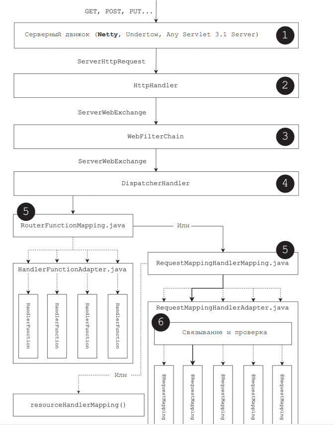
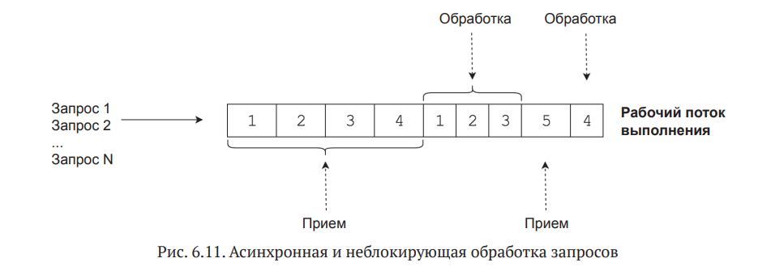

P.S Spring WebFlux == Spring Reactive Web

--------------------------------------------------------------------------------------------------------------------
1)Что такое WebFlux?

Spring 5 представил платформу WebFlux, которая представляет собой полностью асинхронный и неблокирующий реактивный веб-стек, который позволяет обрабатывать огромное количество одновременных соединений.Модуль WebFlux является альтернативой Spring MVC и представляет собой реактивный подход для написания веб-сервисов.
WebFlux позиционирует себя как микрофреймворк.Этот новый микрофреймворк поддерживает аннотированные контроллеры, функциональные конечные точки, WebClient (аналог RestTemplate в Spring Web MVC), WebSockets и многое другое.

--------------------------------------------------------------------------------------------------------------------
2)В чем отличие Spring WebFlux от RxJava ?

Spring WebFlux и RxJava2+ являются реализациями реактивных потоков.
Т.е. теперь начинает складываться более детальная картина:Project Reactor — это библиотека, которая лежит в основе WebFlux.Она исправляет недостатки в RxJava и больше подходит для бэкэнд-разработки. RxJava имеет некоторые проблемы, которые могут вызвать нехватку памяти.
Если можно сказать простыми словами, то "Реактивное программирование" — это программирование с асинхронными потоками (streams) данных.
Т.е. можно слушать поток и реагировать на события в нем. Можем фильтровать поток как нам вздумается, объединять потоки, кроме того потоки могут быть входными параметрами других потоков.Даже множественный поток может быть использован как входной аргумент другого потока. Вы можете объединять несколько потоков. Вы можете фильтровать один поток, чтобы потом получить другой, который содержит только актуальные данные. Вы можете объединять данные с одного потока с данными другого, чтобы получить еще один.
Поток — это некая последовательность, состоящая из постоянных событий, отсортированных по времени. В нем может быть три типа сообщений: значения (данные некоторого типа), ошибки и сигнал о завершении работы.Нам лишь надо подписаться на поток.Наблюдатель (observers) подписывается на поток.
Данные же будут получены тогда, когда они будут готовы — произойти это может в этом же самом либо другом потоке. Publisher их сам отдаст, когда они придут. Это push-модель. Отдача готового элемента — это event. Реактивная модель основана на событиях (event-driven).

--------------------------------------------------------------------------------------------------------------------
3)Каковы цели WebClient и WebTestClient в Spring?

WebClient — это функция новой среды Web Reactive, которая позволяет не блокировать HTTP-запросы в качестве реактивного клиента. Будучи реактивным, он может эффективно обрабатывать
реактивные потоки и имеет возможность использовать лямбда-выражения Java 8. Он может управлять обоими
синхронные и асинхронные сценарии, а также поддерживает обратное давление.
С другой стороны, WebTestClient — это сопоставимый класс, специально разработанный
для использования в тестировании. Он служит тонким слоем над WebClient и может подключаться к
любой сервер через HTTP-соединение. Кроме того, он может напрямую взаимодействовать с
Приложения WebFlux, использующие фиктивные объекты запросов и ответов, не требующие HTTP-сервер

--------------------------------------------------------------------------------------------------------------------
4)Можем ли мы использовать как Web MVC, так и WebFlux в одном приложении?

Да, в одном приложении Spring можно использовать как Web MVC, так и WebFlux.
Spring предоставляет гибридную конфигурацию, в которой можно использовать обе платформы.
вместе. Это полезно при переносе существующего приложения на WebFlux, так как
позволяет постепенно внедрять реактивное программирование в приложение.
Чтобы использовать Web MVC и WebFlux вместе, вы можете использовать @EnableWebMvc и
Аннотации @EnableWebFlux в отдельных классах конфигурации.

--------------------------------------------------------------------------------------------------------------------
5)Какими интерфейсами были заменены ServletHttpResponse/Request?

ServerHttpRequest/Response.

--------------------------------------------------------------------------------------------------------------------
6)Почему при передаче типов в Spring WebFlux, они обрабатываются?

Всё потому что, Spring Web Flux сам является subscriber и при обработке response, запускает обработку.

--------------------------------------------------------------------------------------------------------------------
7)Как работает Spring WebFlux?

Пояснения к диаграмме на рис. 6.2.
1. Входящий запрос, обрабатываемый серверным движком. Как видите, список серверных движков не ограничивается серверами с Servlet API и теперь
   включает такие движки, как Netty и Undertow. Здесь для каждого серверного движка имеется свой реактивный адаптер, который отображает внутреннее представление HTTP-запросов и  HTTP-ответов в  ServerHttpRequest
   и ServerHttpResponse.
2. Этап выполнения HttpHandler, который объединяет ServerHttpRequest,
   ServerHttpResponse пользовательский сеанс и прочую сопутствующую информацию в экземпляр ServerWebExchage.
3. Этап выполнения WebFilterChain, который добавляет в цепочку заданный
   WebFilter. Затем WebFilterChain вызывает метод WebFilter#filter каждого экземпляра WebFilter в этой цепочке, чтобы отфильтровать входящие
   ServerWebExchange.
4. Если все условия, определяемые фильтрами, соблюдены, WebFilterChain
   вызывает экземпляр WebHandler.
5. Следующий шаг  – поиск экземпляров HandlerMapping и  вызов первого подходящего. В  этом примере мы изобразили несколько экземпляров HandlerMapping, таких как RouterFunctionMapping, RequestMapping
   HandlerMapping и  HandlerMapping. Здесь присутствует пока незнакомый
   экземпляр HandlerMapping  – RouterFunctionMapping, который появился
   в модуле WebFlux и выходит за рамки чисто функциональной обработки запросов. Поближе познакомимся с этим типом в следующем разделе.
6. Этап выполнения RequestMappingHandlerAdapter, который сохранил прежние функциональные обязанности, но теперь использует реактивные потоки для управления реактивными взаимодействиями
7. 
--------------------------------------------------------------------------------------------------------------------

8)Как работает традиционное веб-приложения Spring MVC?

Контейнер сервлетов имеет выделенный пул потоков для обработки HTTP-запросов, где каждому входящему запросу будет назначен поток, и этот поток будет обрабатывать весь жизненный цикл запроса (модель «поток на запрос»). Это означает, что приложение сможет обрабатывать количество одновременных запросов, равное размеру пула потоков. Можно настроить размер пула потоков, но поскольку каждый поток резервирует некоторую память (обычно 1 МБ), чем больший размер пула потоков мы настраиваем, тем выше потребление памяти.
Если приложение разработано в соответствии с архитектурой на основе микросервисов, у нас есть лучшие возможности для масштабирования в зависимости от нагрузки, но за высокое использование памяти по-прежнему приходится платить. Таким образом, модель потока на запрос может стать довольно дорогостоящей для приложений с большим количеством одновременных запросов.
Важной характеристикой архитектур на основе микросервисов является то, что приложение распределено, выполняется большое количество отдельных процессов, обычно на нескольких серверах. Использование традиционного императивного программирования с синхронными вызовами запроса/ответа для взаимодействия между службами означает, что потоки часто блокируются в ожидании ответа от другой службы, что приводит к огромной трате ресурсов.

--------------------------------------------------------------------------------------------------------------------

9)Можно ли описывать конечные точки, не так как в Spring Web?

Да, это возможно с помощью статических методов RouterFunctions.nest, RouterFunctions.route.
Примерно выглядит так:
nest(path("/orders"),
    nest(accept(APPLICATION_JSON), 
    route(GET("/{id}"), handler::get) 
    .andRoute(method(HttpMethod.GET), handler::list)
))

--------------------------------------------------------------------------------------------------------------------

10)Можете рассказать о реактивном WebSocket?

В качестве центрального интерфейса для обработки соединений WebSocket модуль WebFlux предлагает WebSocketHandler. Этот интерфейс имеет метод handle,
принимающий экземпляр WebSocketSession. Класс WebSocketSession представляет успешно установленное соединение между клиентом и сервером и обеспечивает доступ к  информации, включая информацию о  соединении, атрибуты
сеанса и входящий поток данных.

--------------------------------------------------------------------------------------------------------------------

11)Можете назвать сходства Spring Web и Spring WebFlux(Spring Reactive Web)

Spring Web и Spring WebFlux очень похожи в построении логики.
Многие аннотации, как в Spring Web, так и в Spring WebFlux выполняют одну и туже логику.
Схема(структура) приложений одинакова, но в Spring WebFlux присутствует описание конечных точек с помощью функционального стиля.
и т.д

--------------------------------------------------------------------------------------------------------------------

12)Расскажите об обработке http запросов в Spring WebFlux.

Модуль WebFlux, напротив, построен на основе неблокирующего API. То есть рабочему потоку выполнения не требуется выполнять никаких блокирующих операций ввода/вывода. Этот эффективный подход к обработке запросов изображен
на рис. 6.11.

--------------------------------------------------------------------------------------------------------------------