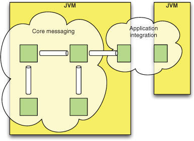
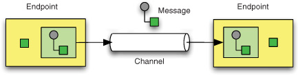
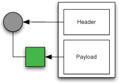
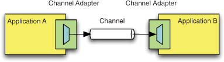
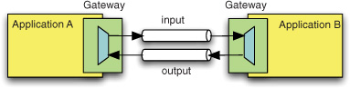
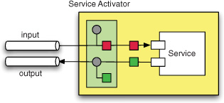
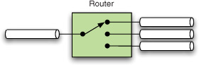
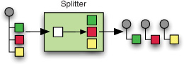
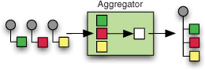

1)Что такое Spring Integration?
Spring Integration состоит из двух частей. По своей сути это платформа обмена сообщениями, которая поддерживает легковесные, управляемые событиями взаимодействия внутри приложения. Помимо этого ядра, он предоставляет платформу на основе адаптера, которая поддерживает гибкую интеграцию приложений в рамках всего предприятия. Эти две роли изображены на рисунке 1.1.

--------------------------------------------------------------------------------------------------------------------

2)Назовите составные части Spring Integration.
С самой общей точки зрения, только три базовых шаблона составляют шаблоны корпоративной интеграции: Message , Message Channel и Message Endpoint . На рис. 1.2 показано, как эти компоненты взаимодействуют друг с другом в типичном приложении интеграции.

--------------------------------------------------------------------------------------------------------------------

3)Что такое Message?

Сообщение — это единица информации, которая может передаваться между различными компонентами, называемыми конечными точками сообщения.

Каждое сообщение состоит из заголовков и полезной нагрузки. Заголовок содержит данные, относящиеся к системе обмена сообщениями, такие как обратный адрес или идентификатор корреляции . Полезная нагрузка содержит фактические данные, которые должны быть доступны или обработаны получателем. Сообщения могут иметь разные функции.

--------------------------------------------------------------------------------------------------------------------

4)Какие реализации Message вы знаете?

1) Базовой реализацией интерфейса Message является GenericMessage<T>, и он предоставляет два конструктора, показанных в следующем листинге:

        new GenericMessage<T>(T payload);

        new GenericMessage<T>(T payload, Map<String, Object> headers)

При Message создании генерируется случайный уникальный идентификатор. Конструктор, который принимает Map заголовки, копирует предоставленные заголовки во вновь созданный файл Message.

2) ErrorMessage - простая реализация сообщения для ошибок

--------------------------------------------------------------------------------------------------------------------
5)Что такое Message Chanel?

Канал сообщений — это соединение между несколькими конечными точками. Реализация канала управляет деталями того, как и куда доставляется сообщение, но не должна взаимодействовать с полезной нагрузкой сообщения. (Apache Kafka, RabbitMQ)

    public interface MessageChannel {

    boolean send(Message message);

    boolean send(Message message, long timeout);
    }

PollableChannel - основной интерфейс для буферизированной отправки сообщения.

    public interface PollableChannel extends MessageChannel {

    Message<?> receive();

    Message<?> receive(long timeout);

    }

SubscribableChannel - интерфейс реализуется каналами, которые отправляют сообщения непосредственно своим подписанным MessageHandler экземплярам(нельзя читать).

    public interface SubscribableChannel extends MessageChannel {

    boolean subscribe(MessageHandler handler);

    boolean unsubscribe(MessageHandler handler);

    }

--------------------------------------------------------------------------------------------------------------------

6)Назовите основные реализации канала сообщения.

PublishSubscribeChannel - Реализация PublishSubscribeChannel рассылает все Message отправленные ей сообщения всем подписанным обработчикам. Это чаще всего используется для отправки сообщений о событиях, основной ролью которых является уведомление.

QueueChannel - Реализация QueueChannel оборачивает очередь. В отличие от PublishSubscribeChannel, QueueChannel имеет двухточечную семантику. Другими словами, даже если у канала есть несколько потребителей, только один из них должен получать сообщения, Message отправленные на этот канал.

PriorityChannel - Принимая во внимание, что применяется QueueChannel упорядочение в порядке поступления (FIFO), это PriorityChannel альтернативная реализация, которая позволяет упорядочивать сообщения в канале на основе приоритета.

RendezvousChannel - Активирует RendezvousChannel сценарий «прямой передачи обслуживания», в котором отправитель блокируется до тех пор, пока другая сторона не вызовет метод канала receive(). Другая сторона блокируется до тех пор, пока отправитель не отправит сообщение.

DirectChannel - Имеет DirectChannel семантику точка-точка, но в остальном больше похож на чем PublishSubscribeChannel любая из описанных ранее реализаций канала на основе очереди. Он реализует SubscribableChannel интерфейс вместо PollableChannel интерфейса, поэтому он отправляет сообщения непосредственно подписчику.
Внутренне делегирует DirectChannel диспетчеру сообщений вызов своих обработчиков сообщений с подпиской, и этот диспетчер может иметь стратегию балансировки нагрузки, предоставляемую атрибутами load-balancer или load-balancer-ref (none или round-robin). Балансировка нагрузки также работает в сочетании с булевым failover свойством. Если failover значение равно true (по умолчанию), диспетчер возвращается к любым последующим обработчикам (при необходимости), когда предыдущие обработчики выдают исключения.

ExecutorChannel - Это ExecutorChannel канал «точка-точка», который поддерживает ту же конфигурацию диспетчера, что и DirectChannel(стратегия балансировки нагрузки и failover логическое свойство). Ключевое различие между этими двумя типами каналов диспетчеризации заключается в том, что они ExecutorChannel делегируются экземпляру TaskExecutor для выполнения диспетчеризации.

PartitionedChannel - Это расширение AbstractExecutorChannel и представляет логику диспетчеризации точка-точка, где фактическое потребление обрабатывается в определенном потоке, определяемом ключом раздела, полученным из сообщения, отправленного в этот канал.

FluxMessageChannel - Это FluxMessageChannel реализация org.reactivestreams.Publisher отправки "sinking"сообщений во внутреннюю память reactor.core.publisher.Flux для потребления по запросу реактивными подписчиками ниже по течению.

--------------------------------------------------------------------------------------------------------------------

7)Что такое ChannelInterceptor?

ChannelInterceptor - предоставляет возможность перехвата операций отправки и получения.

    public interface ChannelInterceptor {

    Message<?> preSend(Message<?> message, MessageChannel channel);

    void postSend(Message<?> message, MessageChannel channel, boolean sent);

    void afterSendCompletion(Message<?> message, MessageChannel channel, boolean sent, Exception ex);

    boolean preReceive(MessageChannel channel);

    Message<?> postReceive(Message<?> message, MessageChannel channel);

    void afterReceiveCompletion(Message<?> message, MessageChannel channel, Exception ex);
    }

Методы, которые возвращают Message экземпляр, могут использоваться для преобразования Message или могут возвращать «null», чтобы предотвратить дальнейшую обработку (конечно, любой из методов может генерировать a RuntimeException). Кроме того, preReceive метод может вернуться false, чтобы предотвратить продолжение операции приема.

--------------------------------------------------------------------------------------------------------------------

8)Что такое MessagingTemplate?

Когда представлены конечные точки и их различные параметры конфигурации, Spring Integration обеспечивает основу для компонентов обмена сообщениями, которая обеспечивает неинвазивный вызов кода вашего приложения из системы обмена сообщениями. Однако иногда необходимо вызвать систему обмена сообщениями из кода вашего приложения. Для удобства реализации таких вариантов использования Spring Integration предоставляет , MessagingTemplate который поддерживает различные операции в каналах сообщений, включая сценарии запросов и ответов.

--------------------------------------------------------------------------------------------------------------------

9)Что такое Poller?

Polling Consumer:
    Когда конечные точки сообщений (адаптеры канала) подключаются к каналам и создаются экземпляры, они создают один из следующих экземпляров:
        PollingConsumer,
        EventDrivenConsumer.
    Фактическая реализация зависит от типа канала, к которому подключаются эти конечные точки. Адаптер канала, подключенный к каналу, реализующему org.springframework.messaging.SubscribableChannel интерфейс, создает экземпляр EventDrivenConsumer. С другой стороны, адаптер канала, подключенный к каналу, который реализует интерфейс org.springframework.messaging.PollableChannel(например, QueueChannel), создает экземпляр PollingConsumer.

Pollable Message Source:
    Spring Integration предлагает второй вариант шаблона опроса потребителей. Когда используются адаптеры входящего канала, эти адаптеры часто упаковываются в файл SourcePollingChannelAdapter.

--------------------------------------------------------------------------------------------------------------------

10)Что такое Message Endpoint?

Конечные точки сообщения — это компоненты, которые фактически что-то делают с сообщением. Это может быть как простое перенаправление на другой канал, так и сложное разделение сообщения на несколько частей или их обратное объединение.Соединения с приложением или внешним миром также являются конечными точками, и эти соединения принимают форму адаптеров каналов, шлюзов обмена сообщениями или активаторов службы.

--------------------------------------------------------------------------------------------------------------------

11)Какие бывают Message Endpoint Consumer?

1) EventDrivenConsumer - потребитель, который подписывается на канал и читает его
2) PollingConsumer - потребитель, который подписывается и читает не в реальном времени, а через какой-то фиксированный промежуток времени. Свойство maxMessagesPerPollуказывает максимальное количество сообщений, которые необходимо получить в рамках данной операции опроса. Свойство receiveTimeout указывает количество времени, в течение которого модуль опроса должен ждать, если нет доступных сообщений, когда он вызывает операцию получения.

--------------------------------------------------------------------------------------------------------------------

12)Что такое паттерн Channel Adapter?

Адаптер канала (см. рис. 1.6 ) соединяет приложение с системой обмена сообщениями. В Spring Integration мы решили ограничить определение, включив в него только однонаправленные соединения, поэтому однонаправленный поток сообщений начинается и заканчивается в адаптере канала.

--------------------------------------------------------------------------------------------------------------------

13)Что такое Messaging Bridge?

Messaging bridge - это относительно простая конечная точка, которая соединяет два канала сообщений или адаптеров каналов. Например, вы можете подключить a PollableChannel к a SubscribableChannel, чтобы подписавшиеся конечные точки не беспокоились о какой-либо конфигурации опроса.

--------------------------------------------------------------------------------------------------------------------

14)Что такое паттерн Messaging Gateway?

В Spring Integration шлюз обмена сообщениями (см. рис. 1.7 ) — это соединение, предназначенное для двунаправленного обмена сообщениями. Если входящий запрос должен обслуживаться несколькими потоками, но инициатор должен оставаться в неведении о системе обмена сообщениями, решением является входящий шлюз.

--------------------------------------------------------------------------------------------------------------------

15)Что такое паттерн Service Activator?

Активатор службы (см. рис. 1.9 ) — это компонент, который вызывает службу на основе входящего сообщения и отправляет исходящее сообщение на основе возвращаемого значения вызова этой службы.

--------------------------------------------------------------------------------------------------------------------

16)Что такое паттерн Router?

Маршрутизатор (см. рис. 1.10 ) определяет следующий канал, на который должно быть отправлено сообщение, на основе входящего сообщения . Это может быть полезно для отправки сообщений с разными полезными нагрузками разным специализированным потребителям ( маршрутизатор на основе содержимого ).

--------------------------------------------------------------------------------------------------------------------

17)Что такое паттерн Splitter?

Разделитель (см. рис. 1.11 ) получает одно сообщение и разбивает его на несколько сообщений , которые отправляются в выходной канал. Это полезно, когда процесс обработки содержимого сообщения может быть разделен на несколько шагов и выполняться разными потребителями одновременно.

--------------------------------------------------------------------------------------------------------------------

18)Что такое паттерн Aggregator?

Агрегатор ( рис. 1.12 ) ожидает группу коррелированных сообщений и объединяет их вместе, когда группа сформирована . Корреляция сообщений обычно основана на идентификаторе корреляции, а завершение обычно связано с размером группы.

--------------------------------------------------------------------------------------------------------------------

19)Что такое Transformer?

Transformer - это специальный объект для сериализация/десериализации объектов приходящих из каналов.

--------------------------------------------------------------------------------------------------------------------

20)Как описать Transformer с помощью аннотаций?

    @Transformer
    Order generateOrder(String productId) {
        return new Order(productId);
    }

--------------------------------------------------------------------------------------------------------------------

21)Что такое Endpoint Roles и как их определить?

Роли позволяют запускать и останавливать конечные точки как группу. Это особенно полезно при использовании выбора лидерства, когда набор конечных точек может быть запущен или остановлен при предоставлении или отзыве лидерства соответственно. Для этого фреймворк регистрирует SmartLifecycleRoleControllerbean-компонент в контексте приложения с именем IntegrationContextUtils.INTEGRATION_LIFECYCLE_ROLE_CONTROLLER.

Определить роль можно с помощью аннотации @Role()

--------------------------------------------------------------------------------------------------------------------

22)Что такое Delayer?

Задержка — это простая конечная точка, которая позволяет задерживать поток сообщений на определенный интервал. Когда сообщение задерживается, первоначальный отправитель не блокируется. Вместо этого задержанные сообщения планируются с экземпляром для org.springframework.scheduling.TaskScheduler отправки в выходной канал после того, как задержка прошла.

--------------------------------------------------------------------------------------------------------------------

23)Что такое Java-DSL в Spring Integration?

Конфигурация Spring Integration Java и DSL предоставляют набор удобных компоновщиков и гибкий API, который позволяет настраивать потоки сообщений Spring Integration из @Configuration классов Spring.

DSL представлен IntegrationFlow fluent API (IntegrationFlowBuilder). Это создает IntegrationFlow компонент, который должен быть зарегистрирован как компонент Spring (с помощью аннотации @Bean). Шаблон построителя используется для выражения произвольно сложных структур в виде иерархии методов, которые могут принимать лямбда-выражения в качестве аргументов.

--------------------------------------------------------------------------------------------------------------------

24)Как можно преобразовать входящий и исходящий Message в DSL Spring Integration?

С помощью метода transform().

Метод transform класса IntegrationFlow принимает лямбда-выражение в качестве аргумента конечной точки для работы с полезной нагрузкой сообщения. Настоящим аргументом этого метода является экземпляр GenericTransformer<S, T>. Следовательно, здесь можно использовать любой из предусмотренных трансформаторов (ObjectToJsonTransformer, FileToStringTransformer и др.).

--------------------------------------------------------------------------------------------------------------------

25)Как настроить выходной канал в dsl?

Для настройки можно использовать метод channel() класса IntegrationFlow

Примеры:

1) channel("queueChannel")работает так же, но использует существующий queueChannel bean-компонент.

2) channel(publishSubscribe())является ссылкой на bean-метод.

3) channel(MessageChannels.executor("executorChannel", this.taskExecutor))это тот IntegrationFlowBuilder, который предоставляет IntegrationComponentSpec и ExecutorChannel регистрирует его как executorChannel.

4) channel("output")регистрирует DirectChannel bean-компонент с output его именем, если bean-компонентов с таким именем уже не существует.

--------------------------------------------------------------------------------------------------------------------

26)Как настроить Адаптеры входящего канала в dsl?

Настроить адаптер входящего канала можно с помощью метода from() класса IntegrationFlow.

Принимает в себя:

1) Название Channel
2) Объект Channel
3) Gateway
4) Consumer

--------------------------------------------------------------------------------------------------------------------

27)Как настроить Маршрутизацию сообщений в dsl?

Можно настроить с помощью метода route().

Например:

    .<Integer, Boolean>route(p -> p % 2 == 0, m -> m
        .subFlowMapping(true, sf -> sf.<Integer>handle((p, h) -> p * 2))
        .subFlowMapping(false, sf -> sf.<Integer>handle((p, h) -> p * 3)))

--------------------------------------------------------------------------------------------------------------------

28)Как настроить Splitter в dsl?

Для создания разветвителя используйте split() метод EIP. 
По умолчанию, если полезной нагрузкой является Iterable, Iterator, Array, а Stream или реактивный Publisher, split()
метод выводит каждый элемент как отдельное сообщение. Он принимает лямбду, выражение SpEL или любую AbstractMessageSplitter реализацию.

--------------------------------------------------------------------------------------------------------------------

29)Что такое Агрегаторы и ресеквенсеры в dsl и как их определить?

Метод split() разбивает список на отдельные сообщения и отправляет их в ExecutorChannel. 
Метод resequence() переупорядочивает сообщения по сведениям о последовательности, найденным в заголовках сообщений. 
Метод aggregate() собирает эти сообщения.

--------------------------------------------------------------------------------------------------------------------

30)Как использовать Service Activators в dsl?

С помощью метода handle().

Цель метода handle() — вызвать любую MessageHandler реализацию или любой метод для некоторого POJO. Другой вариант — определить «активность» с помощью лямбда-выражений.

--------------------------------------------------------------------------------------------------------------------

31)Что делает gateway()?

Оператор gateway() в IntegrationFlow определении — это специальная реализация активатора службы, вызывающая какую-либо другую конечную точку или поток интеграции через ее входной канал и ожидающая ответа.

--------------------------------------------------------------------------------------------------------------------

32)Опишите основные аннотации для Spring Integration.

@Aggregator - Агрегатор объединяет группу связанных сообщений, сопоставляя и сохраняя их до тех пор, пока группа не будет считаться полной. В этот момент агрегатор создает одно сообщение, обрабатывая всю группу, и отправляет агрегированное сообщение в качестве вывода.

    public Delivery aggregatingMethod(List<OrderItem> items) {
    ...
    }

@Filter - Фильтры сообщений используются для принятия решения о том, Message следует ли передавать или отбрасывать сообщение на основе некоторых критериев, таких как значение заголовка сообщения или само содержимое сообщения.

    public class PetFilter {
    @Filter  
    public boolean dogsOnly(String input) {
        ...
    }
    }

@Router - Маршрутизаторы являются важным элементом многих архитектур обмена сообщениями. Они потребляют сообщения из канала сообщений и пересылают каждое полученное сообщение в один или несколько различных каналов сообщений в зависимости от набора условий.

    @Bean
    @Router(inputChannel = "routingChannel")
    public AbstractMessageRouter myCustomRouter() {
    return new AbstractMessageRouter() {

        @Override
        protected Collection<MessageChannel> determineTargetChannels(Message<?> message) {
            return // determine channel(s) for message
        }

    };
    }

@ServiceActivator - Активатор службы — это тип конечной точки для подключения любого объекта, управляемого Spring, к входному каналу, чтобы он мог играть роль службы. Если служба производит выходные данные, она также может быть подключена к выходному каналу. replyChannel В качестве альтернативы служба создания вывода может быть расположена в конце конвейера обработки или потока сообщений, и в этом случае можно использовать заголовок входящего сообщения . Это поведение по умолчанию, если выходной канал не определен. Как и в случае с большинством опций конфигурации, описанных здесь, такое же поведение применимо и к большинству других компонентов.

    @ServiceActivator(inputChannel = "exampleChannel")
    public void exampleHandler(SomeData payload) {
        ...
    }

@Splitter - Разделитель — это компонент, роль которого состоит в том, чтобы разделить сообщение на несколько частей и отправить полученные сообщения для независимой обработки. Очень часто они являются восходящими производителями в конвейере, включающем агрегатор.

    @Splitter
    List<LineItem> extractItems(Order order) {
    return order.getItems()
    }

@Transformer - Преобразователи сообщений играют очень важную роль в обеспечении слабой связи между производителями и потребителями сообщений. Вместо того чтобы требовать, чтобы каждый компонент, производящий сообщения, знал, какой тип сообщения ожидает следующий потребитель, вы можете добавить преобразователи между этими компонентами.

    @Transfomer(inputChannel = "transformChannel", outputChannel = "nextServiceChannel")
    public OutputData exampleTransformer(InputData payload) {
        ...
    }

@InboundChannelAdapter - Адаптер канала — это конечная точка сообщения, которая позволяет подключить одного отправителя или получателя к каналу сообщений. Spring Integration предоставляет ряд адаптеров для поддержки различных транспортов, таких как JMS, файл, HTTP, веб-сервисы, почта и т. д. В следующих главах этого справочного руководства рассматривается каждый адаптер. Однако в этой главе основное внимание уделяется простой, но гибкой поддержке адаптера канала, вызывающего метод.

@BridgeFrom - Соединение из какого то канала.

    @Bean
    @BridgeFrom(value = "polled", poller = @Poller(fixedDelay = "5000", maxMessagesPerPoll = "10"))
    public SubscribableChannel direct() {
    return new DirectChannel();
    }

@BridgeTo - Соединение в какой-то канал.

    @Bean
    @BridgeTo(value = "direct", poller = @Poller(fixedDelay = "5000", maxMessagesPerPoll = "10"))
    public PollableChannel polled() {
    return new QueueChannel();
    }

@MessagingGateway - Шлюз скрывает API обмена сообщениями, предоставляемый Spring Integration. Это позволяет бизнес-логике вашего приложения не знать о Spring Integration API. При использовании универсального шлюза ваш код взаимодействует только с простым интерфейсом.

    @Gateway(requestChannel="orders")
    void placeOrder(Order order);

@IntegrationComponentScan - разрешает сканирование путей к классам. Эта аннотация играет ту же роль, что и стандартная @ComponentScan аннотация Spring Framework, но она ограничена компонентами и аннотациями, специфичными для Spring Integration, которые не может охватить стандартный механизм сканирования компонентов Spring Framework.

@EnableIntegration - подгружает Spring Integration

--------------------------------------------------------------------------------------------------------------------